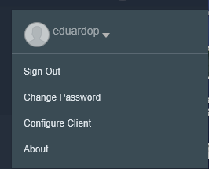

# Accessing Conductor for Containers using the CLI

To access the environment through the CLI, follow these steps:

* Log on to the CfC 
* Click on your user name on the top right corner
* You will see the following menu:

 

* Click *Configure Client*
If you get a blank page, you might need to clear your browser cache and do it again.

* Copy and paste the sequence of commands to a text editor (We have seen many times that this information is displayed only once and requires cleaning the browser cache to display it again)
* Save the commands as a script
* Run the script
