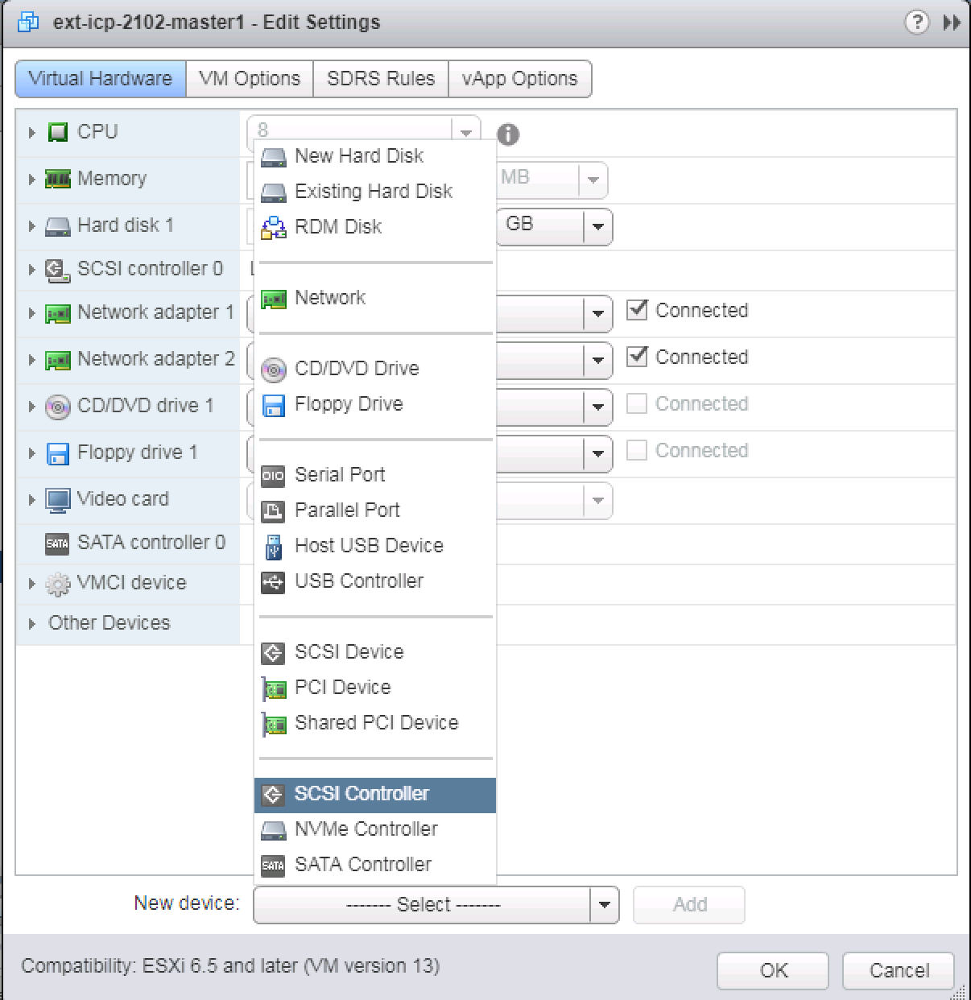
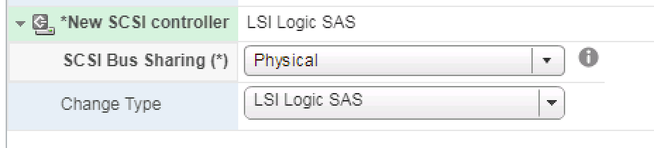
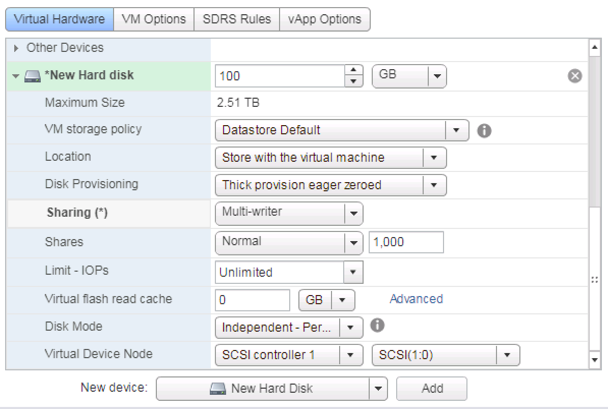
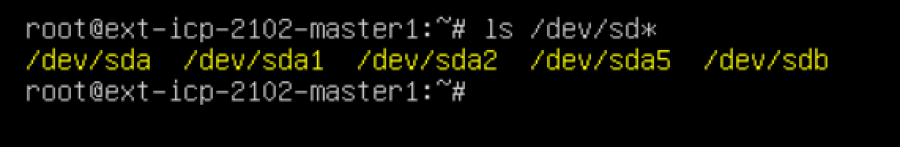
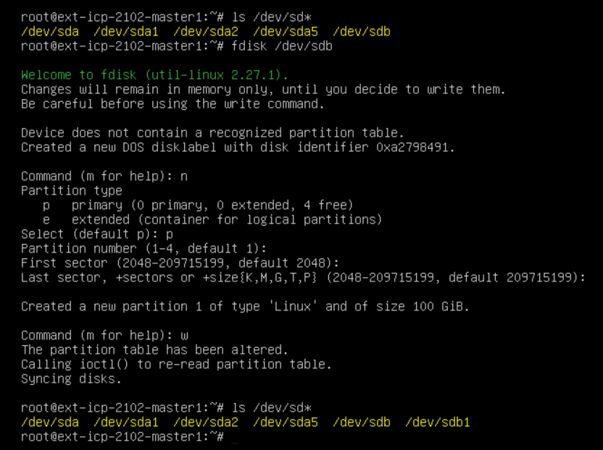
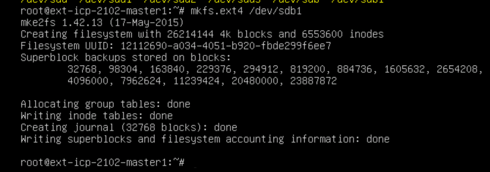
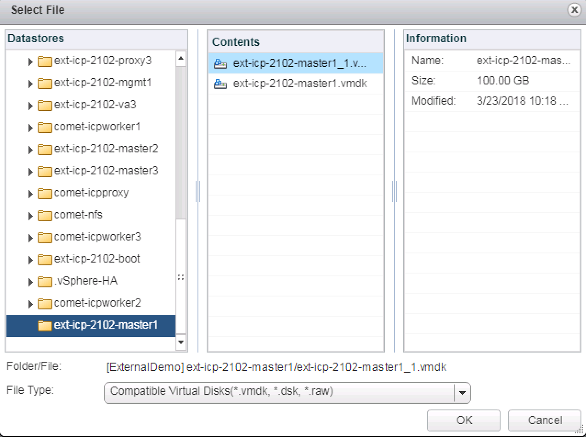
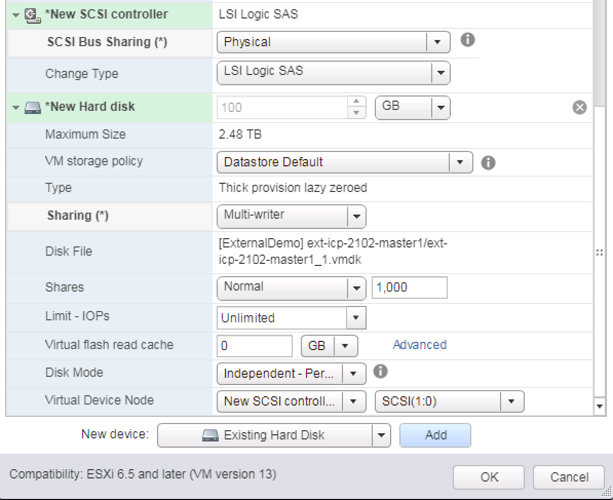
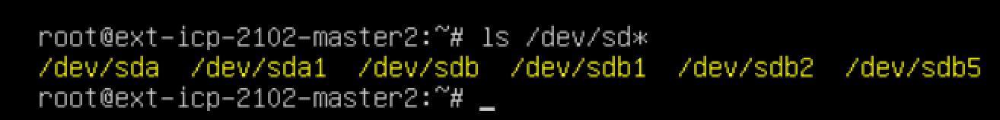

# Configuring ICP for HA on VMware

For Highly Available installations, two additional disks must be created which can be shared by all of the master nodes. These disks hold the Docker Trusted Registry (DTR) files and ICP audit files.

It is recommended to create separate, independent disks which is mounted by all master nodes for these purposes.

First, create all of your needed VMs for your ICP HA environment:
 * 1 boot node
 * 3 master nodes
 * 3 proxy nodes
 * 3 management nodes
 * 3 worker nodes

In VMware vCenter server, you cannot create a virtual disk independent of a virtual machine (VM).  You can create an independent disk associated with a VM and then mount it on multiple servers, but a disk must be associated with a VM.

To create an independent disk on an existing VM it is necessary to add a secondary SCSI controller and add your independent disk to that controller.

On all of the other nodes where this disk will be mounted you should also create an additional controller for the mounted disk.

*IMPORTANT:* You cannot create a new controller with the needed properties if a snapshot exists for the VM.  If you have taken any snapshots on any of your virtual machines you must consolidate or delete them before continuing.

In the vSphere web client, select your first master node, right-click, and click "Edit Settings".

At the bottom of the pane, next to "New Device:" click "Select" and choose "SCSI Controller" and click the "Add" button.


Your new SCSI Controller will show up in green in the table above.  Click the little arrow to the left of the new controller to expand the properties to update the values.  For "SCSI Bus Sharing" select "Physical" and for "Change Type" select "LSI Logic SAS" then click the "OK" button at the very bottom of the pane.


Now edit your VMs settings again and this time add a new Hard Disk.  Expand the new hard disk's properties and make sure the following properties are set correctly:
  * __Disk Size:__ 100GB
  * __Location:__ Store with the virtual machine
  * __Disk Provisioning:__ Thick provision eager zeroed (required)
  * __Sharing:__ Multi-writer
  * __Disk Mode:__ Independent - Persistent
  * __Virtual Device Node:__ "SCSI Controller 1" "SCSI(1:0)"



Now you need to create a filesystem on your new disk.  Login to your master1 VM as root and create a new partition and filesystem on the new disk you just created.

```
ls /dev/sd*
```

This will list all of the hard disks on your system.  A disk which contains a partition will have a number after the disk name.  For example, partition1 on disk a will be named "/dev/sda1", etc.

A disk without a partition will just have a disk name with no parition number, e.g. "/dev/sdb".  Note that disks with a partition will still have the raw device (/dev/sda), but will also have partition devices (/dev/sda1).  A disk with no partition will only have the raw device name (/dev/sdb).



In our instance, the new disk we just created is /dev/sdb and we will create a new partition on this disk. To do this we will use the 'fdisk' command.

```
fdisk /dev/sdb
```

At the "command (m for help):" prompt type "n" to create a new partition.

To the "Parition type" prompt answer "p" for primary partition.

To the "Partition number" prompt hit [enter] to accept the default of partition 1.

To the "First sector" prompt press [enter] to accept the default.

To the "Last sector" prompt press [enter] to accept the default.

You will see a notification that the partition has been created.

At the "command (m for help):" prompt enter "w" to write the partition to the disk.

You are notified that the partition table has been altered.

fdisk is automatically exited and you are dropped back down to the command line.

Now when you execute `ls /dev/sd*` you should see your new partition as /dev/sdb1.



Once your partition has been created you need to add a filesystem to the disk (format the disk).

```
mkfs.ext4 /dev/sdb1
```




Your disk can now be mounted on the filesystem.  For HA implementations, you can either create two separate disks, one for the Docker Trusted Registry (DTR) and one for the Audit logs, or you can mount a single external partition and them mount both the DTR and audit paths to this location via bind mount.  We will use the latter for our purposes.

First, create a location for the independent disk we just created and mount our new disk to that location.

__NOTE:__ You will execute the following commands on all master nodes after the shared disk has been attached to the virtual machine.

Exeute the following commands as root:

```
mkdir /storage
mount /dev/sdb1 /storage
```

Then make the mount permanent:

```
echo "/storage  /dev/sdb1 none  defaults   0 0" >> /etc/fstab
```

Next, use a bind mount to mount the needed filesystems from this new partition:

```
mkdir /storage/registry
mkdir -p /var/lib/registry
mount --rbind /storage/registry /var/lib/registry
echo "/storage/registry /var/lib/registry none defaults,bind 0 0" >> /etc/fstab
```
```
mkdir /storage/audit
mkdir -p /var/lib/icp/audit
mount --rbind /storage/audit /var/lib/icp/audit
echo "/storage/registry /var/lib/icp/audit none defaults,bind 0 0" >> /etc/fstab
```

Your first master server is now configured.  Now you need to mount this same disk onto all other master nodes.

To mount the existing disk onto the other two master nodes you will need to shutdown and power off those two VMs.  As root from the console of each VM type:

`shutdown -h now`

Next, edit the settings of your second and all subsequent master nodes and add a new controller and instead of creating a new disk add an "Existing Hard Disk".

You can create both in one single operation or create them separately as we did for the first master node.

First, add your new controller first (exactly as you did for your first master node) and then add your existing disk from master1 one as a disk on this VM as well.

When creating your "Existing Disk", it will pop up a file chooser window.  Navigate to the datastore on which you installed your first master node, open the folder which contains the first master node's files, and select the .vmdk file which begins with your first master node's VM name with "_1" appended to it.



Select this disk and click the "OK" button at the bottom of the pane.



Ensure your controller is configured as follows:
  * SCSI Bus Sharing: "Physical"
  * Change Type: "LSI Logic SAS"

Ensure you have the existing disk set with the proper parameters:
  * Sharing: "Multi-Writer"
  * Disk Mode: "Independent - Persistent"
  * Virtual Device Node: "New SCSI Controller" "SCSI(1:0)"

Click "OK" at the bottom of the pane to add the new devices and continue.

Once this operation is complete power on your VM.

You will not need to create the partition and filesystem again because we have already done that when we initially created it on the first master node.

You will however have to mount the disk within the filesystem and create the bind mounts for the shared directories.

Repeat the mount operations noted above for the first master node on each of the additional master nodes.  Remember, you do not need to create the partition, filesystem, or mount paths on your independent disk again, the disk and bind mounts just need to be created so your operating system has access to these paths.

__IMPORTANT__: The device names may change after a reboot of the operating system.  Notice in the screenshot below that our /dev/sda device has only one partition and the /dev/sdb device has 5 partitions.  In this case, our new independent disk has been assigned /dev/sda by this operating system rather than /dev/sdb.

Make sure you know which device is which prior before mounting them to the filesystem.



Once you have mounted all your disks and bind mounted your registry and audit directories you are ready to complete your ICP HA install.
