# Recommendations for Hyper-V Dynamic Memory Allocation (DMA) on kubernetes nodes

* __Recommendation 1:__  Disable DMA in all ICP nodes so that performance is what is expected.
* __Recommendation 2:__  If DMA must be enabled, set the Startup RAM value to the value that ICP expects to be available on the node understanding that for bursty traffic (which is the nature of the cloud) performance could be limited to the speed of the disk cache and the maximum value will never be used and is irrelevant.  ICP will not attempt to provision more RAM than is reported available by the operating system (cat /proc/meminfo or free -m).  The amount of total memory available as reported by a linux operating system is the value in the startup RAM configuration.

## Supporting Documentation

We have installed IBM Cloud Private in a Hyper-V environment and have enabled Dynamic Memory Allocation on 2 worker nodes and have not enable it on one worker node.

## Initial Test
In the below content, notice that worker1 is not using DMA and workers 2 and 3 are using DMA.

Note the assigned memory to each node. Assigned memory is less than requested memory for DMA enabled nodes, but not for DMA disabled nodes:

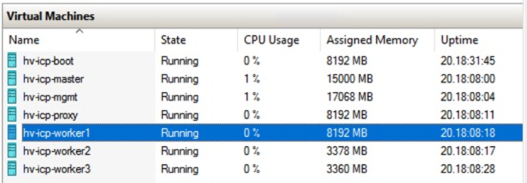

The node with DMA disabled shows the full 8GB/s assigned to the node, and the nodes with DMA enabled show to have just under 5GB less RAM assigned.

Note below the information for each of the worker nodes in this cluster:

**WORKER1 - DMA disabled**

The value of RAM: at the top of memory settings is the amount of RAM allocated at startup and is what is reported to the linux operating system as total memory.  Note that "Enable Dynamic Memory" is not checked (grayed out here because the VM is running and it cannot be changed while the VM is running).

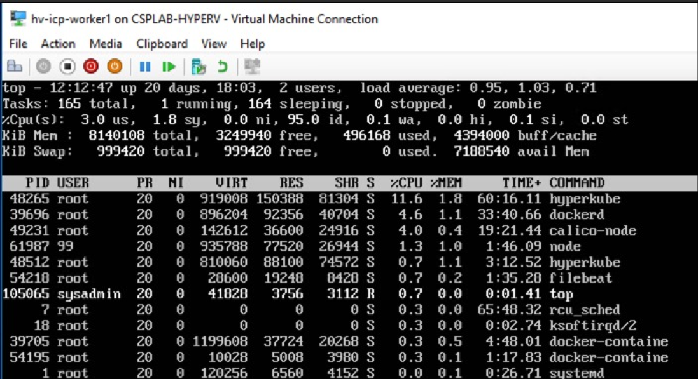

Note that total memory reported is 8GB and with no workloads running about 3GB is showing as available.

**WORKER2 - DMA is enabled**

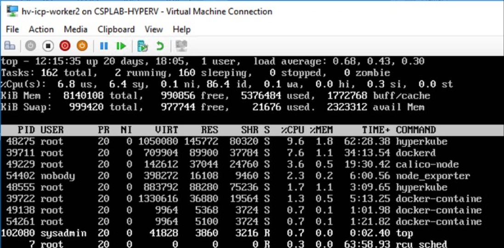

Note that 8GB of RAM is shown as provisioned, but more than 5GB is in use even though there are also no workloads running on this node either.

**WORKER3 - DMA Enabled**

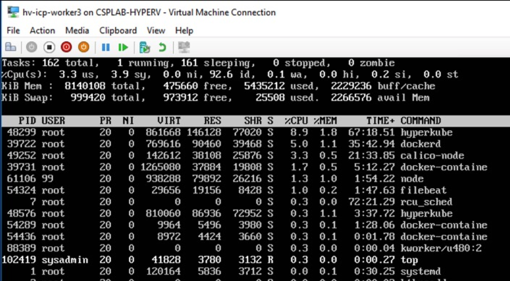

Note that worker3 is provisioned exactly like worker2 and is showing pretty much the exact same results.

## Swap configurations and note the changes

Next, we will swap the configurations of these worker nodes and enable DMA on worker1 and disable DMA on worker2.

After the settings change, it took a couple of minutes for the allocated memory to change on the newly DMA enabled node:

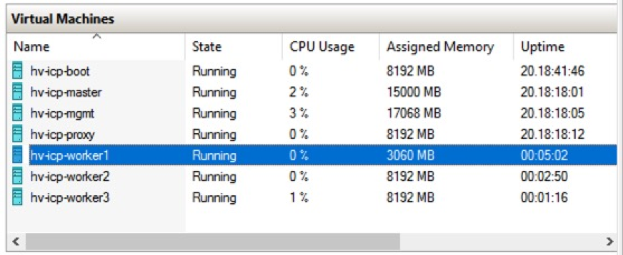

**WORKER1 - DMA Enabled**

Note that worker1 (DMA now enabled) now only has 3GB of assigned memory and workers 2 and 3 both have the full 8GB assigned (DMA now disabled).

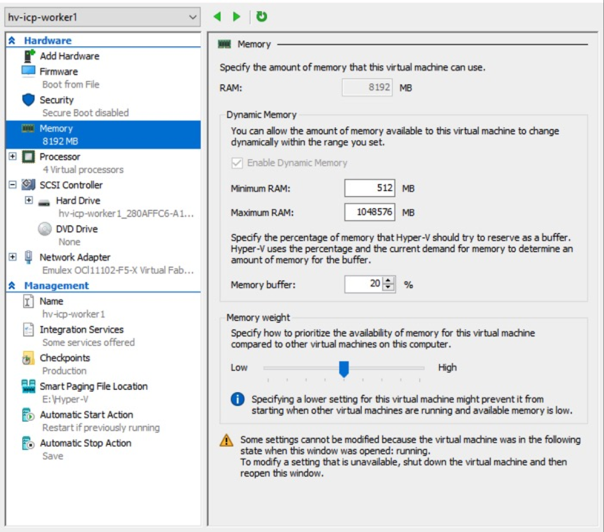

Note that now, worker1 with DMA enabled is now showing to have only about 1GB of free memory - still with no workloads running.

**WORKER2 - DMA Disabled**
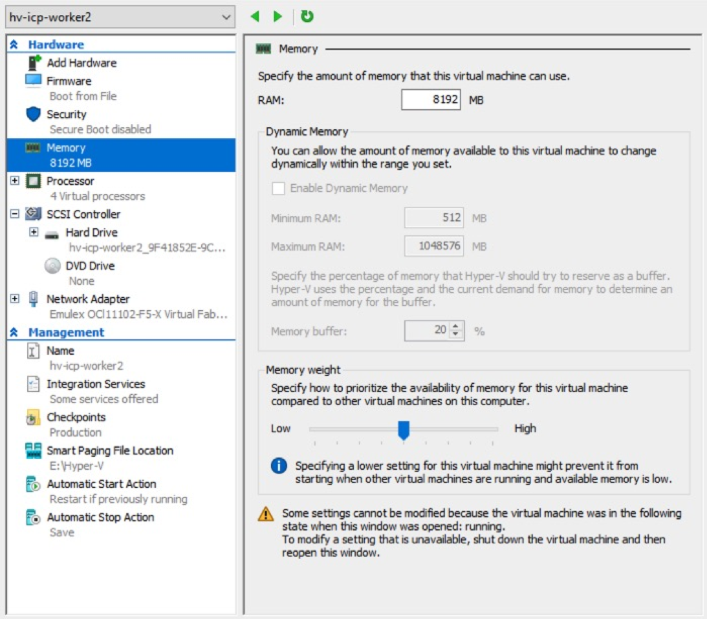

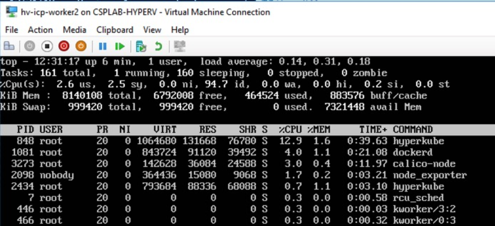

Note that worker2 now shows more than 6GB of free memory with no workloads with DMA disabled.

**WORKER3 - DMA disabled**
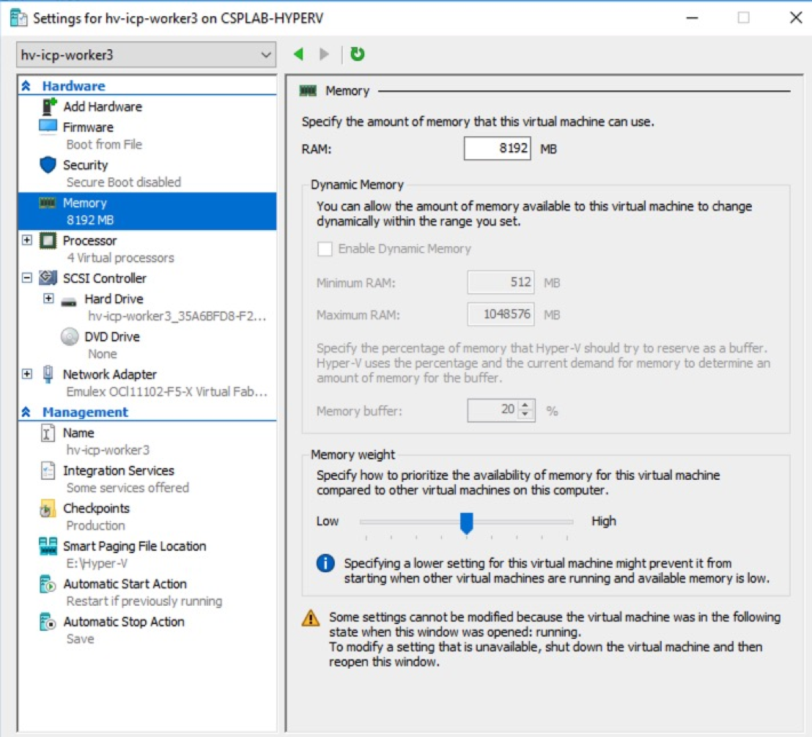

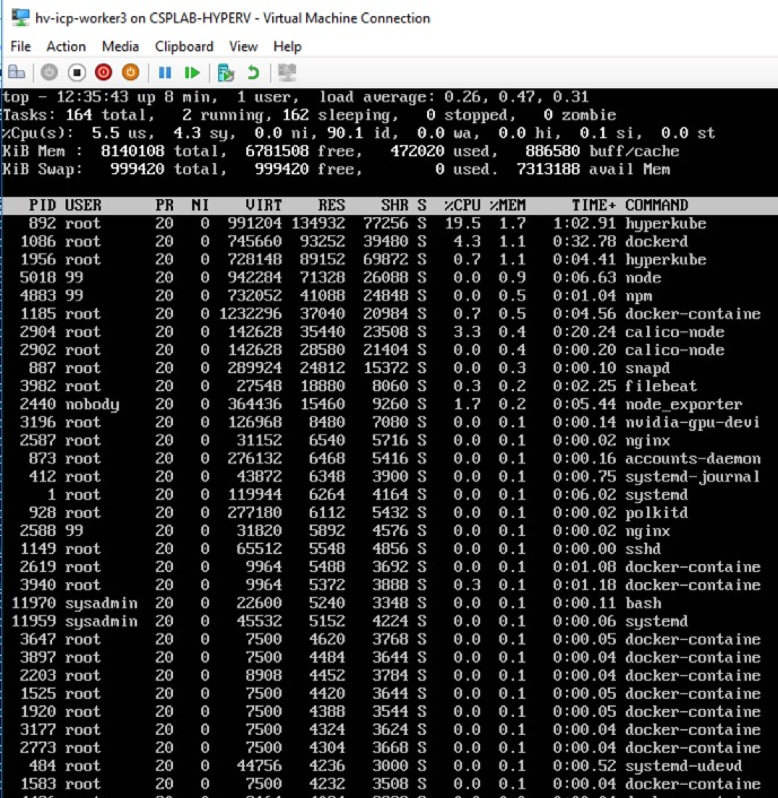

Worker 3 also shows more than 6GB available.

Also note that this top is sorted by memory utilization and total memory used by all processes using memory is <10% of the total memory assigned.

We see the exact same picture on worker1 which now shows only 1GB of memory to be free.

Looking at meminfo from two of the differently configured VMs shows the following:
")

Note the significant difference in the "MemAvailable" fields in these two nodes.

MemFree is the amount of physical RAM that is unused by the sytem.
MemAvailable is an estimate of how much memory is available for starting new applications without swapping.

The primary differences here are Active and Active(file):

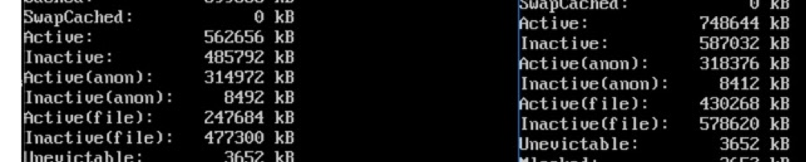

Active is anonymous memoryt hat has been used more recently and has not been swapped out
Active(file) is Pagecache memory (swap) that is not reclaimed until needed.

From reading the Microsoft docs about how DMA works, when active memory is reclaimed by the hypervisor, it essentially moves that memory over to swap on the hypervisor.  The memory is available to be access, but it will be slow because it must swap it back in from disk.

Based on the tests done here, we can see that when memory is deallocated from the VM by the hypervisor, it reports to the VM that that memory has been swapped out to disk and it shows up in /proc/meminfo as Pagecached memory.  This is why the amount of available memory on the DMA enabled nodes is significantly lower than the available memory on the DMA disabled nodes.

It should be noted that the value of startup RAM at the top of the memory configuration page is the value that is reported to linux as the total available memory:

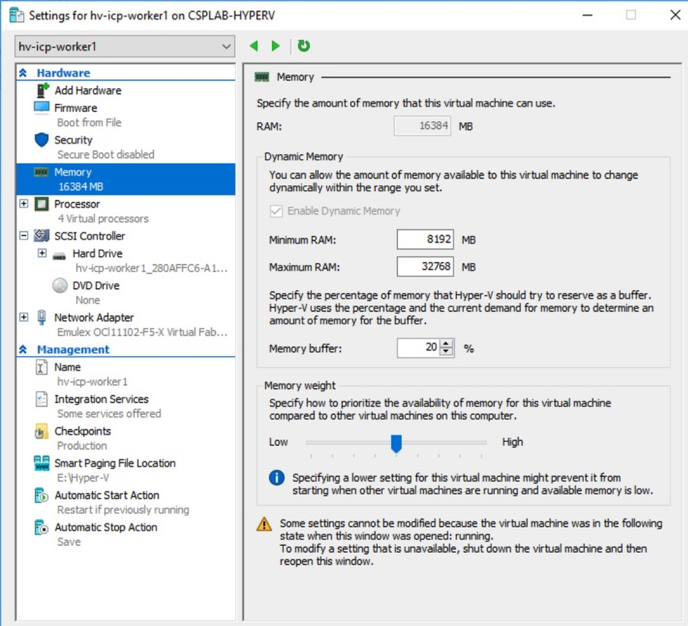
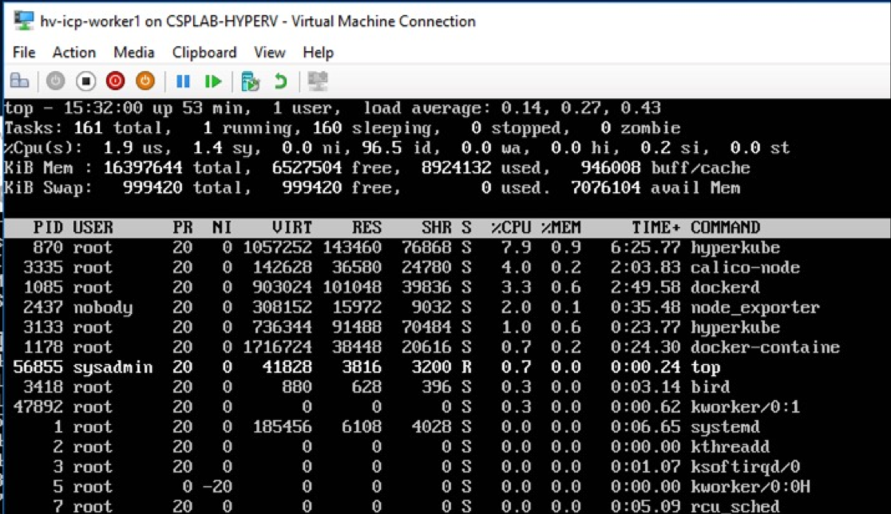

kubernetes will not attempt to allocate RAM beyond the total memory amount reported by /proc/meminfo or free -m.

As far as ICP is concerned, however, the total amount of available RAM remains the same (8GB), but, based on the Microsoft docs, any nodes which attempt to utilize memory which has been swapped out to disk will experience a performance hit as that memory is swapped back in from disk.  Once that happens, though, it should stay swapped in as the need has increased.

Based on my tests, it takes a couple of minutes for the hypervisor to determine that memory is not needed and start to deallocate it.  If the worker nodes' workload is fairly bursty and those bursts are more than about 3 minutes in between, the likelihood is that every time the burst happens you will have performance issues until the memory is fully swapped in.

## Recommandations based on these tests

* __Recommendation 1:__  Disable DMA in all ICP nodes so that performance is what is expected.
* __Recommendation 2:__  If DMA must be enabled, set the Startup RAM value to the value that ICP expects to be available on the node understanding that for bursty traffic (which is the nature of the cloud) performance could be limited to the speed of the disk cache and the maximum value will never be used and is irrelevant.  ICP will not attempt to provision more RAM than is reported available by the operating system (cat /proc/meminfo or free -m).  The amount of total memory available as reported by a linux operating system is the value in the startup RAM configuration.
