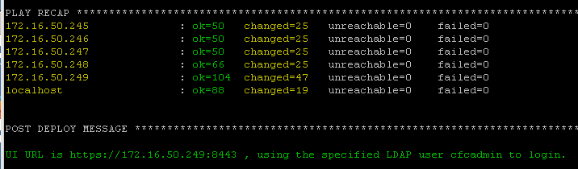
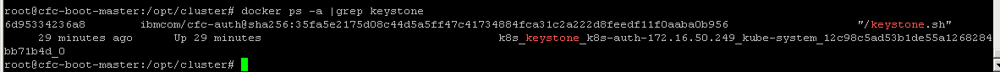
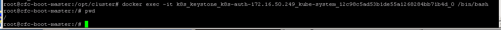
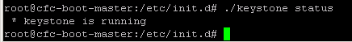

LDAP Best Practices
===================

IBM Cloud Private (ICP, formerly known as IBM Spectrum Conductor for
Containers) uses OpenStack’s Keystone as its Role Based Access Control
(RBAC) provider.

This means that, however sparse the information in the IBM Cloud Private
documentation, there is a lot more detail that can be found in the
OpenStack documentation. In ICP 1.2, the version of Keystone is 9.3.0
which equates to the Mitaka release.

At the time of this writing, OpenStack documentation for the identity
service (keystone) can be found at
<https://docs.openstack.org/mitaka/config-reference/identity/options.html>.
It is these options that we will use to configure LDAP integration with
ICP.

ICP does not support installing LDAP support after installation. If you
want to use LDAP authentication for your ICP environment you must
configure it at install time.

As an added note, I find it very useful to use ApacheDirectoryStudio to
help troubleshoot LDAP issues. At the time of this writing ADS can be
found at <http://directory.apache.org/studio/>.

Also please note that the minimal install does not filtering and when
complete will import all users it finds into keystone and make them all
available to be assigned to a namespace. If your organization has 10,000
users, you may not want this result.

For users doing an enterprise install with more than a few users, please
continue to the “Limiting the Scope” section prior to install.

Minimal Install
---------------

To enable LDAP authentication you must first modify the config.yaml and
add the following lines:

> ldap\_enabled: true\
> default\_admin\_user: cfcadmin\
> default\_admin\_password: password

ldap\_enabled instructs ICP to authenticate via LDAP.

default\_admin\_user is the valid user in the LDAP database which should
be used for the admin user in ICP. The default\_admin\_password value is
the password of the above named admin user. Note that if using the
user\_filter option described in the “Limiting the Scope” section below,
the user specified here must match the specified filter condition or you
will have no users who are able to successfully authenticate once the
installation is complete.

If ICP is installed without LDAP support, the default admin userid is
“admin” and the default password is “admin”. These values in the
config.yaml file will replace those and be placed in the default
namespace. It is these values that you should use for your first
post-installation login.

With these values set, we must now configure the keystone.ldap.conf
file. These values tell keystone how to interpret the LDAP database for
its purposes.

In this example we will use Microsoft Active Directory as our LDAP
provider and the values in the examples will be for that environment.

The first keyword that must be set is “url”. This is the URL for your
LDAP server:

> url = ldap://172.16.0.11

Next, we need to tell the service how to bind to the LDAP server so that
it can query for valid users. The keywords for this are user, and
password, respectively. The “user” value should be the BindDN:

> user = CN=administrator,CN=Users,DC=csplab,DC=local\
> password = &lt;password&gt;

It should be noted that this information is stored in plain text on the
keystone container in /etc/keystone/domains/keystone.ldap.conf.

Now, tell the identity service where to look for users

> suffix = DC=csplab,DC=local\
> user\_tree\_dn = CN=Users,DC=csplab,DC=local\
> user\_id\_attribute = sAMAccountName\
> user\_name\_attribute = sAMAccountName\
> user\_objectclass = person\
> user\_mail\_attribute = mail

suffix is the BaseDN – the root of the tree.

user\_tree\_dn is the location in the domain where users are defined. If
not specified, this will default to the value of “suffix” above.

user\_id\_attribute is the attribute that should be used for the userid
in ICP.

user\_name\_attribute is the attribute that will be used as the username
in ICP. This is the value that will be used in the “User ID” blank on
the login screen.

user\_objectclass is the type of object the user should be

user\_mail\_attribute is the attribute in the LDAP server where the
users email address is stored.

When these values are set, continue to install as the documentation
directs. If everything works correctly you should see something like
this following:

If authentication is successful, you can click on the menu icon at the
top left of the dashboard window and click on System to see a list of
users.

It should be noted that just because a user is listed in the user list
does not mean they can login. In order to login, a user must be assigned
to a namespace. In version 1.2, users (other than the admin user you
specified in config.yaml) are not assigned to namespaces by default.
When looking at the user list you will notice that each user (other than
the admin user) has a red box under the NAMESPACE column with the text
“Associate Namespace”.

To finish the authorization configuration, find the users to whom you
would like to provide access, click the red “Addociate Namespace”
button, and then select a namespace. That user will then be authorized
to login and see any resources associated with the specified namespace.

Since the only accessible namespace upon install is “default” and all
users in the default namespace are system administrators. It is a best
practice to create namespaces named after your various projects and then
assign users to those namespaces. All users assigned to a namespace are
“application administrators” for their assigned namespace.

\
Limiting the Scope
------------------

In my lab environment, the minimal implementation copied over 178 users.
The larger IBM company has close to 400,000 employees in its employee
database and most of those will not need access to this environment.

To limit the users who are sync’d with keystone use the “user\_filter”
keyword in the keystone.ldap.conf file:

> query\_scope = sub\
> user\_filter = (memberOf=CN=CfCUsers,CN=Users,DC=csplab,DC=local)

query\_scope tells keystone to search all subtrees.

The value of user\_filter is an LDAP search term which returns a list of
users in a specified group – in this case a group named “CfCUsers” in
the “CN=Users,DC=csplab,DC=local” subtree.

Specifying these parameters and installing should result in only those
users who are a member of that particular group being sync’d with
keystone.

Adding a user to the specified group in LDAP results in the user
immediately being available to be assigned to a namespace.

\
Troubleshooting
===============

When installation is complete attempt to login using the admin user you
specified in the config.yaml file.

Authentication happens within the keystone container. To find the name
of your keystone container execute “docker ps -a |grep keystone” on the
command line of the boot/master node.

The name of the container is in the last column and should begin with
k8s\_keystone\_k8s-auth followed by a representaion of the IP address of
the master node and a long string of random numbers and letters.

To login to the keystone container and gain a shell for executing
commands use the container name to execute the following:

`docker exec -it &lt;containername&gt; /bin/bash`

Executing a ‘pwd’ command will now show you to be at root (/) in the
keystone container:

Keystone configuration files are in /etc/keystone and the keystone
logfiles are in /var/log/keystone.

The keystone.ldap.conf file you created prior to installation is copied
into /etc/keystone/domains and you can check and modify values in that
file in that location.

To check the status of keystone execute “/etc/init.d/keystone status”.

You can also check the logs from the keystone container with the
command:

`docker logs &lt;keystone container&gt;`

To use watch the logs in real-time use the –follow parameter

`docker logs &lt;keystone container&gt; --follow`
