Introduction
============

This article shows how to implement a DevOps process for the IBM Cloud
private.

IBM Cloud private is IBM’s offering of providing a Kubernetes
environment in a private environment. You can find more information at:
[*http://www-01.ibm.com/common/ssi/ShowDoc.wss?docURL=/common/ssi/rep\_ca/6/897/ENUS217-356/index.html&lang=en&request\_locale=en*](http://www-01.ibm.com/common/ssi/ShowDoc.wss?docURL=/common/ssi/rep_ca/6/897/ENUS217-356/index.html&lang=en&request_locale=en)

Some concepts
=============

-   Kubernetes: [*https://kubernetes.io/*](https://kubernetes.io/)

-   Helm: [*https://docs.helm.sh/*](https://docs.helm.sh/)

Scenario
========

In this article, we are going to focus on deploying a Helm chart
(wordpress) to a Kubernetes environment, created through the
installation of IBM Cloud private.


Deploying the Application manually
==================================

First, we will deploy the application manually, using Helm. Run the
following command to configure helm:

```
  helm init
```

You will see the following output:

```
  Eduardos-MBP:process\_stock\_symbol edu\$ helm init

  \$HELM\_HOME has been configured at /Users/edu/.helm.

  Tiller (the helm server side component) has been installed into your Kubernetes Cluster.

  Happy Helming!
```

Now run the following command to deploy mysql:

```
    helm delete --purge my-wordpress

  helm install --name my-wordpress --set persistence.storageClass=default,mariadb.persistence.storageClass=default,serviceType=ClusterIP stable/wordpress
```  
You will see an output like this:

```
  Eduardos-MBP:\~ edu\$ helm install --name my-wordpress --set persistence.storageClass=default,mariadb.persistence.storageClass=default,serviceType=ClusterIP stable/wordpress

  NAME: my-wordpress

  LAST DEPLOYED: Wed Jul 19 14:43:10 2017

  NAMESPACE: default

  STATUS: DEPLOYED

  RESOURCES:

  ==> v1/Secret

  NAME TYPE DATA AGE

  my-wordpress-mariadb Opaque 2 1s

  my-wordpress-wordpress Opaque 3 1s

  ==> v1/ConfigMap

  NAME DATA AGE

  my-wordpress-mariadb 1 1s

  ==> v1/PersistentVolumeClaim

  NAME STATUS VOLUME CAPACITY ACCESSMODES STORAGECLASS AGE

  my-wordpress-wordpress Bound vol71 10Gi RWO slow 1s

  my-wordpress-mariadb Bound vol69 10Gi RWO slow 1s

  ==> v1/Service

  NAME CLUSTER-IP EXTERNAL-IP PORT(S) AGE

  my-wordpress-wordpress 10.0.1.210 &lt;none&gt; 80/TCP,443/TCP 1s

  my-wordpress-mariadb 10.0.1.206 &lt;none&gt; 3306/TCP 1s

  ==> v1beta1/Deployment

  NAME DESIRED CURRENT UP-TO-DATE AVAILABLE AGE

  my-wordpress-wordpress 1 1 1 0 1s

  my-wordpress-mariadb 1 1 1 0 1s

  NOTES:

  1\. Get the WordPress URL:

  export POD\_NAME=\$(kubectl get pods --namespace default -l "app=my-wordpress-wordpress" -o jsonpath="{.items\[0\].metadata.name}")

  echo http://127.0.0.1:8080/admin

  kubectl port-forward \$POD\_NAME 8080:80

  2\. Login with the following credentials to see your blog

  echo Username: user

  echo Password: \$(kubectl get secret --namespace default my-wordpress-wordpress -o jsonpath="{.data.wordpress-password}" | base64 --decode)
```  
Follow the instructions described above to access your Wordpress
environment.

Using Jenkins for DevOps
========================

First, we will use Jenkins for DevOps process and install it inside the
Kubernetes environment.

Here is the solution:

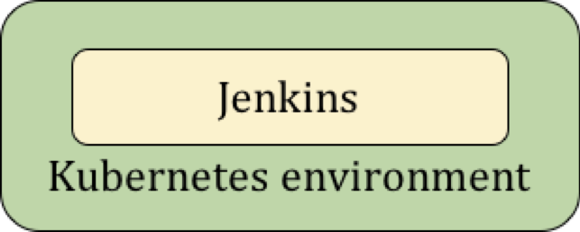

***The Jenkins image available in the IBM Cloud private App Center is already configured to execute Kubernetes command to the cluster.***


Installing Jenkins 
-------------------

Follow these steps to install Jenkins in your IBM Cloud private
environment:

-   Click **AppCenter**

-   Select **Jenkins for Linux**

And voila!

To access the Jenkins, server:

-   Click **Workloads → Applications**

-   In the Expose Details, click **access http:**

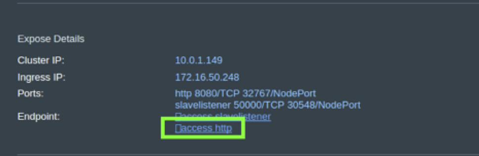

Log in using user: admin, pwd: admin

Using Jenkins for DevOps
------------------------

### Enable the executor in the Jenkins server

Before we can deploy an application through Jenkins, we need to enable
an executor in the Jenkins server.

Follow these steps in Jenkins:

-   Click Manage Jenkins

-   Click Manage Nodes

-   Select the Configure button next in the master line:\
    > 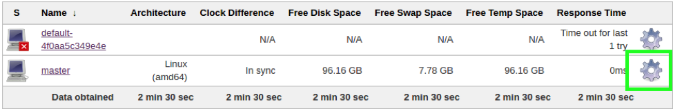

-   In the \# of executors, type 1

-   Click Save

Now that Jenkins is installed in your environment, let’s use it to
deploy a sample Helm chart

Deploy a chart using Jenkins
----------------------------

Inside Jenkins, follow these steps:

-   Click New Item

-   In the Enter an item name text field, type **wordpress**

-   Select Freestyle Project and click OK

-   Click the Build tab

-   Click Add build step

-   Select Execute shell

-   Type

```    

  curl https://raw.githubusercontent.com/kubernetes/helm/master/scripts/get &gt; get\_helm.sh

  chmod 700 get\_helm.sh

  ./get\_helm.sh -v v2.4.1

  helm init

  helm delete --purge my-wordpress

  helm install --name my-wordpress --set persistence.storageClass=default,mariadb.persistence.storageClass=default,serviceType=ClusterIP stable/wordpress
```  
-   Click Save

-   Back in the Project page, click Build Now:
    > 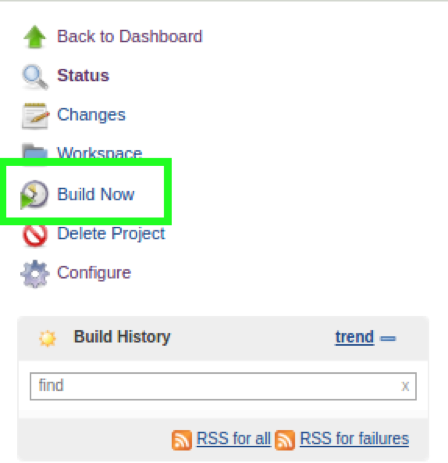

-   You will see in the Build history, a job created:
    > 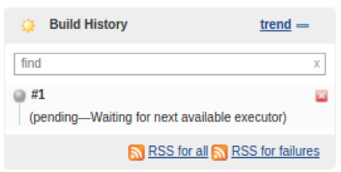

-   Click the latest Build 1

-   Click Console Output

-   You will see that mysql has been provisioned:
    > 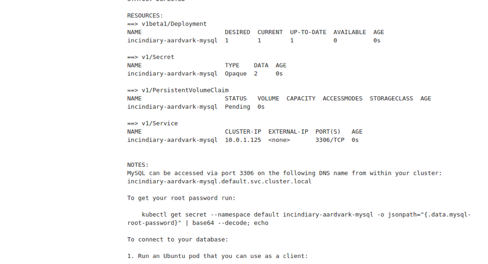

-   You can also validate that the Kubernetes deployment has been created in the IBM Cloud private UI, by going to the Applications area.

Using Jenkins outside the Kubernetes cluster
============================================

Although using the Jenkins application inside the Kubernetes cluster is
very convenient, you may want to integrate the process of deploying
application to IBM Cloud private in an existing Jenkins environment.

The following diagram shows the architecture:

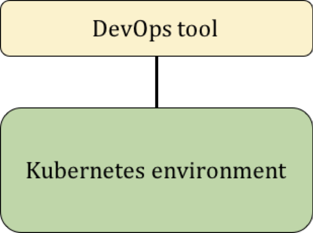


We will show you how to install Jenkins in a Docker container (outside
the Kubernetes environment). Certainly, you can follow the same
instructions for an existing Jenkins server.

Deploy Jenkins server
---------------------

Run the following command to deploy Jenkins to your Docker environment:

```
  docker run -p 8080:8080 -p 50000:50000 jenkins
```

And follow the output instructions to get access to your Jenkins
environment

### Install kubectl in the Jenkins server

Before we use Jenkins, we need to install helm to the Jenkins server.
Follow these steps:

-   Obtain the Docker Container ID:

```
  export CID=\`docker ps | grep jenkins | awk '{print \$1}'\`
```

-   Run the following command to access your Jenkins server (as root):

```
  docker exec -it -u root \$CID bash
```

-   Type the following commands:

```    
  curl -LO https://storage.googleapis.com/kubernetes-release/release/\$(curl -s https://storage.googleapis.com/kubernetes-release/release/stable.txt)/bin/linux/amd64/kubectl

  chmod +x ./kubectl

  mv ./kubectl /usr/local/bin/kubectl
```  

### Install helm in the Jenkins server

Still inside the Docker container bash, run the following commands:

```
  curl https://raw.githubusercontent.com/kubernetes/helm/master/scripts/get &gt; get\_helm.sh\
  sed 's/openssl sha/openssl sha1/' &lt; get\_helm.sh &gt;get\_helm1.sh\
  chmod 700 get\_helm1.sh\
  ./get\_helm1.sh -v v2.4.1
```

You will see the following output:

```
  root@9709204044b3:/\# ./get\_helm1.sh -v v2.4.1

  Downloading https://kubernetes-helm.storage.googleapis.com/helm-v2.4.1-linux-amd64.tar.gz

  Preparing to install into /usr/local/bin

  helm installed into /usr/local/bin/helm

  Run 'helm init' to configure helm.
```

### Obtain Kubernetes Client Configuration 

In the IBM Cloud private UI, follow these steps to obtain the Kubernetes
authentication token:

-   In the upper right side, click your user name:
    > 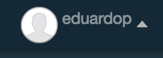

-   Click Configure Client

-   Save the commands described in the text area:\
    > 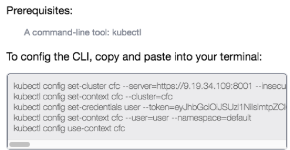

Deploy a chart using Jenkins
----------------------------

### Configure the build process

Inside Jenkins, follow these steps:

-   Click New Item

-   In the Enter an item name text field, type **wordpress**

-   Select Freestyle Project and click OK

-   Click the Build tab

-   Click Add build step

-   Select Execute shell

-   Paste the Kubernetes Client configuration, obtained in the previous step

-   Type

```  
  % Paste the Kubernetes Client configuration here

  %

  helm init

  helm install --name my-wordpress --set persistence.storageClass=default,mariadb.persistence.storageClass=default,serviceType=ClusterIP stable/wordpress
```  

-   Click Save

### Deploy the application

Still in Jenkins, follow these steps:

-   Select the wordpress application

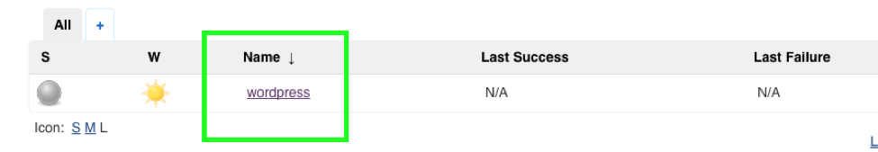

-   Select Build Now:
    > 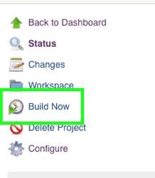

-   You will see a new build created in the Build History:
    > \
    > 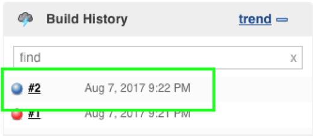

-   Click the Build number, and you will see the Console Output, like
    > this one:\
    > 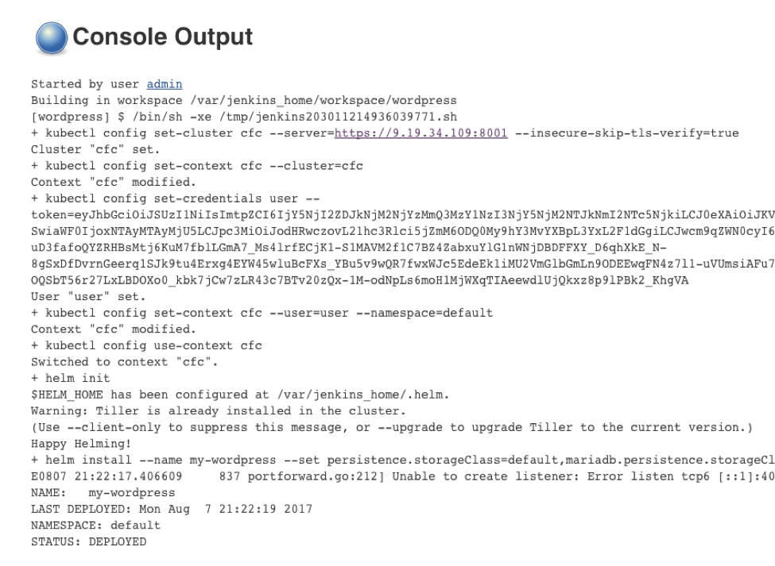

That’s it! You can now deploy an application using Jenkins inside or
outside your Kubernetes environment

Conclusion
==========

In this article, we described how to use Jenkins as the CI/CD tool for
deploying application to your Kubernetes environment.

We showed that the Jenkins server deploying to the Kubernetes
environment is already configured to deploy application, using helm. For
the Jenkins running outside the Kubernetes environment, we needed to
configure the Kubernetes to talk to the environment.
