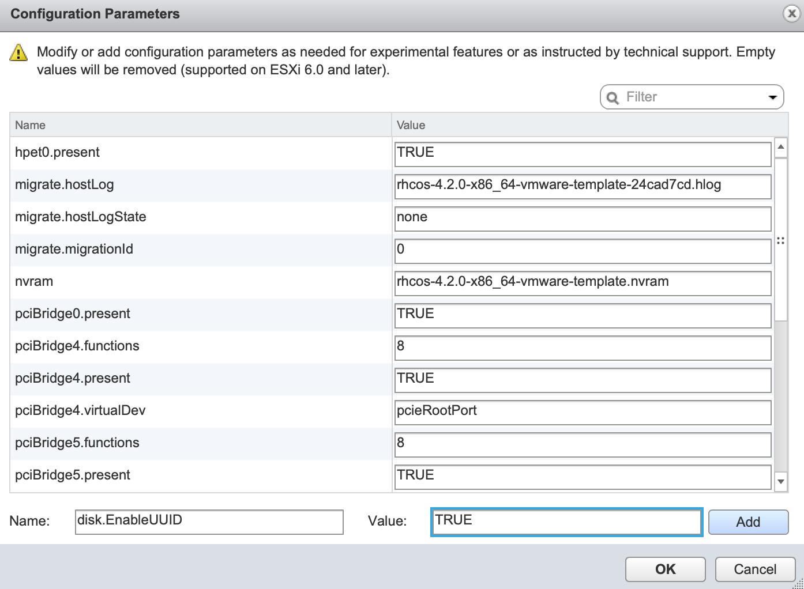

# User Provisioned Installation of Red Hat OpenShift 4.x on VMware Virtual Infrastructure

## Introduction
Installing OpenShift (OCP) 4.x requires a significant amount of pre-planning and infrastructure preparation.

In this guide we will install a small OpenShift 4.2 instance.  We will use an installation server with an embedded web server.  Our cluster will consist of a bootstrap node, 3 master nodes, 3 worker nodes, 2 load balancers.  The installation server and bootstrap server can be deleted when the installation is complete, however you may want to keep the installation server around for future installs.

Installation in a vmware environment includes the following basic steps:

1. Decide how many instances of each node type to install and determine the IP addresses for each node.

  In this guide we will use the following topology:
  
    1. Installation server (with webserver installed)
    1. 1 load balancer for the control control plane (master nodes)
    1. 1 load balancer for the compute nodes (worker nodes)
    1. Bootstrap node
    1. 3 control plane nodes (master nodes)
    1. 3 compute nodes (worker nodes)

1. Create an installation server with embedded web server (or reuse an existing server).
1. Download and deploy the rhcos template onto your vcenter server.
1. Download and explode the openshift installer onto your installation server.
1. Create the needed install-config.yaml file on your installation server.
1. Create the needed ignition files for your deployment
1. Deploy, but don't boot the bootstrap, control plane, and compute nodes.
1. Configure the DHCP server.
1. Create or configure a load balancer for the control plane
1. Create or configure a load balancer for the compute nodes.
1. Configure DNS to support your cluster
1. Configure persistent storage for your image registry
1. Complete installation
1. Login to your new cluster and configure authentication

We will discuss each of these in turn in the rest of this document.

## Preparation

### Create the Installation Server

1. Create a new virtual machine which is network accessible from the vCenter server.  Only the basic server packages are needed, no UI is needed.  This guide will assume this server is running RHEL 8.0.

1. Either register with subscription manager or create a local yum repository so needed packages can be installed.

1. Create a directory for your new cluster.  In this document I will use a cluster named after my userid `vhavard`.

  ```
  mkdir /opt/vhavard
  ```

1. Install the httpd web server

  ```
  yum install -y httpd
  ```

  This will create a document root of /var/www/html.  Create a softlink from the document root to your project directory.

  ```
  ln -s /opt/vhavard /var/www/html/vhavard
  ```

1.  Download the openshift client and installer and explode it into your /opt directory.

  ```
  cd /opt
  wget -c https://mirror.openshift.com/pub/openshift-v4/clients/ocp/latest/openshift-client-linux-4.2.0.tar.gz
  wget -c https://mirror.openshift.com/pub/openshift-v4/clients/ocp/latest/openshift-install-linux-4.2.0.tar.gz
  ```

  Or, if you are in the IBM Cloud Adoption Lab you can get it from:

  ```
  wget -c http://storage4.csplab.local/storage/ocp/4.2/openshift-client-linux-4.2.0.tar.gz
  wget -c http://storage4.csplab.local/storage/ocp/4.2/openshift-install-linux-4.2.0.tar.gz
  ```

  Explode the files into /opt
  ```
  gunzip -c openshift-client-linux-4.2.0.tar.gz |tar -xvf -
  gunzip -c openshift-instll-linux-4.2.0.tar.gz |tar -xvf -
  ```

  Now copy the `oc` and `kubectl` binaries into your path
  ```
  sudo cp oc /usr/local/bin/
  sudo cp kubectl /usr/local/bin
  ```

1. Create an ssh key for your primary user

  ```
  ssh-keygen -t rsa -b 4096 -N ''
  ```

  Accept the default location for the file.

1. Start the ssh agent

  ```
  eval "$(ssh-agent -s )"
  ```

1. Add your private key to the ssh-agent

  ```
  ssh-add ~/.ssh/id_rsa.pub
  ```

1. You will need a pull secret so your cluster can download the needed containers.  Get your pull secret from https://cloud.redhat.com/openshift/install/vsphere/user-provisioned and put it into a file in your /opt directory (e.g. pull-secret.txt).  You will need this in the next step.

1. In your project directory, create a file named `install-config.yaml` with the following contents:

  ```
  apiVersion: v1
  baseDomain: [ocp.csplab.local]
  compute:
  - hyperthreading: Enabled   
    name: worker
    replicas: 0
  controlPlane:
    hyperthreading: Enabled   
    name: master
    replicas: 3
  metadata:
    name: [vhavard]
  platform:
    vsphere:
      vcenter: [demo-vcenter.csplab.local]
      username: username
      password: password
      datacenter: [CSPLAB]
      defaultDatastore: [SANDBOX_TIER4]
  pullSecret: '[contents of pull-secret.txt]'
  sshKey: '[contents of ~/.ssh/id_rsa.pub]'
  ```

  Values in square brackets `[ ]` should be replaced by values for your installation.

  * baseDomain - You will access applications in your cluster through a subdomain of this domain which is named after your cluster.  For example, I use my userid (vhavard) as my cluster name, and my base domain is ocp.csplab.local, therefore, my cluster's domain will be vhavard.ocp.csplab.local.

  * metadata.name - This is the name of your cluster.

  * platform.vsphere.vcenter - This is the hostname or IP address of your vsphere server.

  * platform.vsphere.username - This is a valid user in vsphere with permissions to deploy vApps and add items to the datastore.

  * platform.vsphere.password - The password for the username specified above (this file will be deleted when the installer creates the ignition files).

  * platform.vsphere.datacenter - The datacenter under which files should be created.

  * platform.vsphere.defaultDatastore - The datastore on which files should be stored.  A storage class will be created on your openshift cluster for dynamic storage provisioning to this datastore.

  * pullSecret - The contents of the pull secret you got from the Red Hat URL noted above.

  * sshKey - The contents of ~/.ssh/id_rsa.pub

1. Create your manifest files

  **NOTE:** The file you created in the previous step (install-config.yaml) will be automatically deleted in the next steps.  If you want to keep it for future use, make a backup of it now or you will have to re-create it for each additional cluster you install.

  ```
  cd /opt
  ./openshift-install create manifests --dir=./vhavard
  ```

  Where dir is the name of your cluster - the directory you created in step 3 above.

1. This will create a number of .yaml files in a couple of directories which you can use to change the default installation of your cluster.

  Of particular note is the manifests/clustger-config.yaml file where you can chagne the default networking subnets.

  You will need to edit manifests/cluster-scheduler-02-config.yml file and change the value of spec.mastersSchedulable to false.

  This will make sure the cluster doesn't try to put your applications on master nodes.  Red Hat assumes that at some point in the future kubernetes will allow this and you may want to leave it true so you can use your control plane nodes as compute nodes as well.

1.  Create your ignition files

  **Note:** The installer will create ignition files from these manifest files and then delete the manifest files.  If you would like to keep a copy of these files, make a backup of them before taking the next step.

  ```
  cd /opt
  ./openshift-install create ignition-configes --dir=./vhavard
  ```

  Where vhavard is the name of your cluster just as in the previous step.

1. Create the `append-bootstrap.ign` File

The bootstrap.ign file is too large to be used when deploying the VMs as documented below so you will need to create a smaller file which will cause the VMware server to grab this file from the webserver you configured on the installation server.  Because we created a softlink for our project folder, the file is already accessible for download.  We just need to create the `append-bootstrap.ign` file for use when we deploy our bootstrap node.

  In your project folder (e.g. /opt/vhavard), create a new file named append-bootstrap.ign with the following contents:

  ```
  {
  "ignition": {
    "config": {
      "append": [
        {
          "source": "[http://172.18.1.30/vhavard/bootstrap.ign]",
          "verification": {}
        }
      ]
    },
    "timeouts": {},
    "version": "2.1.0"
  },
  "networkd": {},
  "passwd": {},
  "storage": {},
  "systemd": {}
  }
  ```

  Where `source` is the URL where the vCenter server can download the bootstrap.ign file (from your locally running web server).

1. The ignition files will need to be encoded into base64 strings so they can be placed in a form blank.  In the /opt/<project> directory (e.g. /opt/vhavard), encode master.ign, worker.ign, and append-bootstrap.ign into base64 strings.

  ```
  cd /opt/vhavard
  base64 -w0 append-bootstrap.ign > append-bootstrap.base64
  base64 -w0 master.ign > master.base64
  base64 -w0 worker.ign > worker.base64
  ```

### Create the RHCOS Template in vSphere

1. From any computer with a web browser, download the openshift 4.x vmware template and store it locally.

  **NOTE:** If you are in the Cloud Adoption Lab, this template will have already been created in the demo-vcenter server in the SANDBOX cluster with the filename `rhcos-4.x.x-x86_64-vmware-template`, where 4.x.x is the full version number (e.g. `rhcos-4.2.0-x86_64-vmware-template`).  You may use the correct template for the version of OCP you are deploying and skip this step altogether.

  ```
  wget -c https://mirror.openshift.com/pub/openshift-v4/dependencies/rhcos/4.2/latest/rhcos-4.2.0-x86_64-vmware.ova
  ```

  If you are in the IBM Cloud Adoption Lab (csplab), you can get the file from storage4:

  ```
  wget -c https://mirror.openshift.com/pub/openshift-v4/dependencies/rhcos/4.2/latest/rhcos-4.2.0-x86_64-vmware.ova
  ```

### Configure vCenter and Create your Cluster Nodes

You will need at the very least, 1 bootstrap node, and 3 control plane (master) nodes, and 2 compute (worker) nodes.  It is recommended that you use exactly 3 control plane nodes and a minimum of 2 compute nodes.

1. With a browser, login to your vCenter server.  You will need to create a folder directly under your datacenter with the same name as your cluster.  For example, my cluster name is `vhavard`, so under my datacenter (named CSPLAB, I created a folder named `vhavard`).

  

1. Find your previously uploaded rhcos template and create your bootstrap node.  Right-click on the template and click "New VM from this Template".

  

  1. On the `Select a name and folder` screen, name your VM so you know it's the bootstrap node (e.g. ocp-42-bootstrap), put it into the folder you created in the previous step and click 'Next'.

  1. On the next screen (`Select a compute resource`), select a compute resource location for your VM and click 'Next'.

  1. On the next screen (`Select storage`), choose the datastore you put in the `install-config.yaml` file in step 10 under the 'Create the Installation Server' section and click 'Next'.

  1. On the next screen (`Select clone options`), check the box to customize the virtual machine's hardware and click 'Next'.

  1. On the next screen (`Customize hardware`), set the CPU and Memory values appropriately based on the table below and make sure your network adapter is set to the correct network for your OCP cluster.  For the IBM Cloud Adoption Lab, this is the `OCP` network.

  | Node Type | CPU | Memory |
  |:---------:|:---:|:-------|
  | Bootstrap |  4  | 16Gi   |
  | Control   |  4  | 16Gi   |
  | Compute   |  2  | 8Gi    |

  1. Click the `VM Options` tab and expand the `Advanced` twistie.

    1. Next to `Configuration Parameters` click the `Edit Configuration...` button.

    1. At the bottom of the page next to `Name:` type `disk.EnableUUID` and next to `Value:` type `TRUE`. Then click the `Add` button and then the `Next` button.

    

  1. On the next screen (`Customize vApp properties`), you will have two blanks one named `Ignition config data encoding` and one named `Ignition config data`.

    1. In the `Ignition config data encoding` blank put `base64`.

    1. In the `Ignition config data` blank paste the base64 output from the bootstrap.b64 file.

      ```
      cat bootstrap.base64
      ```

      Copy the output from this file into your clipboard/paste buffer and then paste it into this blank.  Click `Next` and then `Finish`.

    This will result in a new VM being created at your specified location.  **Do not yet power on the VM.**

  1. Repeat these steps for each node in your cluster.  For the master/control plan nodes use the master.b64 ignition file and for the compute/worker nodes use the worker.b64 text.

### Provision two new VMs to use as External Load Balancers

  1. In the csplab, use the template named rhel80-cli-template in the sandbox datastore to instantiate two new VMs.  Otherwise, install any linux VM you choose, in your example, we will use RHEL 8.0.

  1. Name your VMs for their purpose, e.g. `ocp-42-control-lb`, `ocp-42-compute-lb`.

  1. Install the haproxy packages on the VMs

    ```
    yum install -y haproxy
    ```

  1. You will configure your load balancers when you get your IP addresses assigned.


### Note the MAC addresses for all of your VMs.

You will need to know the MAC address for each of the nodes you just created.

  1. In the vCenter client, locate each node you just created, select it, and on the right, click the `Configure` tab.

  1. Expand the `VM Hardware` tistie and under that, the `Network adapter 1` twistie.

  1. Make a note of the MAC address for each cluster node.

  

### CSPLAB: Request a new subnet for your cluster

  If you are deploying a cluster into the Cloud Adoption Lab's OCP environment you will need to be assigned a subnet.  Send an email to the csplab-admin mailing list to request the subnet.

  When you request your subnet, provide the MAC address for each of your cluster nodes including the 2 load balancers.

  The lab admins will configure the DHCP and DNS servers and router for your assigned subnet.

  If you are deploying into the CSPLAB you can ignore the steps `Configure DHCP Server` and `Configure DNS Server` sections.

### Configure the DHCP server

Each node will need to be added to the DHCP server so that it can get its IP address and hostname at boot time.

It is also possible to add this information to the ignition files, but doing so is out of the scope of this document.

If modifying ignition files, you must create a separate ignition file for each node rather than just one for each type of node.

See Appendix B for an example dhcpd.conf file.

If the nodes are on the correct network and the DHCP server is configured correctly, each node should boot with the IP address and hostname you configured for each node.

**IMPORTANT:** Make sure the hostname you specify for the node in the DHCP server is the same as the hostname you use for your DNS server where that is possible.

### Configure the DNS Server

Make the following DNS updates make sure the hostnames and IP addresses match the information specified in the DHCP server:

1. api.\<cluster_name\>.\<base_domain\>

  Points to the load balancer for control plane nodes (master nodes)

  e.g. **api.vhavard.ocp.csplab.local**

1. api-int.\<cluster_name\>.\<base_domain\>

  Points to the load balancer for the control lane nodes (master nodes).

  e.g. **api-int.vhavard.ocp.csplab.local**

1. \*.apps.\<cluster_name\>.\<base_domain\>

  Points to the load balancer for the compute nodes (worker nodes).

  e.g. **\*.apps.vhavard.ocp.csplab.local**

1. etcd-\<index\>.vhavard.ocp.csplab.local

  Points to each of the etcd nodes, respectively (master nodes, normally).

  e.g. </br>
      **etcd-0.vhavard.oc.csplab.local**</br>
      **etcd-1.vhavard.ocp.csplab.local**</br>
      **etcd-2.vhavard.ocplcsplab.local**

1. SRV Records

  For each control plane machine, OpenShift Container Platform also requires a SRV DNS record for etcd server on that machine with priority **0**, weight **10** and port **2380**. A cluster that uses three control plane machines requires the following records:

  ```
  # _service._proto.name.                            TTL    class SRV priority weight port target.
_etcd-server-ssl._tcp.<cluster_name>.<base_domain>  86400 IN    SRV 0        10     2380 etcd-0.<cluster_name>.<base_domain>.
_etcd-server-ssl._tcp.<cluster_name>.<base_domain>  86400 IN    SRV 0        10     2380 etcd-1.<cluster_name>.<base_domain>.
_etcd-server-ssl._tcp.<cluster_name>.<base_domain>  86400 IN    SRV 0        10     2380 etcd-2.<cluster_name>.<base_domain>.
  ```
e.g.

  ```
# _service._proto.name.                            TTL    class SRV priority weight port target.
_etcd-server-ssl._tcp.vhavard.ocp.csplab.local  86400 IN    SRV 0        10     2380 etcd-0.vhavard.ocp.csplab.local.
_etcd-server-ssl._tcp.vhavard.ocp.csplab.local  86400 IN    SRV 0        10     2380 etcd-1.vhavard.ocp.csplab.local.
_etcd-server-ssl._tcp.vhavard.ocp.csplab.local  86400 IN    SRV 0        10     2380 etcd-2.vhavard.ocp.csplab.local.
  ```

### Configure your haproxy nodes

Once you have IP addresses assigned for your load balancers, bootstrap node, control plane nodes, and compute nodes, you need to configure your load balancers.

If not already provided via the DHCP server, create static IP addresses for the load balancers.

1. Configure the control plane load balancer

  1. The control plane server should proxy ports 6443 and 22623 with the bootstrap server and all master nodes as backend targets.  The mode should be `tcp`.

  1. For an example configuration see Appendix C.

1. Configure the compute load balancer

  1. The compute server should proxy ports 443 and 80 with the compute/worker nodes as the backend servers.

  1. For an example configuration see Appendix C.

#### Boot your nodes

Once you have the load balancers, dhcp server, and dns server configured, you can boot your cluster nodes and they will come up and configure themselves based on the ignition files you provided.

1. Power on all nodes

  If you have everything configured properly, you should see the correct IP address for each node on the VMware console for each node, respectively.

1. Issue the following command and wait for a completed result:

```
[sysadmin@localhost opt]$ ./openshift-install --dir=./vhavard wait-for bootstrap-complete --log-level info
```

Anticipated result:

```
INFO Waiting up to 30m0s for the Kubernetes API at https://api.vhavard.ocp.csplab.local:6443...
INFO API v1.13.4+c2a5caf up                       
INFO Waiting up to 30m0s for bootstrapping to complete...
INFO It is now safe to remove the bootstrap resources
```

You can watch the installation progress by logging into the bootstrap server and use journalctl.

Because of the ssh key you provided in the install-config.yaml you can ssh directly to the bootstrap node without credentials:

```
ssh core@bootstrap.vhavard.ocp.csplab.local
```

Where bootstrap.vhavard.ocp.csplab.local is the hostname or IP address of your bootstrap server.

Once logged in, you can monitor progress with the following command:

```
journalctl -b -f -u bootkube.service
```

Installation normally take about 30 minutes.

If you do not get a completed result then you need to troubleshoot what is failing.  Watching the logs on the bootstrap server as noted above can give you information about what is failing.

You can also ssh to one of the master nodes and execute `journalctl -f` to watch the logfile for potential errors.

## Remove bootstrap server from conrol plane load balancer

Once the installation has successfully completed, you must login to the control plane load balancer and remove the bootstrap server from the list of backend servers and restart the haproxy service.

```
systemctl restart haproxy
```

When this is done you should be able to login to your new cluster.

## Login to the ocp cluster

From your installation machine where you installed the oc binary:

```
[sysadmin@localhost opt]$ export KUBECONFIG=/opt/vhavard/auth/kubeconfig
[sysadmin@localhost opt]$ oc whoami
system:admin
```

## Make sure all nodes are in Ready status

1. List all Nodes
```
[sysadmin@localhost opt]$ oc get nodes
NAME      STATUS   ROLES    AGE   VERSION
master1   Ready    master   50m   v1.13.4+12ee15d4a
master2   Ready    master   50m   v1.13.4+12ee15d4a
master3   Ready    master   50m   v1.13.4+12ee15d4a
worker1   Ready    worker   23m   v1.13.4+12ee15d4a
worker2   Ready    worker   22m   v1.13.4+12ee15d4a
worker3   Ready    worker   23m   v1.13.4+12ee15d4a
```

## Make sure all controllers are up

Once the initial boot is complete it will still take a short while for the cluster operators to complete their configuration.

Watch the following command until all operators except for image-registry are available.

```
watch -n5 oc get clusteroperators
```

When complete the output should look something like this:

```
$ watch -n5 oc get clusteroperators

NAME                                 VERSION   AVAILABLE   PROGRESSING   DEGRADED   SINCE
authentication                       4.2.0     True        False         False      69s
cloud-credential                     4.2.0     True        False         False      12m
cluster-autoscaler                   4.2.0     True        False         False      11m
console                              4.2.0     True        False         False      46s
dns                                  4.2.0     True        False         False      11m
image-registry                                 False       True          False      5m26s
ingress                              4.2.0     True        False         False      5m36s
kube-apiserver                       4.2.0     True        False         False      8m53s
kube-controller-manager              4.2.0     True        False         False      7m24s
kube-scheduler                       4.2.0     True        False         False      12m
machine-api                          4.2.0     True        False         False      12m
machine-config                       4.2.0     True        False         False      7m36s
marketplace                          4.2.0     True        False         False      7m54m
monitoring                           4.2.0     True        False         False      7h54s
network                              4.2.0     True        False         False      5m9s
node-tuning                          4.2.0     True        False         False      11m
openshift-apiserver                  4.2.0     True        False         False      11m
openshift-controller-manager         4.2.0     True        False         False      5m943s
openshift-samples                    4.2.0     True        False         False      3m55s
operator-lifecycle-manager           4.2.0     True        False         False      11m
operator-lifecycle-manager-catalog   4.2.0     True        False         False      11m
service-ca                           4.2.0     True        False         False      11m
service-catalog-apiserver            4.2.0     True        False         False      5m26s
service-catalog-controller-manager   4.2.0     True        False         False      5m25s
storage                              4.2.0     True        False         False      5m30s
```

## Configure Persistent Storage for the Image Registry

The image registry requires persistent storage with access mode of ReadWriteMany (RWX), however, the vSphere storage class does not support RWX.  There are two options, 1) do not use persistent storage, in which case an images placed in the registry are lost with each start, or 2) configure persistent storage which does support RWX (e.g. NFS).

1. Option 1 - Do not use persistent storage

If you just want to get the cluster up and running quickly, you can tell the image registry operator to not use persistent storage.  To do this, execute the following command:

```
$ oc patch configs.imageregistry.operator.openshift.io cluster --type merge --patch '{"spec":{"storage":{"emptyDir":{}}}}'
```

Your image-registry custer operator should complete its installation in a couple of minutes and your cluster will be usable.

2. Option 2 - Configure NFS for persistent storage

  1. In order to configure persistent storage for the image repositoryml you will need an NFS server configured to serve up NFS volumes.  Creation of an NFS server is beyond the scope of this document, however, to prevent problems, the exports for the mounted NFS volume should be specified with the following options:

  ```
  /storage	*(rw,no_subtree_check,sync,no_wdelay,insecure,no_root_squash)
  ```

  For security purposes, you could also create a separate entry for each control plane and compute node to ensure no other node can mount the directory.

  With an NFS mount available, next you will configure a storage class, a PV, and a PVC in your openshift cluster to consume it.

  1. To create the storage class create a file on your installation server named `sc.yml` with the following contents:

    ```
    kind: StorageClass
    apiVersion: storage.k8s.io/v1
    metadata:
      name: non-dynamic
    provisioner: no-provisioning
    parameters:
    ```

    Create the storage class by executing `oc create -f sc.yml`.  Your new storage class name is `non-dynamic`.

  1. Make your new storage class the default.

    By default, with a vSphere installation, vsphere storage is the default storage class.  If this isn't changed the image-registry operator will try to create a RWX volume on the vsphere datastore and it will fail.

    To remove the default flag for the `thin` (vsphere) storage class, execute the following command:

    ```
    oc patch storageclass thin -p '{"metadata": {"annotations": {"storageclass.kubernetes.io/is-default-class": "false"}}}'
    ```

    Next, you will need to set your newly created storage class as the default.  Do that by executing the following command:

    ```
    oc patch storageclass non-dynamic -p '{"metadata": {"annotations": {"storageclass.kubernetes.io/is-default-class": "true"}}}'
    ```

    Your new `non-dynamic` storage class is now the default.

  1. Create a file on the installation server named `pv.yml` with the following contents:

    ```
    apiVersion: v1
    kind: PersistentVolume
    metadata:
      name: [pv0001]
    spec:
      capacity:
        storage: 100Gi
      accessModes:
      - ReadWriteMany
      nfs:
        path: [/server]
        server: [10.x.x.138]
      persistentVolumeReclaimPolicy: Retain
      storageClassName: non-dynamic
    ```

    Replace `pv0001` with something more descriptive like `image-registry-pv`.

    Replace `spec.nfs.path` with the path on the NFS server to the volume to mount (e.g. `/storage`).

    Replace `spec.nfs.server` with the ip address of your nfs server.

    Deploy your PV to the clsuter with the following command:

    ```
    oc create -f pv.yml
    ```

  1. Create a file on the installation server named `pvc.yml` with the following contents.

    ```
    apiVersion: v1
    kind: PersistentVolumeClaim
    metadata:
      finalizers:
      - kubernetes.io/pvc-protection
      name: image-registry-storage
      namespace: openshift-image-registry
    spec:
      accessModes:
      - ReadWriteMany
      resources:
        requests:
          storage: 100Gi
    ```

    Deploy the PVC to the cluster with the following command:

    ```
    oc create -f pvc.yml
    ```

  1. Check to make sure your PVC is bound to your PV

    ```
    oc get pv --all-namespaces
    ```

    The result should show the PV bound to a PVC.

    ```
    [sysadmin@localhost vhavard]$ oc get pv --all-namespaces
    NAME         CAPACITY   ACCESS MODES   RECLAIM POLICY   STATUS   CLAIM                                             STORAGECLASS   REASON   AGE
    image-repo   100Gi      RWX            Retain           Bound    openshift-image-registry/image-registry-storage   non-dynamic             7h22m
    ```

  1. Last, configure the image-registry operator to consume the provisioned PVC edit the operator and set the storage values as specified:

  ```
  $ oc edit configs.imageregistry.operator.openshift.io

    storage:
      pvc:
        claim:
  ```
  Leave the value of `claim` blank.

  The result should look something like this:

    ```
    ...

    spec:
      defaultRoute: false
      httpSecret: 76c5cf9d7cd2684b7805495d1d31578009e035f0750dd2c5b79e57e2c6db1ce4e05d101b58e25feb00382a66044b76513d792f8628609b5d417ed2101b52a62c
      logging: 2
      managementState: Managed
      proxy:
        http: ""
        https: ""
        noProxy: ""
      readOnly: false
      replicas: 1
      requests:
        read:
          maxInQueue: 0
          maxRunning: 0
          maxWaitInQueue: 0s
        write:
          maxInQueue: 0
          maxRunning: 0
          maxWaitInQueue: 0s
      storage:
        pvc:
          claim:

        ...
    ```
  When this is complete, recheck your clusteroperator status to make sure the status becomes available.

  ```
  watch -n5 oc get clusteroperators
  ```

  After a minute or two all operators should show available.

  ```
  NAME                                       VERSION   AVAILABLE   PROGRESSING   DEGRADED   SINCE
  authentication                             4.2.0     True        False         False	  7h49m
  cloud-credential                           4.2.0     True        False         False	  8h
  cluster-autoscaler                         4.2.0     True        False         False	  7h55m
  console                                    4.2.0     True        False         False	  7h51m
  dns                                        4.2.0     True        False         False	  8h
  image-registry                             4.2.0     True        False         False	  7h24m
  ingress                                    4.2.0     True        False         False	  7h54m
  insights                                   4.2.0     True        False         False	  8h
  kube-apiserver                             4.2.0     True        False         False	  7h59m
  kube-controller-manager                    4.2.0     True        False         False	  7h57m
  kube-scheduler                             4.2.0     True        False         False	  7h58m
  machine-api                                4.2.0     True        False         False	  8h
  machine-config                             4.2.0     True        False         False	  8h
  marketplace                                4.2.0     True        False         False	  7h55m
  monitoring                                 4.2.0     True        False         False	  7h52m
  network                                    4.2.0     True        False         False	  7h57m
  node-tuning                                4.2.0     True        False         False	  7h55m
  openshift-apiserver                        4.2.0     True        False         False	  7h56m
  openshift-controller-manager               4.2.0     True        False         False	  7h58m
  openshift-samples                          4.2.0     True        False         False	  7h53m
  operator-lifecycle-manager                 4.2.0     True        False         False	  7h58m
  operator-lifecycle-manager-catalog         4.2.0     True        False         False	  7h58m
  operator-lifecycle-manager-packageserver   4.2.0     True        False         False	  7h57m
  service-ca                                 4.2.0     True        False         False	  8h
  service-catalog-apiserver                  4.2.0     True        False         False	  7h56m
  service-catalog-controller-manager         4.2.0     True        False         False	  7h56m
  storage                                    4.2.0     True        False         False	  7h56m
  ```

## Ensure cluster is up and ready

To complete your installation run the following command.  When the installation is complete it will output the credentials for the initial login to your new cluster.

```
cd /opt
./openshift-install --dir=./vhavard wait-for install-complete
```

The output should look something like this:

```
[sysadmin@localhost opt]$ ./openshift-install --dir=./vhavard wait-for install-complete
INFO Waiting up to 30m0s for the cluster at https://api.vhavard.ocp.csplab.local:6443 to initialize...
INFO Waiting up to 10m0s for the openshift-console route to be created...
INFO Install complete!                            
INFO To access the cluster as the system:admin user when using 'oc', run 'export KUBECONFIG=/opt/vhavard/auth/kubeconfig'
INFO Access the OpenShift web-console here: https://console-openshift-console.apps.vhavard.ocp.csplab.local
INFO Login to the console with user: kubeadmin, password: wSbzT-DCZCU-BRYF7-C7bXz
```

Login to your new cluster and enjoy!

# Appendix A - Example DNS Configuration

## named.conf.local

  ```
  //
  // Do any local configuration here
  //

  // Consider adding the 1918 zones here, if they are not used in your
  // organization
  include "/etc/bind/zones.rfc1918";

  zone "ocp.csplab.local" { type master; file "/etc/bind/db.ocp.csplab.local"; };
  zone "vhavard.ocp.csplab.local" { type master; file "/etc/bind/db.vhavard.ocp.csplab.local"; };
 zone "18.172.in-addr.arpa" { type master; file "/etc/bind/db.172.18"; };
```

## db.172.18

  ```
  $TTL    86400 ; 24 hours, could have been written as 24h or 1d
  ; $ORIGIN 172.IN-ADDR.ARPA.
  @    IN  SOA ns1.ocp.csplab.local.      root.ocp.csplab.local. (
                                11 ; serial
                                3H ; refresh
                                15 ; retry
                                1w ; expire
                                3h ; minimum
                               )
  ; Name servers for the zone - both out-of-zone - no A RRs required
         IN  NS ns1.ocp.csplab.local.
  ; Infrastructure
  $ORIGIN 0.18.172.IN-ADDR.ARPA.
  1        IN  PTR    gwy.ocp.csplab.local.
  9        IN  PTR    dhcp.ocp.csplab.local.
  10       IN  PTR    ns1.ocp.csplab.local.
  12       IN  PTR    ipam.ocp.csplab.local.
  $ORIGIN 1.18.172.IN-ADDR.ARPA.
  1       IN  PTR    gwy.vhavard.ocp.csplab.local.
  2       IN  PTR    master1.vhavard.ocp.csplab.local.
  3       IN  PTR    master2.vhavard.ocp.csplab.local.
  4       IN  PTR    master3.vhavard.ocp.csplab.local.
  5       IN  PTR    worker1.vhavard.ocp.csplab.local.
  6       IN  PTR    worker2.vhavard.ocp.csplab.local.
  7       IN  PTR    worker3.vhavard.ocp.csplab.local.
  8       IN  PTR    worker1.vhavard.ocp.csplab.local.
  9       IN  PTR    worker2.vhavard.ocp.csplab.local.
  10       IN  PTR    worker3.vhavard.ocp.csplab.local.
  11       IN  PTR    api-int.vhavard.ocp.csplab.local.
  11       IN  PTR    api.vhavard.ocp.csplab.local.
  12       IN  PTR    infra-lb.vhavard.ocp.csplab.local.
  29       IN  PTR    bootstrap.vhavard.ocp.csplab.local.
  30       IN  PTR    installer.vhavard.ocp.csplab.local.
  ```

## db.vhavard.ocp.csplab.local

  ```
  ;
  ; BIND data file for example.com
  ;
  $TTL    604800
  @       IN      SOA     vhavard.ocp.csplab.local. root.vhavard.ocp.csplab.local. (
                               3         ; Serial
                           604800         ; Refresh
                            86400         ; Retry
                          2419200         ; Expire
                           604800 )       ; Negative Cache TTL
          IN      A       172.18.0.10
  ;
  @       IN      NS      ns1.vhavard.ocp.csplab.local.
  @       IN      A       17.18.0.10
  @       IN      AAAA    ::1
  ns1     IN      A       172.18.0.10
  gwy     IN      A       172.18.1.1
  master1 IN      A       172.18.1.2
  master2 IN      A       172.18.1.3
  master3 IN      A       172.18.1.4
  worker1 IN      A       172.18.1.5
  worker2 IN      A       172.18.1.6
  worker3 IN      A       172.18.1.7
  infra1  IN      A       172.18.1.8
  infra2  IN      A       172.18.1.9
  infra3  IN      A       172.18.1.10
  control-lb      IN      CNAME   api
  infra-lb        IN      A       172.18.1.12
  bootstrap       IN      A       172.18.1.29
  installer       IN      A       172.18.1.30
  api     IN      A       172.18.1.11
  api-int IN      A       172.18.1.11
  *.apps  IN      A       172.18.1.12
  etcd-0  IN      A       172.18.1.2
  etcd-1  IN      A       172.18.1.3
  etcd-2  IN      A       172.18.1.4
  ; _service._proto.name.                         TTL   class SRV priority weight port target.
  _etcd-server-ssl._tcp.vhavard.ocp.csplab.local  86400 IN    SRV 0        10     2380 etcd-0.vhavard.ocp.csplab.local.
  _etcd-server-ssl._tcp.vhavard.ocp.csplab.local  86400 IN    SRV 0        10     2380 etcd-1.vhavard.ocp.csplab.local.
  _etcd-server-ssl._tcp.vhavard.ocp.csplab.local  86400 IN    SRV 0        10     2380 etcd-2.vhavard.ocp.csplab.local.
  ```

# Appendix B - Example DHCP configuration

## dhcpd.conf

  ```
  shared-network ocp {
  	option domain-name-servers 172.18.0.10;
  	subnet 172.18.1.0 netmask 255.255.255.224 {
  		option domain-name "vhavard.ocp.csplab.local";
  		option subnet-mask 255.255.255.224;
  		option routers 172.18.1.1;
  		option broadcast-address 172.18.1.31;
  		default-lease-time 86400;
  	}
  	subnet 172.18.0.0 netmask 255.255.255.224 {
  		option domain-name "ocp.csplab.local";
  		option subnet-mask 255.255.255.224;
  		option routers 172.18.0.1;
  		option broadcast-address 172.18.0.31;
  		default-lease-time 86400;
  		range 172.18.0.21 172.18.0.30;
  	}
  }

  host vhavard-control-lb {
  	hardware ethernet 00:50:56:a5:84:3f;
  	fixed-address 172.18.1.11;
  }

  host vhavard-infra-lb {
  	hardware ethernet 00:50:56:a5:bb:a9;
  	fixed-address 172.18.1.12;
  }

  host vhavard-installer {
  	hardware ethernet 00:50:56:a5:a8:95;
  	fixed-address 172.18.1.30;
  	option host-name "vhavard-installer";
  }

  host vhavard-bootstrap {
  	hardware ethernet 00:50:56:a5:74:91;
  	fixed-address 172.18.1.29;
  	option host-name "bootstrap";
  }

  host vhavard-master1 {
  	hardware ethernet 00:50:56:a5:22:5b;
  	fixed-address 172.18.1.2;
  	option host-name "master1";
  }

  host vhavard-master2 {
  	hardware ethernet 00:50:56:a5:1e:a7;
  	fixed-address 172.18.1.3;
  	option host-name "master2";
  }

  host vhavard-master3 {
  	hardware ethernet 00:50:56:a5:1d:8d;
  	fixed-address 172.18.1.4;
  	option host-name "master3";
  }

  host vhavard-worker1 {
  	hardware ethernet 00:50:56:a5:e9:14;
  	fixed-address 172.18.1.5;
  	option host-name "worker1";
  }

  host vhavard-worker2 {
  	hardware ethernet 00:50:56:a5:ef:d0;
  	fixed-address 172.18.1.6;
  	option host-name "worker2";
  }

  host vhavard-worker3 {
  	hardware ethernet 00:50:56:a5:f4:53;
  	fixed-address 172.18.1.7;
  	option host-name "worker3";
  }
  ```

# Appendix C - Example haproxy comfiguration

1. Control plane haproxy.conf

  ```
  global
      log         127.0.0.1 local2

      chroot      /var/lib/haproxy
      pidfile     /var/run/haproxy.pid
      maxconn     4000
      user        haproxy
      group       haproxy
      daemon

      # turn on stats unix socket
      stats socket /var/lib/haproxy/stats

      # utilize system-wide crypto-policies
      ssl-default-bind-ciphers PROFILE=SYSTEM
      ssl-default-server-ciphers PROFILE=SYSTEM

  #---------------------------------------------------------------------
  # common defaults that all the 'listen' and 'backend' sections will
  # use if not designated in their block
  #---------------------------------------------------------------------
  defaults
      mode                    http
      log                     global
      option                  httplog
      option                  dontlognull
      option http-server-close
      option forwardfor       except 127.0.0.0/8
      option                  redispatch
      retries                 3
      timeout http-request    10s
      timeout queue           1m
      timeout connect         10s
      timeout client          1m
      timeout server          1m
      timeout http-keep-alive 10s
      timeout check           10s
      maxconn                 3000

  #---------------------------------------------------------------------
  # main frontend which proxys to the backends
  #---------------------------------------------------------------------
  frontend api
      bind *:6443
      mode tcp
      default_backend             api

  frontend machine-config
      bind *:22623
      mode tcp
      default_backend		machine-config

  #---------------------------------------------------------------------
  # round robin balancing between the various backends
  #---------------------------------------------------------------------
  backend api
      mode tcp
      balance     roundrobin
      server  bootstrap 172.18.1.29:6443 check
      server  master1 172.18.1.2:6443 check
      server  master2 172.18.1.3:6443 check
      server  master3 172.18.1.4:6443 check

  backend machine-config
      mode tcp
      balance     roundrobin
      server  bootstrap 172.18.1.29:22623 check
      server  master1 172.18.1.2:22623 check
      server  master2 172.18.1.3:22623 check
      server  master3 172.18.1.4:22623 check
  ```

1. Compute haproxy.conf

  ```
  global
      log         127.0.0.1 local2
      chroot      /var/lib/haproxy
      pidfile     /var/run/haproxy.pid
      maxconn     4000
      user        haproxy
      group       haproxy
      daemon

      # turn on stats unix socket
      stats socket /var/lib/haproxy/stats

      # utilize system-wide crypto-policies
      ssl-default-bind-ciphers PROFILE=SYSTEM
      ssl-default-server-ciphers PROFILE=SYSTEM

  #---------------------------------------------------------------------
  # common defaults that all the 'listen' and 'backend' sections will
  # use if not designated in their block
  #---------------------------------------------------------------------
  defaults
      mode                    tcp
      log                     global
      option                  httplog
      option                  dontlognull
      option http-server-close
      option forwardfor       except 127.0.0.0/8
      option                  redispatch
      retries                 3
      timeout http-request    10s
      timeout queue           1m
      timeout connect         10s
      timeout client          1m
      timeout server          1m
      timeout http-keep-alive 10s
      timeout check           10s
      maxconn                 3000

  #---------------------------------------------------------------------
  # main frontend which proxys to the backends
  #---------------------------------------------------------------------
  frontend https
      bind *:443
      mode tcp
      default_backend             https

  frontend http
      bind *:80
      mode http
      default_backend             http

  #---------------------------------------------------------------------
  # round robin balancing between the various backends
  #---------------------------------------------------------------------
  backend https
      balance     roundrobin
      server  worker1 172.18.1.5:443 check
      server  worker2 172.18.1.6:443 check
      server  worker3 172.18.1.7:443 check

  backend http
      balance     roundrobin
      mode http
      server  worker1 172.18.1.5:80 check
      server  worker2 172.18.1.6:80 check
      server  worker3 172.18.1.7:80 check
  ```
