Installing CfC in an AWS EC2 Environment
========================================

Assumptions
-----------

1)  Security

    a.  The only node that needs an internet facing address is the
        master node. The default port for access to the CfC console is
        8443 and this port must be open in order for users to access
        the console. For security reasons, all non-master nodes will not
        have a permanent external (internet facing) address.

    b.  All TCP ports should be open between the internal interfaces on
        each of the nodes in the cluster.

    c.  Without an internet facing address, EC2 instances are be able to
        communicate with internet servers for installing such things as
        operating system packages and docker.\
        \
        Since instances assigned a public IP at instantiation cannot
        have that IP removed at a later time, we will create elastic IPs
        for the non-master nodes which can be assigned as needed for
        internet access and then removed when installation is complete.

2)  Access to each node will require the use of ssh keys. Use the same
    keypair for all nodes and configure your local ssh client (e.g.
    putty) to use these keys.\
    \
    Note that when you create an ssh key pair in AWS EC2, it will
    automatically start the download of a .pem file through
    your browser. To use this file with putty you must use the puttygen
    utility to import the .pem file and save as a .ppk (private key)
    file. Then you can use the SSH-&gt;Auth menu item in putty to
    specify the .ppk file you should use to attach to your instance.\
    \
    See Appendix A for more information.

3)  This tutorial will walk through creating an IBM Spectrum Conductor
    for Containers (CfC) instance on AWS made up of a single node for
    boot and master (hereafter referred to as the “master node” but also
    fulfilling the role of boot node), one node for the proxy node, and
    three worker nodes. The nodes will be named cfc-boot-master,
    cfc-proxy, cfc-worker1, cfc-worker2, and cfc-worker3, respectively.

\
Creation of Nodes
-----------------

The first server will be the boot and master node and will be created
separately from the others because it needs a permanent public IP for
access to the console by the users.

On the EC2 dashboard, click the “Launch Instance” button.

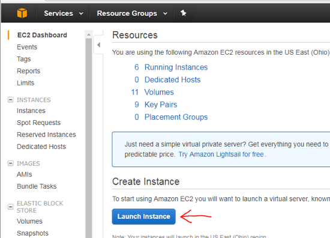

On the “1. Choose AMI” tab, choose Ubuntu 16.04 LTS.

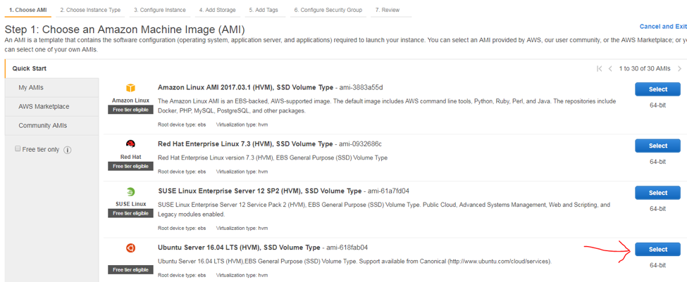

On the “2.Choose Instance Type” tab, choose the t2.medium flavor for all
servers

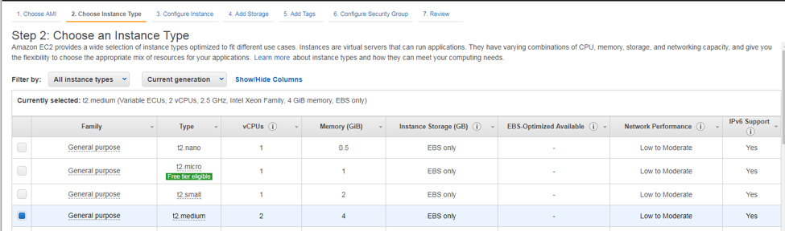

The worker nodes need not be this large, so we will first create only
this single node and will repeat the process to create the worker nodes.

Leave “3. Configure Instance” at the default settings ensuring you are
creating only one instance and that “Auto-assign Public IP” is enabled
(the default subnet setting).

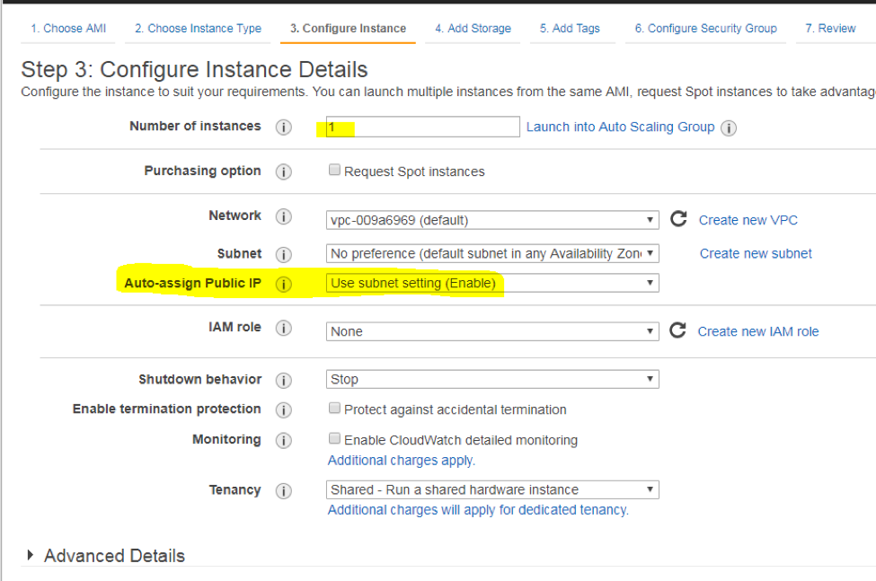

On the “4. Add Storage” tab change the size of the disk to 40GB. This is
to allow adequate space for the elasticsearch logs.

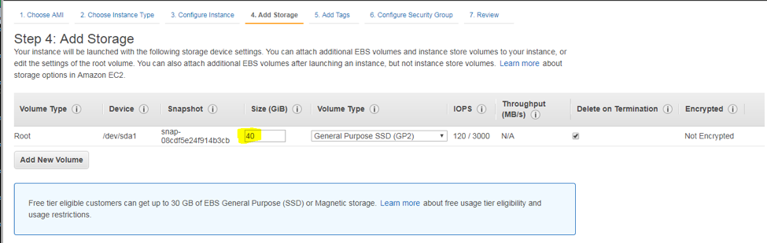

Optionally, on the “5. Add Tags” tab, add some tags to help you identify
your environment. These tags can be used to filter on the dashboard so
you can see only the instances created for this project.

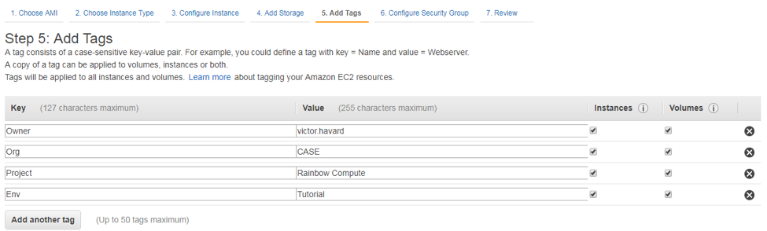

On the “6. Configure Security Group” tab, add additional rules to allow
inbound traffic to port 8443 from anywhere (or from your home or
workplace internet gateway to restrict who can access the admin console)
and inbound TCP traffic from all other nodes in the cluster to the
master node.

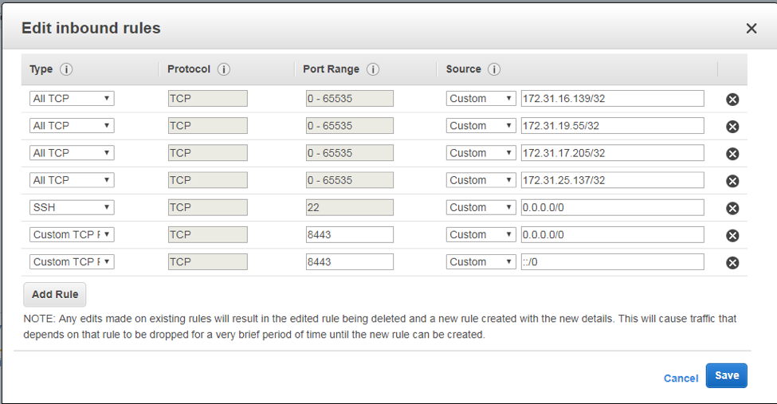

On the “7. Review” tab, click the blue “Launch” button at the bottom
right.

Select an existing keypair create a new one can click the blue “Launch
Instances” button.

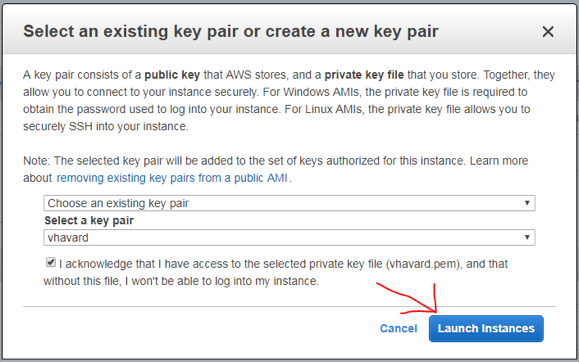

In the instance window, find and mouse over the “Name” column in the row
of your newly created instance to make the pencil icon visible and then
click it to give your instance a name so you can easily recognize it
later.

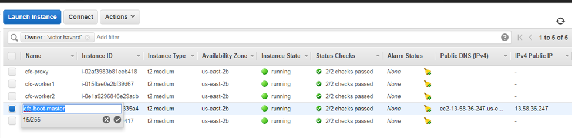

Repeat this process to create the proxy and worker nodes.

And under the “3. Configure Instance” tab, change the number of
instances to 4. And change the “Auto-assign Public IP” value to
“Disable”.

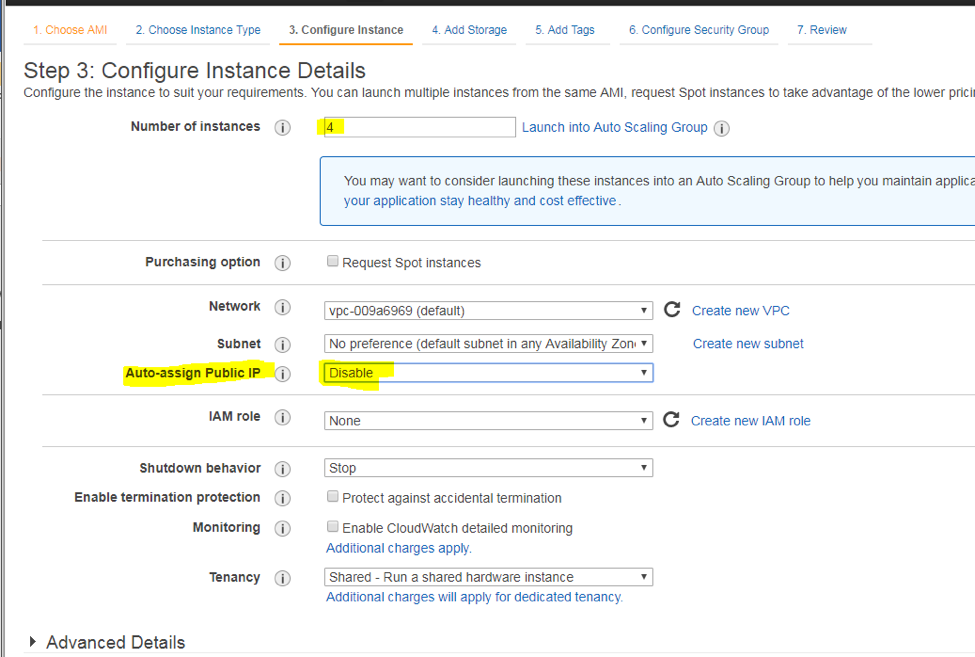

On the “4. Add Storage” tab, you can leave the size of the storage at
the default. Storage for applications will be provided via NFS. This
storage just needs to be large enough for the operating system, docker,
etc.

On the “6. Configure Security Group”, all nodes need to have all inbound
ports opened from the master node.

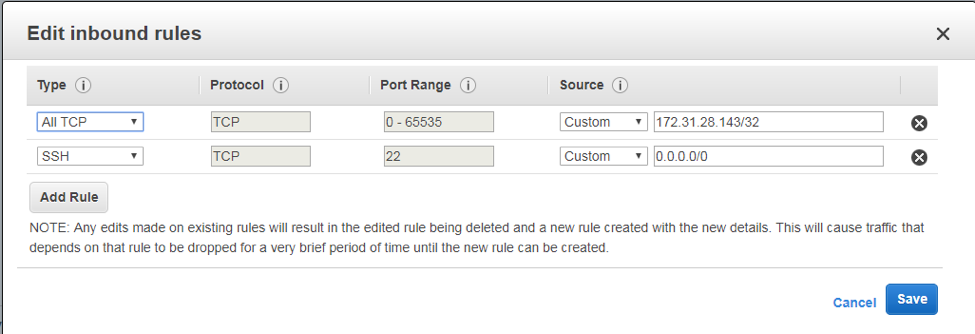

On the “7. Review” tab, click Launch, select your keypair, and then
update the name of your instances so you can easily find them later.

When you are done you should have 5 instances in a running state each
labeled for the function they will perform.

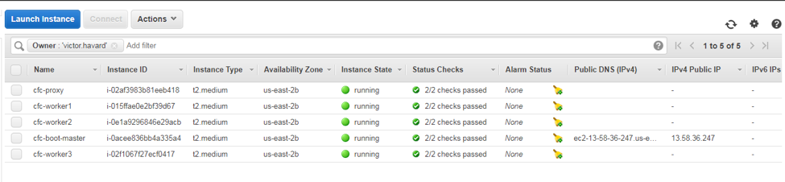

For the needed packages to be installed, the proxy and worker nodes need
a temporary public IP address.

On the EC2 dashboard, click on Network & Security -&gt; Elastic IPs,
then click on the “Allocate New Address” button at the top.

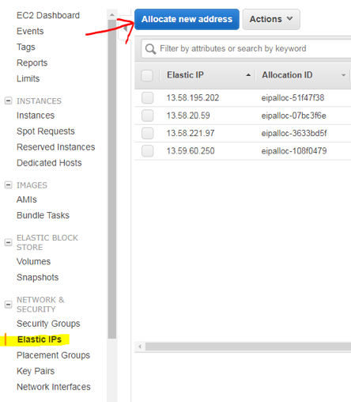

On the following screen click “Allocate”.

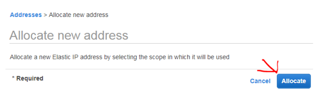

You should get a confirmation screen, just click “Close”.

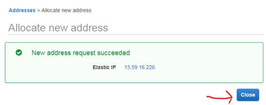

Next, you need to associate this address with an instance. On the
elastic IP address dashboard, choose an address and then click on
“Actions -&gt; Associate Address“.

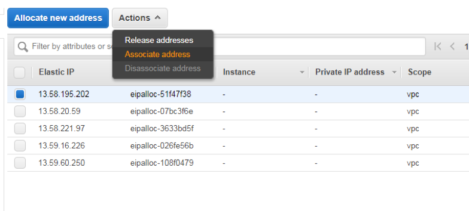

Choose an instance which which to associate this IP address

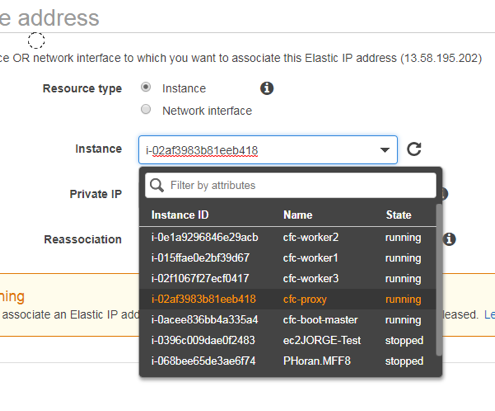

Then chose the internal IP address that should be associated with this
public IP address.

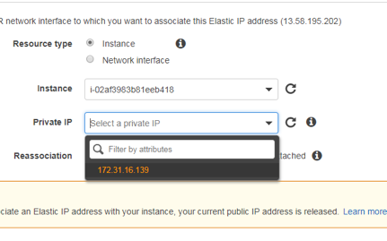

Then click “Associate” at the bottom left, and then “Close” on the
following screen.

Repeat this process until all of your nodes has a public IP assigned.

On your instances dashboard, you should now see the public IP assigned
to each instance.

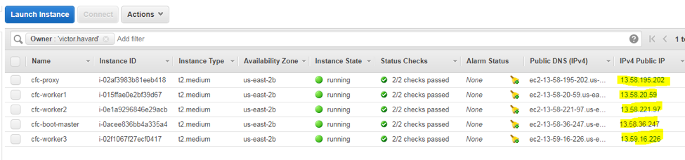

You are now ready to prepare your environment for CfC installation.

Preparing your environment for CfC installation
-----------------------------------------------

Using your preferred SSH client attach to each node in a separate
window. The public IP of each node can be found in the EC2 dashboard
under “Instances-&gt;Instances” as shown in the screenshot above.

Login as the “ubuntu” user using the keypair you specified to be
associated with your instances when you launched them.

For this tutorial, we will use PuTTY as our SSH client. In PuTTY,
highlighting text will automatically copy that text to the clipboard and
right-clicking on another PuTTY window will paste it into that window.
This makes replicating commands in multiple instances very easy.

**The** **following instructions should be completed on each node**
(cfc-boot-master, cfc-proxy, cfc-worker1, cfc-worker2, and cfc-worker3).

All commands will be run as the root user. To gain access to a root
shell execute the command “sudo su –“.

1)  First, we need to know the internal IP addresses of each node in
    the cluster. On the EC2 dashboard, select each instance in turn and
    look at the detailed information in the bottom pane for “Private
    IPs”.\
    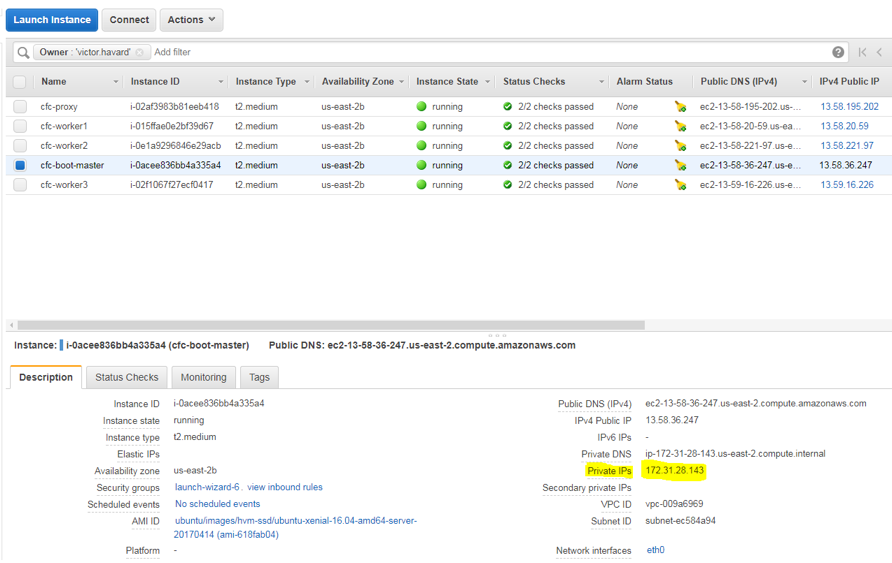
    
> Make note of the private IP address of each instance.

1)  Change the hostname of each node to represent the function. The
    instance you named cfc-boot-master should also have a hostname of
    cfc-boot-master, and so on.\
    \
    To change the hostname execute the “hostname &lt;newhostname&gt;”
    command.\
    hostname cfc-bmp\
    \
    Edit the /etc/hostname file and replace the default value with
    “cfc-bmp”\
    {width="3.2243055555555555in"
    height="0.5430555555555555in"}\
    \
    Edit the /etc/hosts file to specify an IP address and hostname for
    each node (instance) in your cluster.\
    {width="2.870833333333333in"
    height="1.6465277777777778in"}\
    \
    If you exit the root shell and log back in (with “sudo su –“) you
    will see the hostname reflected on your command line and, if you are
    using PuTTY, the title of the window will also be updated to make it
    easier for you to tell one node from another.

> {width="1.7930555555555556in"
> height="0.9222222222222223in"}

1)  Install NTP to ensure all nodes stay in time sync\
    apt-get install -y ntp

2)  Update the vm.max\_map\_count setting to 26214\
    \
    sysctl -w vm.max\_map\_count=262144\
    echo “vm.max\_map\_count=262144” &gt;&gt; /etc/sysctl.conf\
    \
    {width="3.654861111111111in"
    height="0.49166666666666664in"}\
    \
    Check the value with the command “sysctl vm.max\_map\_count”.\
    {width="2.0347222222222223in"
    height="0.3013888888888889in"}

3)  Install docker

    a.  Make sure your repository information is up-to-date\
        apt-get update

    b.  Install the linux image extra virtual package\
        apt-get install -y linux-image-extra-virtual

    c.  Install the additional required packages\
        apt-get install -y apt-transport-https ca-certificates curl
        software-properties-common

    d.  Add Docker’s official GPG Key\
        curl -fsSL https://download.docker.com/linux/ubuntu/gpg |
        apt-key add -

    e.  Verify that the key fingerprint is\
        9DC8 5822 9FC7 DD38 854A E2D8 8D81 803C 0EBF CD88\
        \
        apt-key fingerprint 0EBFCD88\
        \
        {width="3.68125in"
        height="0.7152777777777778in"}

    f.  Setup the docker stable repository\
        add-apt-repository “deb \[arch=amd64\]
        https://download.docker.com/linux/ubuntu \$(lsb\_release -cs)
        stable”

    g.  Install docker

> apt-get update id="_Hlk485217153" class="anchor">\
> apt-get install -y docker-ce

a.  Makes sure docker is working

> docker run hello-world

a.  If this doesn’t work, you will need to do some troubleshooting

<!-- -->

1)  Install docker.py\
    apt-get install -y python-setuptools\
    easy\_install pip\
    pip install docker-py&gt;=1.7.0

2)  Setup passwordless SSH from the master node to the proxy node and
    all three worker nodes

    a.  From root’s home directory on the master node create ssh keys.
        In the following command the P is upper case and the ‘’ are two
        single quotes:\
        \
        cd \~\
        ssh-keygen -t rsa -P ‘’\
        \
        Accept the default location for the new files.\
        \
        {width="2.5430555555555556in"
        height="1.56875in"}

    b.  Update the /root/.ssh/authorized\_keys file on each node
        (master, proxy, and all worker nodes) with the value of
        /root/.ssh/id\_rsa.pub on the master node. Note that there will
        already be a file there with existing content from AWS. Replace
        the contents of this file with the contents from the
        \~/.ssh/id\_rsa.pub file on the master node.\
        \
        On the master node, cat the value of /root/.ssh/id\_rsa.pub to
        the screen and copy it to the clipboard (Note that some of the
        text here is intentionally obscured).\
        {width="4.017361111111111in"
        height="0.81875in"}\
        \
        Paste that value into each other node’s
        /root/.ssh/authorized\_keys file, replacing the existing
        contents.\
        \
        On the master node, you can just change to root’s .ssh directory
        and copy the id\_rsa.pub file over the authorized\_keys file.\
        \
        cd \~/.ssh\
        cp id\_rsa.pub authorized\_keys

    c.  When this is complete, the root user on the master node should
        be able to ssh to each node (including itself) without the need
        for a password. Note that on the first attempt, the system will
        require you to confirm the authenticity of the host. If you
        answer yes, it will add the master node to the list of known
        hosts and this will not be required again in the future.\
        \
        {width="3.5861111111111112in"
        height="1.836111111111111in"}

> Your instances are now configured and ready to install CfC

\
Install IBM Spectrum Conductor for Containers
---------------------------------------------

**NOTE: The following commands are only executed on the master**
**node.**

1)  Make sure docker is running\
    systemctl status docker\
    \
    {width="3.6118055555555557in"
    height="1.8881944444444445in"}\
    \
    If it is not running start it\
    systemctl start docker

2)  Pull the CfC installer docker image from the repository\
    docker pull ibmcom/cfc-installer:1.1.0\
    \
    {width="3.404861111111111in"
    height="1.198611111111111in"}

3)  **IMPORTANT:** Change to the /opt directory\
    cd /opt

4)  Extract the configuration files\
    \
    docker run -e LICENSE=accept –rm -v “\$(pwd)”:/data
    ibmcom/cfc-installer:1.1.0 cp -r cluster /data\
    \
    You should now have a subdirectory under /opt named “cluster”

5)  Change to the /opt/cluster directory and edit the configuration
    files as needed for the install\
    \
    cd /opt/cluster

    a.  Edit the /opt/cluster/hosts file to specify the correct
        **internal** IP addresses of each node in your cluster.\
        \
        {width="2.672222222222222in"
        height="1.301388888888889in"}

    b.  Copy the value of /root/.ssh/id\_rsa over the ssh\_keys file and
        make sure the file permissions for the ssh\_key file is 400.\
        cp /root/.ssh/id\_rsa /opt/cluster/ssh\_key\
        chmod 400 /opt/cluster/ssh\_key

    c.  Make any needed changes to the config.yml file. For our purposes
        we will leave these values at their defaults. However, if either
        of the *network\_cidr* or *service\_cluster\_ip\_range* values
        conflict with any network defined in your environment, they must
        be changed. Since the only defined network in our AWS EC2
        environment is 172.16.0.0/20, we have no conflicts with either
        of these subnet definitions.

> {width="2.3965277777777776in"
> height="0.7583333333333333in"}\
> \
> To see which subnets are defined in your environment you can execute
> the “netstat -arn” command on the master node and check for any
> existing routes to these subnets. If any exist, then you will need to
> change these values to something that does not yet exist, otherwise,
> you can leave them at their defaults.

1)  Deploy your environment

    a.  **IMPORTANT**: Make sure to launch the deployment from the /opt
        directory\
        cd /opt

    b.  Launch the installer\
        docker run -e LICENSE=accept –net=host –rm -t -v
        “\$(pwd)/cluster”:/installer/cluster \\\
        ibmcom/cfc-installer:1.1.0 install

    c.  About 10 minutes later your environment is installed.

    d.  Login with https to the external IP address of your master node
        on port 8443. E.g. https:// 1.2.3.413.58.36.247:8443. The
        default userid is “admin” (without the quotes), and the default
        password is “admin” (without the quotes).\
        \
        {width="3.0430555555555556in"
        height="2.4569444444444444in"}

2)  With all installation and configuration complete, you can now
    disassociate your elastic IPs from your proxy and worker nodes. On
    the instance dashboard, select a node, then click on
    Actions-&gt;Networking-&gt;Disassociate Elastic IP Address.\
    \
    {width="6.5in" height="1.8534722222222222in"}\
    On the following screen click “Yes, Disassociate”.

3)  Repeat this for all of your elastic IPs.

4)  When you are done, only your master node should have an external IP
    address\
    {width="6.5in" height="1.4826388888888888in"}

\
Installing an NFS server for persistent storage
-----------------------------------------------

Now that you have a working CfC environment, you will need persistent
storage. In this tutorial we will create an NFS server to be used by CfC
for this purpose.

Following the same directions as above, create a new instance.

On the “2. Choose and Instance Type” tab, choose the “t2.small” flavor.

On the “3. Configure Instance” tab, disable “Auto-assign Public IP”.

On the “4. Add Storage” tab, keep the first 8GB disk for the operating
system add a second larger disk a part of which can be used for NFS
storage. For this example we will add an additional 50GB volume.

We will also set the volume to be deleted on termination so we don’t
have unused storage laying around costing us more money when we are no
longer using this environment.

If you want to ensure no data gets lost between installations or if you
want to plan for the future where you might want to attach this same
disk to a different instance, you may want to leave the “Delete on
Termination” checkbox unchecked.

{width="6.508333333333334in" height="1.68125in"}

On the “6. Configure Security Group” tab, allow all traffic from all
nodes in the cluster to the NFS server, specifying the internal
(private) IP address for each node.

{width="6.5in" height="2.3534722222222224in"}

On the “7. Review” tab, click the Launch button and choose your existing
SSH keys to deploy your new instance.

When the Instance is provisioned name your new instance “cfc-nfs” and
using the same procedure as before, assign it an elastic IP address.

SSH to your new instance using the elastic IP you just assigned and the
SSH key you specified when you launched the instance and use the “sudo
su –“ command to get a root shell.

Using the same procedure as before, change the hostname to “cfc-nfs” and
update the /etc/hosts file to add the IP addresses of all nodes.

If you would like to refer to this node from the CfC console then login
to each node in the cluster and add the internal IP address of the NFS
server to the hosts file of each. Otherwise, you can refer to it via its
internal IP address.

Next, find the device which represents your second hard disk

ls /dev/xvd\*

{width="2.198611111111111in"
height="0.38819444444444445in"}

/dev/xvda is your first disk, and /dev/xvda1 is the first partition on
the disk.

The second disk is /dev/xvdb, note there is no existing partition.

Executing the df -h command will show that /dev/xvda1 is mounted as
root, but no /dev/xvdb disk is mounted.

Before a disk can be mounted, it must have a partition and be formatted.

Use fdisk to create a partition on your second disk. fdisk will report
no existing partition.

{width="3.68125in" height="1.3451388888888889in"}

Use the “n” command to create a new primary partition and accept all the
defaults to use the entire disk
{width="3.827777777777778in"
height="1.2326388888888888in"}.

Use the “w” command to write the partition to the disk and exist fdisk.

{width="2.18125in" height="0.6118055555555556in"}

Listing /dev/xvd\* will now show /dev/xvdb1 – your new partition.

{width="2.551388888888889in"
height="0.39652777777777776in"}

Now that we have a partition, we need to format it so it can be used. We
will format it as ext4.

mkfs -t ext4 /dev/xvdb1

{width="4.2243055555555555in"
height="1.5256944444444445in"}

Now we can mount the disk. We need a mount point so we will first create
/storage and then mount the disk to this mount point and make it
read/write/execute for world. A directory listing of the newly mounted
disk will show a lost+found directory which is the hallmark of a mounted
partition.

mkdir /storage\
chmod 777 /storage\
mount -t ext4 /dev/xvdb1 /storage\
ls /storage

{width="2.81875in" height="0.5951388888888889in"}

To make the mount permanent, we will add it to the /etc/fstab file.

{width="3.3534722222222224in"
height="0.4222222222222222in"}

Now that we have something to share, we need to install the nfs server
to share it.

apt-get install -y nfs-kernel-server

Now tell the nfs server what to share and how to share it. Note that
there is a tab between /storage and the asterisk and that there is no
space between the asterisk and the open parenthesis.

echo “/storage
\*(rw,no\_subtree\_check,async,insecure,no\_root\_squash)” &gt;&gt;
/etc/exports

Now restart your nfs server to read the new exports

systemctl restart nfs-kernel-server

Disable your firewall so the worker nodes can communicate with your new
server

ufw disable

{width="2.8965277777777776in"
height="0.3451388888888889in"}

Your new NFS server is now available for use in your new CfC
environment.

To make this storage available login to the CfC console as the admin
user and click on the menu icon at the top left and select
Infrastructure -&gt; Storage then click the “Create New Storage” button.

{width="3.629166666666667in"
height="3.051388888888889in"}

Give your new storage a name (e.g. vol1.1g.rwo.recycle), set the
Capacity to 1 Gi, Access Mode “ReadWriteOnce” and Reclaim Policy
“Recycle”. The Type should be NFS.

If you have done everything correctly, you should now have persistent
storage available for applications.

For more information on storage best practices see the document “IBM
Spectrum Conductor for Containers – Storage Best Practices”.

{width="2.4916666666666667in"
height="2.6381944444444443in"}

In the “Key” section add 2 new keys.

> Server: &lt;IP of your NFS server&gt;
>
> Path: /storage

{width="2.4569444444444444in"
height="2.3881944444444443in"}

Click the Create button to create your storage.

Appendix A

### Using Putty with .pem files generated by EC2

Open “PuTTYgen”, click the “Load” button and navigate to the .pem file
you saved when you created your EC2 instances.

To find .pem files you will need to change the filetype at the bottom
left of the selection windo to “All Files (\*.\*)”.

PuTTYgen will import the .pem file and convert it to its own internal
format (.ppk).

{width="6.5in" height="3.732638888888889in"}

Click the “Save Private Key” button at the bottom left in the “Actions”
pane and give your private key a name – e.g.
