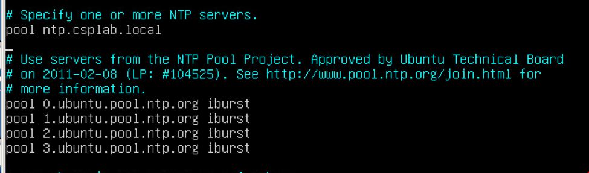
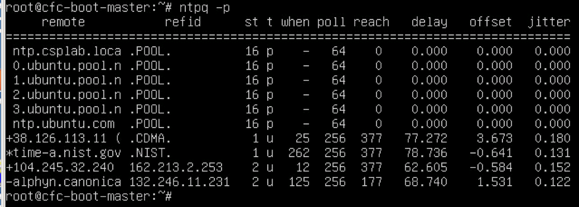
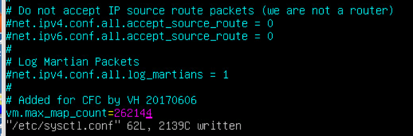
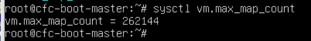
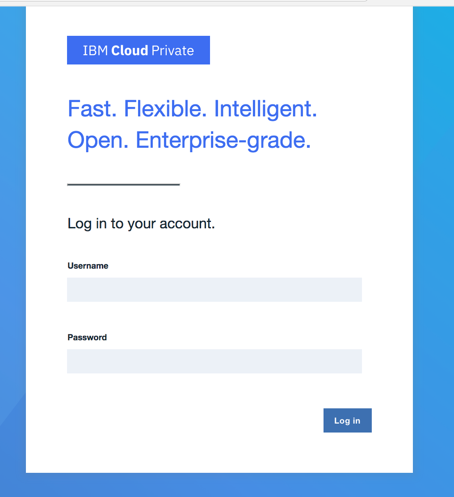
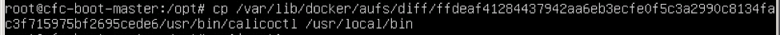
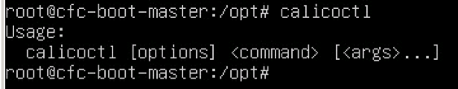
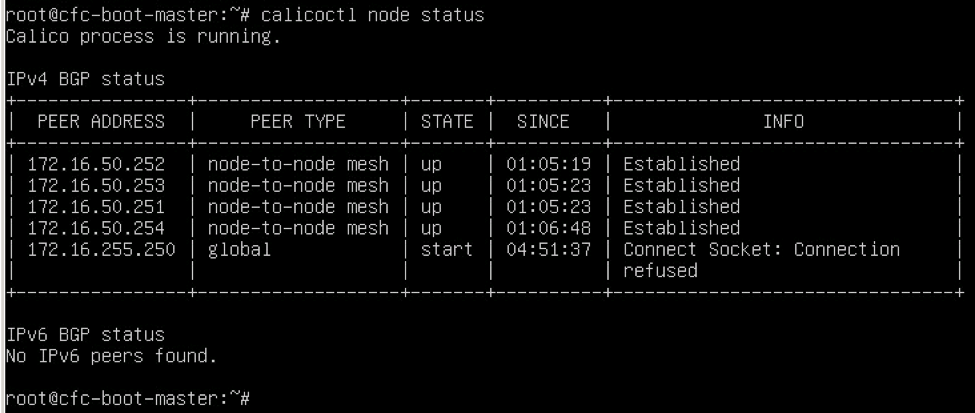
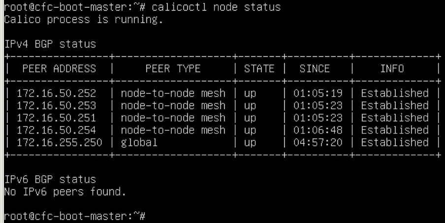
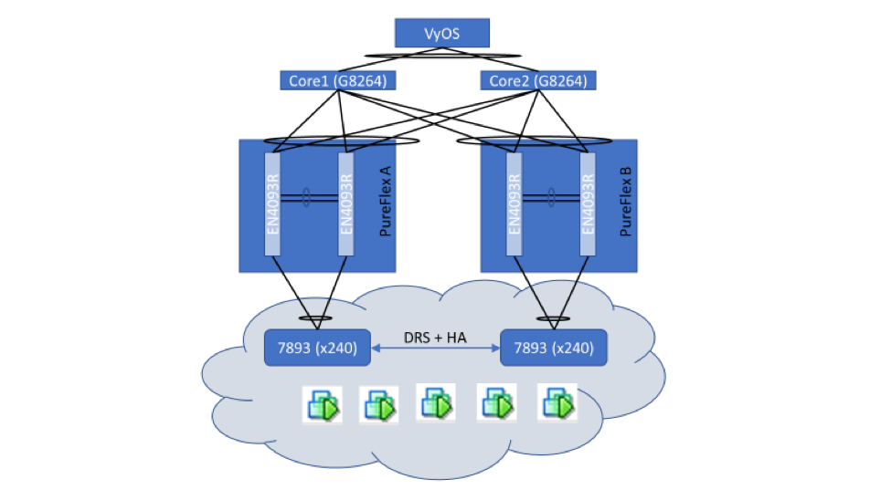

# Install IBM Cloud Private Enterprise Edition (ICP-EE) HA on Ubuntu
*(with notes on deploying in an air-gapped environment)*

This document provides practical guidance on installing ICp Enterprise Edition on VMWare with Ubuntu based images.   
For more information, please reference the IBM Cloud Private Knowledge Base.

## IBM Cloud private Community  Edition vs Enterprise Edition
There are two main differences between ICp Community Edition (CE) and Enterprise Edition (EE).

  * CE supports single node control plane while EE supports Highly Available Control Plane, with 3 or 5 master and proxy nodes
  * CE offers community support while EE offers SLAs and enterprise support

This walkthrough will focus on installing the IBM Cloud private Enterprise Edition (ICP ee) on VMWare running in HA mode.  If you are running in an air-gapped environment with proxy access to the internet, notes throughout this document will explain how to configure the environment to support this configuration.

## Assumptions:
* Overprovisioning

  The way cloud services are designed to work is they only allocate as much resources to a virtual machine as is required for the current workload. Capacity is granted and removed as needed. For example, you may allocate 8 virtual CPUs to a VM, but that VM is actually only using the amount of GHz of processing power on the host machine as is needed to satisfy the demand.

  This means that whether you allocate 1 vCPU or 2 vCPUs, you are not using more capacity on the host to run the same workload.

  The same is the case for Memory. If you allocate 16GB of memory, but your VM is only using 2 GB of it, the host only allocates 2 GB.

  Studies indicate that the average dedicated server only uses about 10 – 20% of its available capacity. Because of this, a cloud service may overprovision the amount of CPU and RAM on a host by a factor of as much as 10 and still provide optimal responsiveness to VMs it hosts.

  To add additional CPU and Memory resources to a guest (virtual machine) it must be shutdown and resources re-allocated. For this reason, we will allocate ample CPU and Memory for our virtual machines knowing that we will only be using what we need at any given time and it is better to have too much than too little.

  Similarly, storage can normally be overprovisioned by a factor of 4 when all VMs are using thin provisioned disks. It is better to create a larger thinly provisioned disk than we think we may need than to create a smaller one and then have to come back later and increase the size or add additional disks to satisfy the need.

  If provisioning into a public cloud provider, this may not be the case depending on that providers billing model. If you are only charged for resources **used** then this model still works, but if you are billed for resources **allocated**, then you may want to make sure you request only what you need so you are not charged for resources you are not using.

  In this example we will use the former model and allocate ample resources so we do not have to come back later and add more.

* Installation will be performed on Ubuntu 16.04 LTS server amd64. All commands will be for this platform.

* Installation must be done as root. Many commands must be run on all nodes. It is a big time saver to type the command into the terminal window on the master node and then, before hitting [enter], copy the command from the master window (including the carriage return), and then hit [enter] on the master node. You can then paste that command in the other windows to execute it on all other nodes.   

* For simple demo/test purposes, the entire environment can be installed onto a single node, but this is not suitable for any amount of test or production use. The Topology for this implementation will have a combined boot and master server plus a proxy server and three worker nodes.

* **HA/DR:** In this tutorial, we will be installing an HA instance of ICP, but HA depends on more than just software in most environments.<br><br>For more information on the high availability aspects of the infrastructure see Appendix B.

## Prepare VM Templates for the Various Node Types
* Install two Ubuntu 16.04 Server x86_64 virtual machines to use as your templates nodes. The first template will be used for all master, management, and vulnerability advisor nodes.  The second will be for all proxy and worker nodes.

  **NOTE:** _You could use a single template rather than two, however, when cloning these templates to VMs you cannot change the size of the disk without significant pain.  Since different VMs need different disk sizes, you must either create two templates which contain the correct disk sizes, or provision all VMs with the master node disk size (500GB) and re-configigure the CPU and Memory requirements based on the node type when you deploy the VMs from these templates.  If disks are thin provisioned, there is no problem making all disks 500GB since they will not occupy space on the datastore which they do not need.  There is a risk, however, that you could over-provision your datastore to the point that the overall datastore disk runs out of space with no warning and all VMs on that datastore will start experiencing "out of space" errors even they should to have plenty of space available.  To reduce the possibility of causing this frustrating and sometimes difficult to troubelshoot problem, it is recommended to use two templates as we have specified here._

  You can get the guest OS image from:   <http://releases.ubuntu.com/>

  Master  Template:<br>
  >CPUs: 16<br>
  >Memory: 32GB<br>
  >Disk: 500GB (optionally, Thin Provisioned)<br>

  Worker Template:
  >CPUs: 8<br>
  >Memory: 16<br>
  >Disk: 200GB (optionally, Thin Provisioned)<br>

  **Note:** All infrastructure storage is hostPath, meaning, it will reside on the local VM's filesystem.  Workload storage (PersistentVolume [PV] storage) should *not* be hostPath for a number of reasons.  In this tutorial, workload storage is via NFS and is external to this environment. There is no need to allocate additional storage for PV storage here.

  Initially, configure the server for DHCP (if available) so that we can clone these VMs without getting IP address conflicts, we will assign static IP’s later.<br><br>If DHCP is not available assign the static IP of your boot/master server now.  See below for instructions for setting a static IP address on an ubuntu 16.04 server.

* Execute the following commands on both template VMs. This enables root login remotely via ssh

  a. Set a password for the root user

  1. `sudo su -` \# provide your user password to get to the root shell
  2. `passwd` \# Set the root password

  b.  Enable remote login as root

  ```
  sed -i 's/prohibit-password/yes/' /etc/ssh sshd_config
  systemctl restart ssh
  ```

* For air-gapped environments only, you must set a proxy server to provide for internet access for installing needed packages including docker.  The easiest way to do this is to edit the /etc/profile file and add lines at the bottom such as:

  ```
  export http_proxy="http://myproxy.mydomain.com:3128"
  export HTTP_PROXY="http://myproxy.mydomain.com:3128"
  export https_proxy="http://myproxy.mydomain.com:3128"
  export HTTPS_PROXY="http://myproxy.mydomain.com:3128"
  export no_proxy="mycluster.icp,<ip of icp master node or master vip>,*.mydomain.com"
  export NO_PROXY="mycluster.icp,<ip of icp master node or master vip>,*.mydomain.com"
  ```

  Do this on your boot node and then propagate to all other nodes in your environment.  You can either logout and log back in to enable to new envvars or just read the profile with a command like:

  ```
  . /etc/profile
  ```

  **IMPORTANT:**

  a) Some applications may expect a lower case envvars and some may expect upper case. It is safest to provide both.

  b) A no_proxy envvar is required so that the ICP installer will not attempt to use the proxy setting to attach to ICP when doing the product installation.  After the vip is created, ICP will attempt to login to docker to push images.  **If the hostname and IP address of the vip are not in the no_proxy envvar the install will fail when docker attempts to reach these interfaces via the proxy.**

  The ubuntu apt service does *not* respect the envvars you just created.  To get apt-get to work correctly in an air-gapped environment, you must create the file `/etc/apt/apt.conf` and in that file put the following lines:

  ```
  Acquire::http::Proxy "http://proxy.mydomain.com:3128"
  Acquire::https::Proxy "http://proxy.mydomain.com:3128"
  ```

  Replace "mydomain.com" with your local domain.  There should be no need for a no_proxy entry since all ubuntu packages are pulled from the internet.

* Update NTP (Network Time Protocol) settings to make sure time stays in sync

  a. Get the latest apt updates and install ntp

  ```
  apt-get update
  apt-get install -y ntp
  ```

  b.  If using an internal NTP server, edit /etc/ntp.conf and add your internal server to the list and then restart the ntp server. In the following configuration, the server is configured to use a local NTP server (ntp.csplab.local) and fall back to public servers if that server is unavailable.

  

  c.  After making configuration changes restart the NTP server with the command:

  ```
  systemctl restart ntp
  ```

  d. Test the status of your NTP servers to make sure they are working.

    Use the command:

    ```
    ntpq -p
    ```

    

    **NOTE:** ICP requires all nodes be in time sync and most proxies will not support NTP. In an air-gapped environment, you must provide a local NTP server which can be used by all nodes to keep time in sync.

    If you do not have an NTP server and cannot create one easily, you can use somethink like the excellent script provided at https://gist.github.com/jaytaylor/60c8a4e22431c4271200cab68186deb7 which can be added to the server's root crontab to run every minute and it will function to keep servers in sync.  This should only be used, however, if a local ntp service is not available.

* If the ufw firewall is enabled, disable it. ICP will install iptables.
* Configure the Virtual Memory setting (required for ELK)  
  a. Update the vm.max\_map\_count setting to 262144:

    ```
    sysctl -w vm.max_map_count=262144
    ```

  b. Make the changes permanent by adding the following line to the bottom of the /etc/sysctl.conf file:

    

  c. To check the current value use the command:

    ```
    sysctl vm.max_map_count
    ```

    

* Install the NFS common packages

  ```
  apt-get install -y nfs-common
  ```

  **NOTE:** If you will be using Ceph, gluster, or other such storage, it is a good idea to go ahead and install the needed packages here as well so that you will have access to those systems after installation.

* Install python

  ```
  apt-get install -y python-setuptools
  ```

* Install docker

  a. Update your ubuntu repositories

    ```
    apt-get update
    ```

  b.  Install Linux image extra packages

    ```
    apt-get install -y linux-image-extra-$(uname -r) linux-image-extra-virtual
    ```

  c.  Install additional needed packages   

    ```
    apt-get install -y apt-transport-https ca-certificates curl software-properties-common
    ```

    **NOTE**: These packages may all exist depending on what packages were included when the operating system installed. If they already exist, you will just see output indicating they already exist. If you assume they exist, however, and do not do this step and they are not there, the installation will fail.

  d. Add Docker’s official GPG key

    ```
    curl -fsSL https://download.docker.com/linux/ubuntu/gpg | apt-key add -
    ```

  e.  Verify that the key fingerprint is 9DC8 5822 9FC7 DD38 854A E2D8 8D81 803C 0EBF CD88

    ```
    apt-key fingerprint 0EBFCD88
    ```

    

  f.  Setup the docker stable repository and update the local cache

    ```
    add-apt-repository "deb [arch=amd64] https://download.docker.com/linux/ubuntu $(lsb_release -cs) stable"
    apt-get update
    ```  

  g.  Install docker   

    ```
    apt-get install -y docker-ce
    ```

  h. In an air-gapped environment only, configure Docker to use the proxy server.

    Docker must be able to reach the internet to be able to pull images from the IBM catalog and any other public repositories that are configured in the platform.  It is extremely important that the NO_PROXY section be correctly configured in the file below to prevent an installation failure caused by docker trying to use the proxy to hit the ICP vip interface.

    The following instructions will create environment variables in the process space that runs the docker daemon which will tell it to use a proxy for some addresses and not for others.

    ```
    mkdir -p /etc/systemd/systedm/docker.service.d/
    ```

    Create a file in this directory named "http-proxy.conf" with contents similar to the following:

    ```
    [Service]
    Environment="HTTP_PROXY=http://proxy.mydomain.com:3128" "NO_PROXY=.icp,localhost,172.16."
    Environment="HTTPS_PROXY=http://proxy.mydomain.com:3128" "NO_PROXY=.icp,localhost,172.16."
    ```

    Replace the URL as needed for your environment.

    Replace the NO_PROXY information for your installation and local environment.

    Save the file, reload the daemon, and restart docker:

    ```
    systemctl daemon-reload
    systemctl restart docker
    ```

  i. (optional) If the default docker bridge address (172.17.0.1/24) conflicts with your local environment you may need to change it's default subnet such that it uses something that is not already routable in the environment (e.g. 172.18.0.1/24).

    To change the IP address of the docker bridge take the following steps:

    * Create the path /etc/docker/, if needed

      ```
      mkdir -p /etc/docker/
      ```

    * Create the file daemon.json in this directory with the following contents:

      ```
      {
        "bip": "172.18.0.1/24"
      }
      ```

      Change the CIDR to reflect a subnet and IP address that is not currently in use in your environment.

    * Restart Docker

      ```
      systemctl daemon-reload
      systemctl restart docker
      ```

    * Makes sure docker is running and pulling correctly from the internet

      ```
      docker run hello-world
      ```

      This should downloaded the latest hello-world docker image version and put some text on the screen indicating a working installation.

## Clone and Prepare Your Cluster VMs

* Create VM templates and start other virtual machines.   

  Shutdown your VM: `shutdown -h now`

  Clone your templates for each of the needed nodes in your cluster as specified below.  There is no need to create an actual "VMware template" from these existing VMs.  You can just clone them from an existing VM to a new VM. When doing this, you do not need to change the CPU or memory allocations from their defaults.

  Note that you can create a minimal, non-HA environment by just using a single node for each below and VA is not required, but should be used if VA will be installed:

  1.  master template -> icp-master1, icp-master2, icp-master3

  1.  master template -> icp-mgmt1, icp-mgmt2, icp-mgmt3

  1.  master template -> icp-va1, icp-va2, icp-va3

  1.  worker template -> icp-proxy1, icp-proxy2, icp-proxy3

  1.  worker template -> icp-worker1, icp-worker2, icp-worker3

  1.  worker template -> icp-boot

  **IMPORTANT:** For HA, and to provide for workload persistent storage, you will also need an NFS node which does not need to be configured with any of the packages used by the above server (but will need the proxy information if being installed in an air-gapped environment).  If an enterprise NFS server already exists which can be used for this environment it can be used, otherwise, an additional NFS node will need to be created to support this environment.

  If creating a new NFS node, you can use the master template and change the CPU and Memory requirements to match the worker nodes.

* Configure your newly cloned VMs and set their hostnames and static IP addresses.

  **Note:** The VMs can use DHCP assigned IP addresses, however, DHCP addresses are subject to change and if any addresses change your environment will break.  For a quick test environment, static IP's are not needed, however, for any kind of permanent environment, static IP addresses should be used.

  If your network interface is configured for DHCP, boot all of the newly provisioned nodes and then, using the VMware console, login to each VM and reconfigure the hostname and add the appropriate static IP address.

  **IMPORTANT:** If you do not have a DHCP server and configured your original VMs with a static IPs, you will need to boot each VM in turn, configuring each with its new IP address before booting the next to prevent having duplicate IP addresses on your network.

  Perform the following tasks to change the IP address and hostname on each respective node.

  1. Change the hostname

    ```
    hostnamectl set-hostname <icp-master1>
    ```

    Replace &lt;icp-master1&gt; with the new hostname for your node.

  2.  Modify /etc/network/interfaces to configure a static IP address

    Your file should look something like this:

    ```
    # This file describes the network interfaces available on your system
    # and how to activate them. For more information, see interfaces(5).

    source /etc/network/interfaces.d/*

    # The loopback network interface
    auto lo
    iface lo inet loopback

    # The primary network interface
    auto ens160
    iface ens160 inet static
      address 172.16.40.30
      netmask 255.255.0.0
      broadcast 172.16.255.255
      gateway 172.16.255.250
      dns-nameservers 172.16.0.11 172.16.0.17
      dns-search csplab.local
    ```

  3.  In ubuntu 16.04, there seems to be a bug where resetting the network with the standard `systemctl restart networking` command does not change the IP address, rather it adds an additional IP address to the interface. Enabling the new IP will require a reboot.
    ```
    shutdown -r now
    ```

* Configure passwordless SSH from the master node to all other nodes   
    You should now have all of your hosts prepared, named properly, and containing the proper IP addresses. The next step is to configure passwordless SSH between the boot-master node and the other nodes. You first need to create a passwordless SSH key that can be used across the implementation:

  1.  Login as to the boot node as root
    ```
    cd ~
    ```

  2.  From root’s home directory execute:
    ```
    ssh-keygen -t rsa -P ''     # Upper case P and two single quotes for no password
    ```

    Accept the default location of /root/.ssh/id\_rsa for the new key file

    Now, executing `ls ~/.ssh` should show three files: id_rsa, id_rsa.pub and known_hosts

  3.  Copy the resulting id_rsa key file from the boot node to each node in the cluster

    `ssh-copy-id -i .ssh/id_rsa root@icp-master1`

    `ssh-copy-id -i .ssh/id_rsa root@icp-master2`

    `ssh-copy-id -i .ssh/id_rsa root@icp-master3`

    ...

    `ssh-copy-id -i .ssh/id_rsa root@icp-worker3`

    You will be required to type the root password for each node during this process, but not thereafter.

  4.  When this is complete you should be able to ssh from the boot node to each of the other nodes without having to provide a password. Test this now by executing the following for each node in the cluster:

    `ssh root@icp-master1`

    `ssh root@icp-master2`

    `ssh root@icp-master3`

    ...

    `ssh root@icp-worker3`

  5.  Now update the /etc/hosts file on your boot node and add entries for each of your nodes and propogate that file to all of your other nodes:

    For example:

    ```
    # /etc/hosts
    127.0.0.1     localhost
    172.16.40.30  icp-boot.csplab.local icp-boot boot
    172.16.40.31  icp-master1.csplab.local icp-master1 master1
    172.16.40.32  icp-master1.csplab.local icp-master2 master2
    172.16.40.33  icp-master1.csplab.local icp-master3 master3
    172.16.40.34  icp-proxy1.csplab.local icp-proxy1 master1
    172.16.40.35  icp-proxy2.csplab.local icp-proxy2 master2
    172.16.40.36  icp-proxy3.csplab.local icp-proxy3 master3
    172.16.40.37  icp-mgmt1.csplab.local icp-mgmt1 mgmt1
    172.16.40.38  icp-mgmt2.csplab.local icp-mgmt2 mgmt2
    172.16.40.39  icp-mgmt3.csplab.local icp-mgmt3 mgmt3
    172.16.40.40  icp-va1.csplab.local icp-va1 va1
    172.16.40.41  icp-va2.csplab.local icp-va2 va2
    172.16.40.42  icp-va3.csplab.local icp-va3 va3
    172.16.40.43  icp-worker1.csplab.local icp-worker1 worker1
    172.16.40.44  icp-worker2.csplab.local icp-worker2 worker2
    172.16.40.45  icp-worker3.csplab.local icp-worker3 worker3
    ```

    With your /etc/hosts file configured correctly on the boot node, propogate it to all the other nodes in your cluster:

    ```
    scp /etc/hosts master1:/etc/hosts
    scp /etc/hosts master2:/etc/hosts
    scp /etc/hosts master3:/etc/hosts
    scp /etc/hosts proxy1:/etc/hosts
    scp /etc/hosts proxy2:/etc/hosts
    scp /etc/hosts proxy3:/etc/hosts
    scp /etc/hosts mgmt1:/etc/hosts
    scp /etc/hosts mgmt2:/etc/hosts
    scp /etc/hosts mgmt3:/etc/hosts
    scp /etc/hosts va1:/etc/hosts
    scp /etc/hosts va2:/etc/hosts
    scp /etc/hosts va3:/etc/hosts
    scp /etc/hosts worker1:/etc/hosts
    scp /etc/hosts worker2:/etc/hosts
    scp /etc/hosts worker3:/etc/hosts
    ```

    Your virtual machines are now ready to install ICP and now is a good time to take a snapshot of each VM in the cluster. In the event something goes horribly wrong with the installation you can revert to this snapshot and try it again.  Snapshots slow down Virtual Machines by a factor of the number of shapshots that have been taken.  For this reason, it is not a good idea to leave a bunch of snapshots (or any, really) hanging around.  Once your installation is complete, you should consolidiate your disks to remove the snapshot.

## Install ICP

* Load your icp tarball into your boot node's docker registry

  Only on the boot node, load the inception image from the ICP tarball into boot node's local docker registry.

  ```
  tar -xvf /opt/ibm-cloud-private-x86_64-2.1.0.tar.gz ibm-inception-amd64-3.1.1.tar -O |docker load
  ```   

  Note that this will take quite some time and a lot of disk space and memory because tar has to gunzip the entire tarball before it can extract any images.  This takes memory, filespace in /tmp, and quite a lot of time.  Please be patient.

* Find the name and tag of the current inception image
  IBM releases a new version of ICP as often as every six weeks.  The specific version number (and even the full image name) can/will change with every release.  To find your release information execute the following command on the boot node:

  ```
  docker images -a |grep inception
  ```

  Which will result in something like this:

  ```
  ibmcom/icp-inception-amd64      3.1.1-ee      5f449d4b46ac      4 weeks ago     756MB
  ```

  In this case, the inception image name is "ibmcom/icp-inception-amd64" and the version tag is "3.1.1-ee".

  In the following section, replace the image name and version tag with the ones you got when you issued the command above.

* Prepare the installation files

  1. Create a directory to hold installation configuration files

    ```
    mkdir /opt/icp
    cd /opt/icp
    ```

  2. Extract the installation configuration files

    ```
    docker run -e LICENSE=accept --rm -v /opt/icp:/data ibmcom/icp-inception-amd64:3.1.1-ee cp -r cluster /data
    ```

    After this command, you should have a folder named /opt/icp/cluster.   

  3. **Enterprise Edition only:** Move the ICP tarball to /opt/icp/cluster/images directory.

    ```
    mkdir -p  /opt/icp/cluster/images
    mv /opt/ibm-cloud-private-x86_64-3.1.1.tar.gz /opt/icp/cluster/images/
    ```

  4. (optional) If using IBM*Z or power nodes, add the x390x and ppc tarballs to /opt/icp/cluster/images as well

  5. Copy the ssh key to the installation directory

		  ```
		  cp ~/.ssh/id_rsa /opt/icp/cluster/ssh_key
		  chmod 400 /opt/icp/cluster/ssh_key
		  ```

* Configure the installation

  1. Edit the /opt/icp/cluster/hosts file and enter the IP addresses of all nodes.  The result should look something like this:

    ```
    [master]
    172.16.40.31
    172.16.40.32
    172.16.40.33

    [worker]
    172.16.40.40
    172.16.40.41
    172.16.40.42

    [proxy]
    172.16.40.34
    172.16.40.35
    172.16.40.36

    [management]
    172.16.40.37
    172.16.40.38
    172.16.40.39

    [va]
    172.16.40.43
    172.16.40.44
    172.16.40.45
    ```

  1. In an HA environment, there are three directories which must be shared by all Master nodes.  These are /var/lib/registry, /var/lib/icp/audit, and /var/log/audit.

    On your NFS server, create mount points for each of these paths e.g. ``/storage/registry`, ``/storage/icp/audit`, and ``/storage/log/audit`.

    Your NFS server should export fileystems with the `sync` parameter set.  For example:
    ```
		# /etc/exports
    /storage/mycluster.icp/var/lib/registry	master1(rw,no_subtree_check,sync,insecure,no_root_squash) master2(rw,no_subtree_check,sync,insecure,no_root_squash) master3(rw,no_subtree_check,sync,insecure,no_root_squash)
    /storage/mycluster.icp/var/lib/icp/audit	master1(rw,no_subtree_check,sync,insecure,no_root_squash) master2(rw,no_subtree_check,sync,insecure,no_root_squash) master3(rw,no_subtree_check,sync,insecure,no_root_squash)
    /storage/mycluster.icp/var/log/audit	master1(rw,no_subtree_check,sync,insecure,no_root_squash) master2(rw,no_subtree_check,sync,insecure,no_root_squash) master3(rw,no_subtree_check,sync,insecure,no_root_squash)
    ```

    On each of the master nodes, mount the NFS mount points to the appropriate locations:
    ```
    mkdir -p /var/lib/registry
    mkdir -p /var/lib/icp/audit
    mkdir -p /var/log/audit
    ```

    Update the /etc/fstab file so that the mountes will be reestablished after a reboot.  The /etc/fstab entries should look something like this:
    ```
    172.16.40.49:/storage/registry	/var/lib/registry	nfs	auto,nofail,noatime,nolock,intr,tcp,actimeo=0	0 0
    172.16.40.49:/storage/icp/audit	/var/lib/icp/audit	nfs	auto,nofail,noatime,nolock,intr,tcp,actimeo=0	0 0
    172.16.40.49:/storage/log/audit	/var/log/audit		nfs	auto,nofail,noatime,nolock,intr,tcp,actimeo=0	0 0
		```

    Mount the directories in the current environment
    ```
    mount /var/lib/registry
    mount /var/lib/icp/audit
    mount /var/log/audit
    ```

* Deploy the ICP environment.

  ```
  cd /opt/icp/cluster
  docker run --rm -t -e LICENSE=accept --net=host -v /opt/icp/cluster:/installer/cluster ibmcom/icp-inception-amd64:3.1.1-ee install -vvv |tee install.log
  ```

  Several minutes later you should have a deployed IBM Cloud private implementation.
  You can login to your new cluster with a browser attach to https://10.0.0.1:8443 with credentials admin/admin.   

  

* Add a worker node to an ICP cluster
  To dynamically add a worker node to an existing implementation, prepare the VM exactly as the original installation, update the /etc/hosts file with the IP and hostname of the new worker node and execute the install command with the -l option:

  ```
  cd /opt/icp/cluster
  docker run --rm -t -e LICENSE=accept --net=host -v "$(pwd)":/installer/cluster ibmcom/icp-inception-amd64:3.1.1-ee install -l <IP of worker node>,<IP of second worker node>[,...]
  ```

* Uninstall an ICP environment.

  To uninstall ICP use the exact same container but run the uninstall command

  ```
  cd /opt/icp/cluster
  docker run --rm -t -e LICENSE=accept --net=host -v "$(pwd)":/installer/cluster ibmcom/icp-inception-amd64:3.1.1-ee uninstall
  ```

Appendix A
==========

Access to cluster networks from outside the cluster.
----------------------------------------------------

IBM Cloud private was installed with calico networking. Calico runs a vRouter on each host in the cluster which manages routing for all applications and services running on that host. Calico uses BGP for internal routing, so in oder to reach services running on your cluster from outside networks you must configure your network to communicate with the calico network via BGP.

In the Cloud Adoption Lab, routing is performed by a VyOS router, so the following instructions describe how to configure a VyOS router to communicate with your cfc cluster. If you are using a different router the principles will be the same by the commands may be different.

It should also be noted that the BGP instructions for VyOS are skimpy at best. I am not sure if all the commands listed are strictly required, but it works when I use them as they are so I have not tried to test any kind of changes.

Extract the calicoctl command from docker:

    `docker run --rm -v /root:/data --entrypoint=cp ibmcom/calico-ctl:v1.2.1 /calicoctl /data`

Then move the file to a directory in your path:




Next, create a new resource file in your home directory called .calicorc with the following contents:

    `export ETCD_AUTHORITY=mycluster.icp:4001`
    `export ETCD_SCHEME=https`
    `export ETCD_CA_CERT_FILE=/etc/cfc/conf/etcd/ca.pem`
    `export ETCD_CERT_FILE=/etc/cfc/conf/etcd/client.pem`
    `export ETCD_KEY_FILE=/etc/cfc/conf/etcd/client-key.pem`

Then, include this file in your .bashrc file by adding the following line at the bottom:

    `. ~/.calicorc`

This will ensure that your calicoctl environment is setup correctly every time you login.  To set it up for use in the current shell, execute the following on the command line:

    `. ~/.calicorc`

You are now ready to execute calicoctl commands.

Before making any changes we will take a snapshot of our currently well-running ICP VMs as well as our VyOS router VM.

To configure BGP connectivity, your external router must configured for BGP sessions between the router and each calico-enabled host (e.g. icp-boot-master, icp-proxy, icp-worker1, icp-worker2, icp-worker3).

The ICP BGP AS (Autonomous System) number is 64511, by default.  You can check your AS number by running the command:

    `calicoctl config get asnumber`

If you need to change the BGP AS number of your installation (if this default AS conflicts with an existing BGP network or you have more than one ICP installation), you can do so with the following command:

    `calicoctl config set asnumber 64515`

Your master node will need to be configured for a BGP session with the router. All of the other BGP neighbors in the Calico AS will then route through the master node.

The gateway address of our VyOS router is 172.16.255.250 and that will be used as the peerIP for the BGP configuration on cfc-boot-master.

Create a file in the root home directory named ‘bgpPeer.yaml’ with the following contents:

    apiVersion: v1
    kind: bgpPeer
    metadata:
      peerIP: 172.16.255.250
      scope: global
    spec:
      asNumber: 65536

Note that the offset at the beginning of the lines under metadata and spec are spaces and not tabs.

Create an environment variable to define the prooper etcd endpoints[2]:

export ETCD\_ENDPOINTS=http://172.16.50.255:4001

Use the calicoctl utility to create the bgpPeer using the file you just created:

    `calicoctl create -f ~/bgpPeer.yaml`

&gt;&gt; Successfully created 1 ‘bgpPeer’ resource(s)

When you check the calico node status you will find that now one side of the bgpPeer connection is configured, but the other is not:



Now we have to configure the VyOS router for the other side of the BGP connection. Use the following commands to configure the router:

    set protocols bgp 65536 neighbor 172.16.50.255 ebgp-multihop '2'
    set protocols bgp 65536 neighbor 172.16.50.255 remote-as 64511
    set protocols bgp 65536 neighbor 172.16.50.255 update-source '172.16.255.250'
    set protocols bgp 65536 neighbor 172.16.50.255 description "cfc-boot-master"
    set protocols bgp 65536 neighbor 172.16.50.254 ebgp-multihop '2'
    set protocols bgp 65536 neighbor 172.16.50.254 remote-as '64511'
    set protocols bgp 65536 neighbor 172.16.50.254 update-source '172.16.255.250'
    set protocols bgp 65536 neighbor 172.16.50.254 description "cfc-proxy"
    set protocols bgp 65536 neighbor 172.16.50.253 ebgp-multihop '2'
    set protocols bgp 65536 neighbor 172.16.50.253 remote-as '64511'
    set protocols bgp 65536 neighbor 172.16.50.253 update-source '172.16.255.250'
    set protocols bgp 65536 neighbor 172.16.50.253 description "cfc-worker3"
    set protocols bgp 65536 neighbor 172.16.50.252 ebgp-multihop '2'
    set protocols bgp 65536 neighbor 172.16.50.252 remote-as '64511'
    set protocols bgp 65536 neighbor 172.16.50.252 update-source '172.16.255.250'
    set protocols bgp 65536 neighbor 172.16.50.252 description "cfc-worker2"
    set protocols bgp 65536 neighbor 172.16.50.251 ebgp-multihop '2'
    set protocols bgp 65536 neighbor 172.16.50.251 remote-as '64511'
    set protocols bgp 65536 neighbor 172.16.50.251 update-source '172.16.255.250'
    set protocols bgp 65536 neighbor 172.16.50.251 description "cfc-worker1"
    set protocols bgp 65536 network "10.2.0.0/16"
    set protocols bgp 65536 parameters router-id '172.16.255.250'
    set protocols static route 10.2.0.0/16 blackhole distance '254'
    commit
    save

Now the bgpPeer connection shows as established and you should be able to reach addresses on your Calico network (10.1.0.0/16 in our example.)



Appendix B
==========

High Availability
-----------------

Configuring high availability for the cluster is outside the scope of this document, but the following are things to consider for local High Availability configuration within the datacenter.

High Aviailability (HA) requires redundancy at all levels. This includes the data and SAN networks, compute nodes, virtualization, and servers.

The environment in this tutorial is running in a traditional computer lab with the following characteristics:

Compute

2 PureFlex Chassis

2 Compute Nodes (x240), one running in each chassis

Data Network

Each chassis has 2x 10GB EN4093R network switches

The chassis switches are configured with InterSwitch Links (ISLs).

Each switch has two vLAG/LACP links to two redundant core switches providing a total of 40GB total bandwidth to the core.

Two core switches are also configured with ISLs providing a total of 40GB total bandwidth and full redundancy at the core.

SAN Network

Each chassis also has 2x Brocade FC5022 8/16G Fiber Switches connected to two core SAN Switches (Fabric A and Fabric B). Storage is provided via v7000 SVC with internal mechanical and SSD disks as well as external FlashStorage 820 appliances providing flash storage as external disks.

Volumes provided to the CFC cluster are made up of mechanical, SSD, and Flash storage with EasyTier enabled.

A single thinly provisioned SAN volume is exposed to both compute nodes in the VMware cluster such that vMotion, HA, and DRS can be enabled.

With this configuration, all resources are fully redundant and highly available within the datacenter.



For DR purposes, a second datacenter (or more) with similar characteristics would need to be available. For the highest level of HA/DR, the environment would be spread across a hybrid environment made up of on-premises resources (such as is defined in this tutorial), and public/dedicated cloud environments from two or more cloud service providers.

In this scenario, resources would be available regardless of the availability of any of the three cloud service providers. This would require site-to-site VPN connections between the on-prem resources and any cloud service providers to allow for direct network connectivtiy between all resources.
