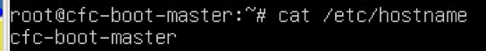
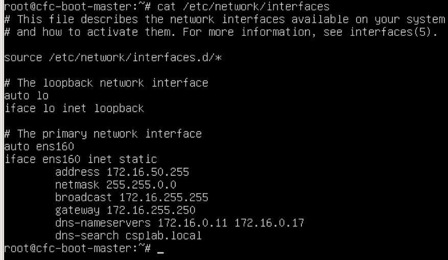

Install IBM Cloud private (Ubuntu)
=============================================

This document provides practical guidance on installing ICp 2.1 Enterprise Edition on VMWare with Ubuntu based images.   
For other other system requirement, please reference [IBM Cloud private Knowledge Center](https://www.ibm.com/support/knowledgecenter/SSBS6K_2.1.0).   

## IBM Cloud private Community  Edition vs Enterprise Edition
There are two main differences between ICp Community Edition (CE) and Enterprise Edition (EE).

   * CE supports single node control plane while EE supports Highly Available Control Plane, with 3 or 5 master and proxy nodes
   * CE offers community support while EE offers SLAs and enterprise support

This walkthrough will focus on installing the IBM Cloud private Enterprise Edition (ICP ee) on VMWare.


## Install IBM Cloud private-ee
Assumptions:
------------

1.  **Overprovisioning**: The way cloud services are designed to work is they only allocate as much resources to a virtual machine as is required for the current workload. Capacity is granted and removed as needed. For example, you may allocate 8 virtual CPUs to a VM, but that VM is actually only using the amount of GHz of processing power on the host machine as is needed to satisfy the demand.

    This means that whether you allocate 1 vCPU or 2 vCPUs, you are not using more capacity on the host to run the same workload.

    The same is the case for Memory. If you allocate 16GB of memory, but your VM is only using 2 GB of it, the host only allocates 2 GB.
    Studies indicate that the average dedicated server only uses about 10 – 20% of its available capacity. Because of this, a cloud service may overprovision the amount of CPU and RAM on a host by a factor of as much as 10 and still provide optimal responsiveness to VMs it hosts.

    To add additional CPU and Memory resources to a guest (virtual machine) it must be shutdown and resources re-allocated. For this reason, we will allocate ample CPU and Memory for our virtual machines knowing that we will only be using what we need at any given time and it is better to have too much than too little.

    Similarly, storage can normally be overprovisioned by a factor of 4 when all VMs are using thin provisioned disks. It is better to create a larger thinly provisioned disk than we think we may need than to create a smaller one and then have to come back later and increase the size or add additional disks to satisfy the need.

    If provisioning into a public cloud provider, this may not be the case depending on that providers billing model. If you are only charged for resources **used** then this model still works, but if you are billed for resources **allocated**, then you may want to make sure you request only what you need so you are not charged for resources you are not using.

    In this example we will use the former model and allocate ample resources so we do not have to come back later and add more.

2.  Installation will be performed on Ubuntu 16.04.2 LTS server amd64. All commands will be for this platform.

3.  Installation must be done as root. Many commands must be run on all nodes. It is a big time saver to type the command into the terminal window on the master node and then, before hitting [enter], copy the command from the master window (including the carriage return), and then hit [enter] on the master node. You can then paste that command in the other windows to execute it on all other nodes.   

4.  For simple demo/test purposes, the entire environment can be installed onto a single node, but this is not suitable for any amount of test or production use. The Topology for this implementation will have a combined boot and master server plus a proxy server and three worker nodes.

    A short video tutorial for installing IBM Cloud private in a single node can be found on the developerWorks page at <https://www.ibm.com/developerworks/community/blogs/fe25b4ef-ea6a-4d86-a629-6f87ccf4649e/entry/Installing_your_cluster?lang=en>.

5.  **HA/DR:** In this tutorial, we will be installing onto a VMware cluster made up of two hosts with DRS, vMotion, and HA enabled. This will provide for host based HA for our environment

For more information on the high availability aspects of the infrastructure see Appendix B.

For DR, we are using Tivoli Storage Manager (TSM) Data Protection for VMware.  It is configured to take a backup snapshot nightly and store the snapshot which can then be restored at a later time in the event of catastrophic failure.

Installation
------------

1.  Install a single Ubuntu 16.04 Server amd 64 virtual machine on a single Virtual Machine. You can get the guest OS image from:   

> <http://releases.ubuntu.com/16.04/ubuntu-16.04.2-server-amd64.iso>
>
> CPUs: 4
> Memory: 8GB
> Disk: 100GB (Thin Provisioned)   
>       **Note:** All application storage (PersistentVolume [PV] storage) is via NFS and is external to this environment. There is no need to allocate additional storage for PV storage here.
>
> Initially, configure the server for DHCP (if available). We will assign static IP’s later. If not available assign the static IP of your boot/master server here.

2. Enable root login remotely via ssh

    1. Set a password for the root user
        1. `sudo su -` \# provide your user password to get to the root shell
        2. `passwd` \# Set the root password

        

    2.  Enable remote login as root
        1. `sed -i 's/prohibit-password/yes/' /etc/ssh/sshd_config`
        2. `systemctl restart ssh`

        

3.  Update NTP (Network Time Protocol) settings to make sure time stays in sync
    1.  `apt-get install -y ntp`
    2.  If using an internal NTP server, edit /etc/ntp.conf and add your internal server to the list and then restart the ntp server. In the following configuration, the server is configured to use a local NTP server (ntp.csplab.local) and fall back to public servers if that server is unavailable.

    

    After making configuration changes restart the NTP server with the command:
    >`sytemctl restart ntp`

    To test the status of your NTP servers, use the command:
    >`ntpq -p`

    


4.  Configure the Virtual Memory setting   
    1. Update the vm.max\_map\_count setting to 262144:
    `sysctl -w vm.max_map_count=262144`

    2. Make the changes permanent by adding the following line to the bottom of the /etc/sysctl.conf file:
    

    3. To check the current value use the command:
    >   `sysctl vm.max_map_count`

    

5.  Install docker

    1. Update your ubuntu repositories

    >   `apt-get update`

    2.  Install Linux image extra packages

    >   `apt-get install -y linux-image-extra-$(uname -r) linux-image-extra-virtual`

    3.  Install additional needed packages   

    >   `apt-get install -y apt-transport-https ca-certificates curl software-properties-common`

    **NOTE**: These packages may all exist depending on what packages were included when the operating system installed. If they already exist, you will just see output indicating they already exist. If you assume they exist, however, and do not do this step and they are not there, the installation will fail.

    4.  Add Docker’s official GPG key

        `curl -fsSL https://download.docker.com/linux/ubuntu/gpg | apt-key add -`

    5.  Verify that the key fingerprint is 9DC8 5822 9FC7 DD38 854A E2D8 8D81 803C 0EBF CD88

        `apt-key fingerprint 0EBFCD88`

    

    6.  Setup the docker stable repository and update the local cache

        `add-apt-repository "deb [arch=amd64] https://download.docker.com/linux/ubuntu $(lsb\_release -cs) stable"`   
        `apt-get update`   

    7.  Install docker   

        `apt-get install -y docker-ce`

    8.  Makes sure docker is running

        `docker run hello-world`   
        This should downloaded the latest hello-world docker image version and put some text on the screen indicating a working installation.   

    9.  Install python and pip

        `apt-get install -y python-setuptools`   
        `easy_install pip`


6.  Create VM template and start other virtual machines.   

    Shutdown your VM   
    `shutdown -h now`

    In the VMware vCenter Web Client, convert this VM to a template. We will use this template to provision any additional nodes we need in the environment including additional worker nodes as needed.

    Create new VMs from your new template for each of the nodes in the cluster:

    1.  cfc-boot-master

    2.  cfc-proxy

    3.  cfc-worker1

    4.  cfc-worker2

    5.  cfc-worker3

    If your network interface is configured for DHCP, boot all of the newly provisioned nodes and then, using the VMware console, login to each VM and reconfigure the hostname and add the appropriate static IP address.

    If you do not have a DHCP server and configured the original VM with a static IP, you will need to boot each VM in turn configuring each with its new IP address before booting the next to prevent having duplicate IP addresses on your network.

    For each of your new VMs perform the following tasks to change the IP address and hostname of your servers.

    1.  Change the hostname
        Edit the file /etc/hostname with your favorite text editor (e.g. vim) and change the value to match the node: e.g. cfc-boot-master, cfc-proxy, cfc-worker1, cfc-worker2, and cfc-worker3, respectively.

        

    2.  Modify /etc/network/interfaces to configure a static IP address
        In our environment, we are using the IP addresses listed in the screenshot in step 2 above.

        

    3.  In ubuntu 16.04, resetting the network with the standard “systemctl restart networking” does not seem to change the IP address, rather it adds an additional IP address to the interface. Enabling the new IP will require a reboot.

        `shutdown -r now`

7. Pre-load the ICP Installation tarball on all cluster nodes
    **NOTE**: ICP enterprise edition (ee) loads all ICP docker containers into all docker instances on all nodes.

    The ICP tarball containing these images is >3.6GB and ansible will copy the tarball to each node in sequence and import each into their respective docker repositories. As a result, when running the installer, the total install time for ICP will run in excess of 40 minutes, the majority of that time being this process of copying and loading images.

    In order to shorten the installation time, the ICP EE tarball has been copied to all cluster nodes. We will kick off import of the ICP docker containers on all nodes at the same time to shorten the overal installation time.

    ICP community edition (ce) only installs the specific containers that are needed for each cluster node and it pulls those from docker hub during installation. As a result, the installation of ce takes more like 6 - 10 minutes.

    With docker now installed on each node, we can to import the ICP containers into the docker repository on each node and continue to work while this is completing. This will reduce the overall install time in the final step.

      `tar -xvf /opt/ibm-cloud-private-x86_64-2.1.0.tar.gz -O |docker load`   

    **NOTES:** This step is not strictly necessary for any node other than the master node. If the needed containers do not exist in the other nodes, the tarball will be copied to those nodes and loaded into their docker repositories. The installer will do this action serially on each node which will result in an installation time in excess of 40 minutes. Preloading the images will significantly reduce the install time. By loading these images now, we can be continuing to configure the installation while these images are loading. By preloading them we will spend less time waiting for the install to complete later. This step is not necessary when installing ICP Community Edition.   

8.  Configure passwordless SSH from the master node to all other nodes   
    You should now have all of your hosts prepared, named properly, and containing the proper IP addresses. The next step is to configure passwordless SSH between the boot-master node and the other nodes. You first need to create a passwordless SSH key that can be used across the implementation:

    1.  Login as to the boot-master node as root
        `cd ~`

    2.  From root’s home directory execute:
        `ssh-keygen -t rsa -P ''` \# Upper case P and two single quotes for no password

        Accept the default location of /root/.ssh/id\_rsa for the new key file

        Now, executing `ls .ssh` from root’s home directory should show three files: id_rsa, id_rsa.pub and known_hosts

    3.  Copy the resulting id_rsa key file to each node in the cluster (including the boot-master node on which we are currently operating).

        1.  Copy to the master node (to the current node):
            `ssh-copy-id -i .ssh/id_rsa root@cfc-boot-master`   

        2.  Repeat for each additional server:

            `ssh-copy-id -i .ssh/id_rsa root@cfc-proxy`

            `ssh-copy-id -i .ssh/id_rsa root@cfc-worker1`

            `ssh-copy-id -i .ssh/id_rsa root@cfc-worker2`

            `ssh-copy-id -i .ssh/id_rsa root@cfc-worker3`


        3.  When this is complete you should be able to ssh from the boot-master node to each of the other nodes without having to provide a password. You can test this by executing:


            `ssh root@cfc-boot-master`

            `ssh root@cfc-worker1`

            `ssh root@cfc-worker2`

            `ssh root@cfc-worker3`

            If you cannot gain access via SSH without a password, ensure that you have enabled root login on each VM and have modified /etc/ssh/sshd\_config on each VM to allow remote login.

        Your virtual machines are now ready to install CFC and now is a good time to take a snapshot of each VM in the cluster. In the event something goes wrong with the installation you can revert to this snapshot and try it again.[1]

9. Prepare the installation files
    1. Create a directory to hold installation configuration files

      ```
      mkdir /opt/icp
      cd /opt/icp
      ```
    2. Extract the installation configuration files
      ```
      docker run -e LICENSE=accept --rm -v /opt/icp:/data ibmcom/icp-inception:2.1.0-ee cp -r cluster /data
      ```
      After this commond, you should have a folder /opt/icp/cluster.   

	  3. (optional) Configure LDAP authentication (out of scope for bootcamp)
	  4. (optional) Create one or more storage classes (out of scope for bootcamp)
	  5. **Enterprise Edition only:** Move the ICP tarball to /opt/icp/cluster/images directory.

		  ```
		  mkdir -p  /opt/icp/cluster/images
		  mv /opt/ibm-cloud-private-x86_64-2.1.0.tar.gz /opt/icp/cluster/images/
		  ```

	  6. (optional) If using IBM*Z nodes, add the x390x tarball to /opt/icp/cluster/images
	  7. Copy the ssh key to the installation directory

		  ```
		  cp ~/.ssh/id_rsa /opt/icp/cluster/ssh_key
		  chmod 400 /opt/icp/cluster/ssh_key
		  ```

	  8. Configure the installation
		   1. Edit the /opt/icp/cluster/hosts file and enter the IP addresses of all nodes
		        ```
		        [master]
		        10.0.0.1
		        ```
		        ```
		        [worker]
		        10.0.0.3
		        10.0.0.4
		        10.0.0.5
		        ```
		        ```
		        [proxy]
		        10.0.0.2
		        ```

		   2. Edit the /opt/icp/cluster/config.yaml file

				Change *service_cluster_ip_range* to prevent network conflict

11. Deploy the ICP environment.

    ```
    cd /opt/icp/cluster
    docker run --rm -t -e LICENSE=accept --net=host -v "$(pwd)":/installer/cluster ibmcom/icp-inception:2.1.0-ee install
    ```

    Several minutes later you should have a deployed IBM Cloud private implementation.
    You can login to your new cluster with a browser attach to https://10.0.0.1:8443 with credentials admin/admin.   
    

12. Add a worker node to an ICP cluster
    To dynamically add a worker node to an existing implementation, prepare the VM exactly as the original installation, update the /etc/hosts file with the IP and hostname of the new worker node and execute the install command with the -l option:

      ```
      cd /opt/icp/cluster
      docker run --rm -t -e LICENSE=accept --net=host -v "$(pwd)":/installer/cluster ibmcom/icp-inception:2.1.0-s4-rc1-ee install -l <IP of worker node>,<IP of second worker node>[,...]
      ```

13. Uninstall an ICP environment.

    To uninstall ICP use the exact same container but run the uninstall command

    ```
    cd /opt/icp/cluster
    docker run --rm -t -e LICENSE=accept --net=host -v "$(pwd)":/installer/cluster ibmcom/icp-inception:2.1.0-ee uninstall
    ```

Appendix A
==========

Access to cluster networks from outside the cluster.
----------------------------------------------------

IBM Cloud private was installed with calico networking. Calico runs a vRouter on each host in the cluster which manages routing for all applications and services running on that host. Calico uses BGP for internal routing, so in oder to reach services running on your cluster from outside networks you must configure your network to communicate with the calico network via BGP.

In the Cloud Adoption Lab, routing is performed by a VyOS router, so the following instructions describe how to configure a VyOS router to communicate with your cfc cluster. If you are using a different router the principles will be the same by the commands may be different.

It should also be noted that the BGP instructions for VyOS are skimpy at best. I am not sure if all the commands listed are strictly required, but it works when I use them as they are so I have not tried to test any kind of changes.

Extract the calicoctl command from docker:

    `docker run --rm -v /root:/data --entrypoint=cp ibmcom/calico-ctl:v1.2.1 /calicoctl /data`

Then move the file to a directory in your path:


Next, create a new resource file in your home directory called .calicorc with the following contents:

    `export ETCD_AUTHORITY=master.cfc:4001`
    `export ETCD_SCHEME=https`
    `export ETCD_CA_CERT_FILE=/etc/cfc/conf/etcd/ca.pem`
    `export ETCD_CERT_FILE=/etc/cfc/conf/etcd/client.pem`
    `export ETCD_KEY_FILE=/etc/cfc/conf/etcd/client-key.pem`

Then, include this file in your .bashrc file by adding the following line at the bottom:

    `. ~/.calicorc`

This will ensure that your calicoctl environment is setup correctly every time you login.  To set it up for use in the current shell, execute the following on the command line:

    `. ~/.calicorc`

You are now ready to execute calicoctl commands.

Before making any changes we will take a snapshot of our currently well-running ICP VMs as well as our VyOS router VM.

To configure BGP connectivity, your external router must configured for BGP sessions between the router and each calico-enabled host (e.g. icp-boot-master, icp-proxy, icp-worker1, icp-worker2, icp-worker3).

The ICP BGP AS (Autonomous System) number is 64511, by default.  You can check your AS number by running the command:

    `calicoctl config get asnumber`

If you need to change the BGP AS number of your installation (if this default AS conflicts with an existing BGP network or you have more than one ICP installation), you can do so with the following command:

    `calicoctl config set asnumber 64515`

Your master node will need to be configured for a BGP session with the router. All of the other BGP neighbors in the Calico AS will then route through the master node.

The gateway address of our VyOS router is 172.16.255.250 and that will be used as the peerIP for the BGP configuration on cfc-boot-master.

Create a file in the root home directory named ‘bgpPeer.yaml’ with the following contents:

    apiVersion: v1
    kind: bgpPeer
    metadata:
      peerIP: 172.16.255.250
      scope: global
    spec:
      asNumber: 65536

Note that the offset at the beginning of the lines under metadata and spec are spaces and not tabs.

Create an environment variable to define the prooper etcd endpoints[2]:

export ETCD\_ENDPOINTS=http://172.16.50.255:4001

Use the calicoctl utility to create the bgpPeer using the file you just created:

    `calicoctl create -f ~/bgpPeer.yaml`

&gt;&gt; Successfully created 1 ‘bgpPeer’ resource(s)

When you check the calico node status you will find that now one side of the bgpPeer connection is configured, but the other is not:


Now we have to configure the VyOS router for the other side of the BGP connection. Use the following commands to configure the router:

    set protocols bgp 65536 neighbor 172.16.50.255 ebgp-multihop '2'
    set protocols bgp 65536 neighbor 172.16.50.255 remote-as 64511
    set protocols bgp 65536 neighbor 172.16.50.255 update-source '172.16.255.250'
    set protocols bgp 65536 neighbor 172.16.50.255 description "cfc-boot-master"
    set protocols bgp 65536 neighbor 172.16.50.254 ebgp-multihop '2'
    set protocols bgp 65536 neighbor 172.16.50.254 remote-as '64511'
    set protocols bgp 65536 neighbor 172.16.50.254 update-source '172.16.255.250'
    set protocols bgp 65536 neighbor 172.16.50.254 description "cfc-proxy"
    set protocols bgp 65536 neighbor 172.16.50.253 ebgp-multihop '2'
    set protocols bgp 65536 neighbor 172.16.50.253 remote-as '64511'
    set protocols bgp 65536 neighbor 172.16.50.253 update-source '172.16.255.250'
    set protocols bgp 65536 neighbor 172.16.50.253 description "cfc-worker3"
    set protocols bgp 65536 neighbor 172.16.50.252 ebgp-multihop '2'
    set protocols bgp 65536 neighbor 172.16.50.252 remote-as '64511'
    set protocols bgp 65536 neighbor 172.16.50.252 update-source '172.16.255.250'
    set protocols bgp 65536 neighbor 172.16.50.252 description "cfc-worker2"
    set protocols bgp 65536 neighbor 172.16.50.251 ebgp-multihop '2'
    set protocols bgp 65536 neighbor 172.16.50.251 remote-as '64511'
    set protocols bgp 65536 neighbor 172.16.50.251 update-source '172.16.255.250'
    set protocols bgp 65536 neighbor 172.16.50.251 description "cfc-worker1"
    set protocols bgp 65536 network "10.2.0.0/16"
    set protocols bgp 65536 parameters router-id '172.16.255.250'
    set protocols static route 10.2.0.0/16 blackhole distance '254'
    commit
    save

Now the bgpPeer connection shows as established and you should be able to reach addresses on your Calico network (10.1.0.0/16 in our example.)


Appendix B
==========

High Availability
-----------------

Configuring high availability for the cluster is outside the scope of this document, but the following are things to consider for local High Availability configuration within the datacenter.

High Aviailability (HA) requires redundancy at all levels. This includes the data and SAN networks, compute nodes, virtualization, and servers.

The environment in this tutorial is running in a traditional computer lab with the following characteristics:

Compute

2 PureFlex Chassis

2 Compute Nodes (x240), one running in each chassis

Data Network

Each chassis has 2x 10GB EN4093R network switches

The chassis switches are configured with InterSwitch Links (ISLs).

Each switch has two vLAG/LACP links to two redundant core switches providing a total of 40GB total bandwidth to the core.

Two core switches are also configured with ISLs providing a total of 40GB total bandwidth and full redundancy at the core.

SAN Network

Each chassis also has 2x Brocade FC5022 8/16G Fiber Switches connected to two core SAN Switches (Fabric A and Fabric B). Storage is provided via v7000 SVC with internal mechanical and SSD disks as well as external FlashStorage 820 appliances providing flash storage as external disks.

Volumes provided to the CFC cluster are made up of mechanical, SSD, and Flash storage with EasyTier enabled.

A single thinly provisioned SAN volume is exposed to both compute nodes in the VMware cluster such that vMotion, HA, and DRS can be enabled.

With this configuration, all resources are fully redundant and highly available within the datacenter.


For DR purposes, a second datacenter (or more) with similar characteristics would need to be available. For the highest level of HA/DR, the environment would be spread across a hybrid environment made up of on-premises resources (such as is defined in this tutorial), and public/dedicated cloud environments from two or more cloud service providers.

In this scenario, resources would be available regardless of the availability of any of the three cloud service providers. This would require site-to-site VPN connections between the on-prem resources and any cloud service providers to allow for direct network connectivtiy between all resources.

Redundancy of the cluster itself is discussed in a separate document.

Appendix C
==========

Useful Links
------------

Full instllation Instructions: <https://www.ibm.com/support/knowledgecenter/SS8TQM_1.1.0/installing/install_containers.html>

Hardware Requirements: <https://www.ibm.com/support/knowledgecenter/SS8TQM_1.1.0/supported_system_config/hardware_reqs.html>

Preparing VMs for deployment: <https://www.ibm.com/support/knowledgecenter/SS8TQM_1.1.0/installing/prep_cluster.html#task_rl4_knc_ww>

ENDNOTES

[1] It should also be noted that snapshots take up a lot of space and each new snapshot is a delta of changes since the last snapshot or initial version. The more snapshots you have the more disk space you use and the less efficient and performant your implementation will be.

Since we are at a good stage now to which we may want to revert in the future if something goes wrong, it is also not a bad idea to remove any previous interim snapshots you may have taken. As a general rule, the fewer the number of snapshots the better.
