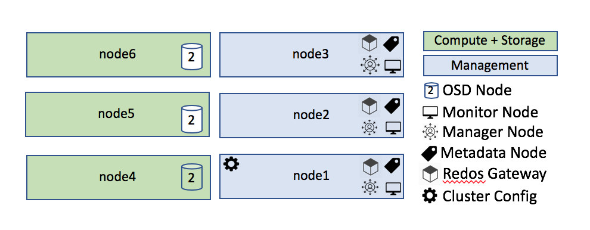
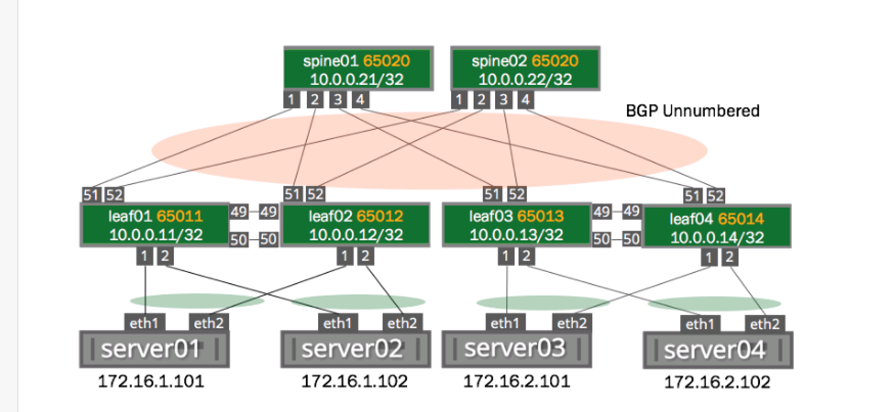
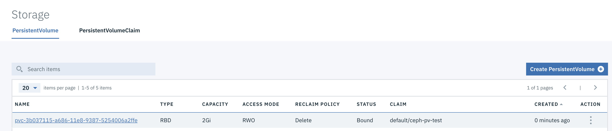

### Integrating ICP with CEPH

Ceph is short for "cephalopod", a class of mollusks of which the octopus is a member.  The octopus is used as the logo for Ceph and this name was chosen because the parallel processing nature of both the octopus and the software.

There are two ways of integrating ICP with Ceph.

Starting with version 2.1.0.3, IBM Cloud Private supports running the entire Ceph environment within ICP utilizing local (hostpath) storage as raw disk for the OSD nodes.  This method will install all of Ceph as workloads running within ICP.  This mechanism (as of version 2.1.0.3) has a number of limitations as described in the [ibm-rook-rbd-cluster github article](https://github.com/IBM/charts/tree/master/stable/ibm-rook-rbd-cluster).

For a more robust solution we will deploy a Ceph implementation outside of ICP and use that as the provider for a storage class which will allow any application to consume Ceph rbd dynamic storage.

Doing so requires an external CEPH infrastructure.  This document will walk through installing Ceph and integrating it with ICP for dynamic storage provisioning.

## Ceph Architecture

We will use a distributed storage architecture.  We will have three management nodes and three storage/compute nodes. Each storage/compute node has one disk with the operating system (/dev/sda) and two available raw disks for Ceph to consume (/dev/sdb, and /dev/sdc).



Each node is connected to the network via two Mellanox ConnectX-4 cards configured for bonded 802.3ad link aggregation for 200Gb/s combined throughput.  This provides for a hyperconverged and highly available architecture for both storage and data network traffic.  OSD nodes do not host management functions and vice versa.

The network architecture connecting these nodes is similar to that depicted in this diagram taken from the Cumulus documentation.



All management nodes are redundant for high availability and management nodes should not run on the same physical nodes as storage nodes, so to implement this solution, you should use at least two servers (or VMs), one for hosting management nodes and one for hosting storage nodes.

In a highly available environment, it is recommended to run three management nodes and at least three storage nodes so that it can handle the loss of any single node.

In this document we will use ubuntu 18.04 as our host operating system.

The hosts are named node1 - node6, respectively, and node1 will be our admin node.  node2 and node3 will be additional management nodes for HA and node4 - node6 will be compute/storage nodes.

We will first install Ceph and test creating and mounting a block device.  Then we will integrate with ICP.

## Prepare for Ceph installation

# Download and install ceph-deploy
The following commands should be run as the **root** user
1. Add the release Key

   ```
   wget -q -O- 'https://download.ceph.com/keys/release.asc' | sudo apt-key add -
   ```

2. Add the CEPH packages to your repository

  ```
  echo deb https://download.ceph.com/debian-{ceph-stable-release}/ $(lsb_release -sc) main | sudo tee /etc/apt/sources.list.d/ceph.list
  ```
  replace {ceph-stable-release} with the release ou would like to install e.g. mimic - `debian-mimic`

3. Install ntp on all nodes
  ```
  apt-get install -y ntp
  ```
  If there is a local ntp server on your network, update /etc/ntp.conf with your local pool server and restart ntp.

4. Install python on all nodes
  ```
  apt-get install -y python
  ```

5. Update and install

  ```
  apt-get update
  apt-get install -y ceph-deploy
  ```

6. Create a `ceph-deploy` user on all nodes.
  ```
  useradd -m -s /bin/bash -c "ceph deploy user" ceph-deploy
  echo "ceph-deploy:Passw0rd!" | sudo -S chpasswd
  ```
7. Add ceph-deploy user to passwordless sudo on all nodes
  ```
    echo 'ceph-deploy   ALL=(root) NOPASSWD:ALL' |sudo EDITOR='tee -a' visudo
  ```

# Run the following commands as the ceph-deploy user

8. Enable running Ceph commands easier on other nodes

  **Login as your ceph-deploy user** and create the following file at ~/.ssh/config.  You may need to create both the /home/ceph-deploy/.ssh directory and the config file.

  ```
  Host node1
   Hostname node1
   User ceph-deploy
Host node2
   Hostname node2
   User ceph-deploy
Host node3
   Hostname node3
   User ceph-deploy
Host node4
    Hostname node4
    User ceph-deploy
 Host node5
    Hostname node5
    User ceph-deploy
 Host node6
    Hostname node6
    User ceph-deploy
  ```

9. Enable passwordless SSH for the ceph-deploy user from the admin node to all other nodes.  **Execute these commands as the the ceph-deploy user.**  Accept all defaults.

  ```
  ssh-keygen -t rsa -P ''
  ```

  This will create ssh public and private keys in ~/.ssh .  Copy the keys to all other nodes:

  ```
  ssh-copy-id -i ~/.ssh/id_rsa ceph-deploy@node1
  ssh-copy-id -i ~/.ssh/id_rsa ceph-deploy@node2
  ssh-copy-id -i ~/.ssh/id_rsa ceph-deploy@node3
  ssh-copy-id -i ~/.ssh/id_rsa ceph-deploy@node4
  ssh-copy-id -i ~/.ssh/id_rsa ceph-deploy@node5
  ssh-copy-id -i ~/.ssh/id_rsa ceph-deploy@node6
  ```

  It will ask you for the password for the ceph-deploy user, answer with the password you created when you created the user.  When this is complete you should be able to execute `ssh ceph-deploy@node1` and get from the ceph-deploy user on the admin host to the remote host without providing a password.

  _IMPORTANT:_ Make sure you copy the ID back to the local node (node1) as well so the process can ssh back to itself.

## Deploy Ceph
Execute the following commands as the **ceph-deploy** user on the admin node.

1. Create the cluster
From the ceph-deploy user's home directory:
```
mkdir mycluster
cd mycluster
ceph-deploy new node1
```

2. Install Ceph on all nodes
```
ceph-deploy install node1 node2 node3 node4 node5 node6
```

3. Deploy the initial monitor and gather the keys
```
ceph-deploy mon create-initial
```

4. Copy the admin config files to all nodes
```
ceph-deploy admin node1 node2 node3 node4 node5 node6
```

5. Deploy a manager node
```
ceph-deploy mgr create node1
```

6. Deploy storage nodes

  The data should be the raw device name of an unused raw device installed in the host.  The final parameter is the hostname.  Execute this command once for every raw device  and host in the environment.

  ```
  ceph-deploy osd create --data /dev/sdb node4
  ceph-deploy osd create --data /dev/sdc node4

  ceph-deploy osd create --data /dev/sdb node5
  ceph-deploy osd create --data /dev/sdc node5

  ceph-deploy osd create --data /dev/sdb node6
  ceph-deploy osd create --data /dev/sdc node6
  ```

7. Install a metadata server
```
ceph-deploy mds create node1
```

8. Deploy the object gateway (S3/Swift) (optional)
```
ceph-deploy rgw create node1
```

9. Deploy mgr to standby nodes for HA (optional)

  On the admin node edit /home/ceph-deploy/mycluster/ceph.conf file and update the mon_initial_members, mon_host, and public_network values to reflect the additional nodes.  The resulting file should look something like this:

  ```
  [global]
  fsid = 264349d2-8eb0-4fb3-9992-bbef4c2759cc
  mon_initial_members = node1,node2,node3
  mon_host = 10.10.2.1,10.10.2.2,10.10.2.3
  public_network = 10.10.0.0/16
  auth_cluster_required = cephx
  auth_service_required = cephx
  auth_client_required = cephx
  ```

  Then deploy the new nodes:

  ```
  ceph-deploy --overwrite-conf mon add node2
  ceph-deploy --overwrite-conf mon add node3
  ```

10. Check the status of your cluster

  ```
  sudo ceph -s
  ```

  The result should look something like this:

  ```
    cluster:
      id:     2fdde238-b426-4042-8cf3-6fc9a151cb9b
      health: HEALTH_OK

    services:
      mon: 3 daemons, quorum node1,node2,node3
      mgr: node1(active), standbys: node2, node3
      osd: 6 osds: 6 up, 6 in
      rgw: 1 daemon active

    data:
      pools:   4 pools, 1280 pgs
      objects: 221  objects, 1.2 KiB
      usage:   54 GiB used, 11 TiB / 11 TiB avail
      pgs:     1280 active+clean
  ```

  You should see HEALTH_OK.  If not, look for your error message in the troubleshooting section below.

  The likelihood is that your health message will say something like:

  ```
  health: HEALTH_WARN
     too few PGs per OSD (3 < min 30)
  ```
  If you do not see this error, you can skip this section until you do see it (and you will).

  A PG is a "placement group" and governs how data is stored in your environment.  A full discussion of how this works is beyond the scope of this document, but resolving the warning can be done without knowing all of the details.

  For more information on this number see:

  * http://docs.ceph.com/docs/giant/rados/operations/placement-groups/
  * https://stackoverflow.com/questions/39589696/ceph-too-many-pgs-per-osd-all-you-need-to-know

  There are two numbers that are important to modify to resolve this issue, the first is the PGs and the second is the PGPs.  The PG is the number of placement groups available and the PGP is the number that are applied to your implementation.  Any time you increase the PGs you should also increase the number of PGPs.

  The documentation recommends using PG numbers with powers of 2 (2, 4, 16, 32, 64, 128,...). The simple solution to this issue is to start with a smaller number, apply it and see what the status says.  If it is still too small, continue to apply ever larger powers of 2 until the warning goes away.

  To change the number of PGs and PGPs, us the following command against every pool in your environment.

  To see the pools in your environment use the command:

  ```
  sudo ceph osd lspools
  ```

  Which should result in a list that looks something like this:

  ```
  1 .rgw.root
  2 default.rgw.control
  3 default.rgw.meta
  4 default.rgw.log
  ```

  For each pool in the list execute:

  ```
  sudo ceph osd pool set [pool name] pg_num 64
  ```

  Example:

  ```
  sudo ceph osd pool set .rgw.root pg_num 32
  sudo ceph osd pool set .rgw.root pgp_num 32
  ```

  Then check your status and see if you need to raise it further.  Continue increasing the number at the end of that command by powers of 2 until the warning goes away.

  Once you have a healthy cluster you can start using your new storage.

  The following command will show you all of your storage devices and their status.

  _Note:_ OSD = Object Storage Daemon

  ```
  sudo ceph osd tree
  ```

  The result should look something like this:

  ```
  -1       192.85042 root default                           
  -3        87.32849     host node4                         
   0   ssd   3.63869         osd.0      up  1.00000 1.00000
   1   ssd   3.63869         osd.1      up  1.00000 1.00000
  -5        47.30293     host node5                         
  24   ssd   3.63869         osd.2     up  1.00000 1.00000
  25   ssd   3.63869         osd.3     up  1.00000 1.00000
  -7        14.55475     host node6                         
  37   ssd   3.63869         osd.4     up  1.00000 1.00000
  38   ssd   3.63869         osd.5     up  1.00000 1.00000
  ```
### Test your newly installed Ceph instance

## Create and mount a block device

Block devices are the most commonly used types of storage provisioned by Ceph users.  Creating and using them is relatively easy once your environment is up and running.

Block devices are known as rbd devices (Rados Block Device).  When you create a new block device and attach it to your filesystem it will show up as /dev/rbd0, /eev/rbd1, etc.

Before you can create a block device you need to create a new pool in which they can be stored.

```
sudo ceph osd pool create rbd 128 128
```

_NOTE:_ The two numbers at the end of this command are the PG and PGP for this pool.  As a start, you should use the same values you used to get the health warning error to go away.  These values may need to be changed based on the size of your environment and number of pools as per the above discussion.

Once your pool has been created you can then create a new image in that pool.  An image is block storage on which you can create a filesystem and is analogous to a virtual disk.

```
sudo rbd map myimage --size 10240 --image-feature layering
```

This command will create a new 10GB disk named "myimage" suitable for mounting on your filesystem.  The --size parameter is in MB.

Now, ssh to the machine on which you want to mount this image.

Before the storage can be mounted you must install the Ceph client on the target machine.

```
sudo apt-get install -y ceph-common ceph-fuse
```

Create yourself a mount point:

```
sudo mkdir /mnt/myimage

sudo rbd map myimage --name client.admin
```

myimage is the name of the image you created previously everything else should be exactly as shown.

The result of this command is a new device named /dev/rbd0.

Next, put a filesystem on your new block device :

```
sudo mkfs.ext4 -m0 /dev/rbd0
```
... and mount your new filesystem at your created mount point:

```
mount /dev/rbd0 /mnt/myimage
```

Now, if you do an ls on your newly mounted filesystem you should see a `lost+found` directory indicating the root of a partition.

## Remove your test configuration

1. Remove your test mount

```
umount /mnt/myimage
```

2. Remove the rbd image from your Ceph instance

```
sudo rbd unmap myimage --name client.admin
```

3. Remove the pool

```
sudo ceph osd pool delete rbd
```

### Interating ICP with CEPH

1. Create an rbd pool for use with ICP

  ```
  sudo ceph osd pool create icp rbd 1024 1024
  ```

2. Create a new ceph user for use with ICP

  ```
  sudo ceph auth get-or-create client.icp mon 'allow r' osd 'allow class-read object_prefix rbd_children, allow rwx pool=icp' -o ceph.client.kube.keyring
  ```

3. Retrieve the Ceph admin key as base64

  ```
  sudo ceph auth get-key client.admin |base64
  ```

  This should return something like: `QVFDSGhYZGIrcmc0SUJBQXd0Yy9pRXIxT1E1ZE5sMmdzRHhlZVE9PQ==`

4. Retrieve the Ceph ICP key as base64

  ```
  sudo ceph auth get-key client.icp |base64
  ```

  This should return something like: `QVFERUlYNWJKbzlYR1JBQTRMVnU1N1YvWDhYbXAxc2tseDB6QkE9PQ==`

5. Create a new file named ceph-secret.yaml with the following contents:

  ```
  apiVersion: v1
  kind: Secret
  metadata:
    name: ceph-secret
    namespace: kube-system
  data:  
    key: QVFBOFF2SlZheUJQRVJBQWgvS2cwT1laQUhPQno3akZwekxxdGc9PQ==
  type: kubernetes.io/rbd
  ```

6. Create the secret in ICP

  Use the ICP UI to configure your kubectl client and create the 'ceph-secret' secret with the following command:

  ```
  kubectl create -f ./ceph-secret.yaml
  ```

7. Create a new file named ceph-user-secret.yaml with the following contents:

  ```
  apiVersion: v1
  kind: Secret
  metadata:  
    name: ceph-user-secret
    namespace: default
  data:
    key: QVFCbEV4OVpmaGJtQ0JBQW55d2Z0NHZtcS96cE42SW1JVUQvekE9PQ==
  type: kubernetes.io/rbd
  ```

  Where data.key is the key retrieved from ceph for the client.icp user.

8. Create the user secret in ICP

  Use the ICP UI to configure your kubectl client and create the 'ceph-user-secret' secret in the default namespace with the following command:

  ```
  kubectl create -f ./ceph-user-secret.yaml
  ```

  **Important Note:** Because this user was created in the 'default' namespace (as noted in metadata.namespace above) This storage class can only be used in the default namespace.

  To use Ceph dynamic provisioning in other namespaces you must create the same user secret in every namespace where you want to deploy Ceph dynamic storage.

  Because the storage class specifically references "ceph-user-secret" the secret should always have this name no matter what namespace is used.

9. Create the Ceph RBD Dynamic Storage Class

  Create a file named 'ceph-sc.yaml' with the following contents:
  ```
  apiVersion: storage.k8s.io/v1beta1
  kind: StorageClass
  metadata:
    name: ceph
    annotations:
      storageclass.beta.kubernetes.io/is-default-class: "true"
  provisioner: kubernetes.io/rbd
  parameters:
    monitors: 10.10.0.1:6789,10.10.0.2:6789,10.10.0.3:6789  
    adminId: admin  
    adminSecretName: ceph-secret  
    adminSecretNamespace: kube-system  
    pool: icp  
    userId: icp
    userSecretName: ceph-user-secret
    fsType: ext4
    imageFormat: "2"
    imageFeature: "layering"
  ```

  Where parameters.monitors are the IP addresses and ports of all Ceph monitor nodes, comma separated.

  Remove metadata.annotations.storageclass.* if this should not be the default storage class.

  **IMPORTANT:** As noted above, there will need to be a secret named `ceph-user-seret` in each of the namespaces where will use Ceph dynamic storage provisioning.  They should all be the same with the admin key for the *userId* user.

10. Test your new storage class by creating a new PV from the ceph pool.

  Create a file named ceph-pvc.yaml with the following contents:

  ```
  kind: PersistentVolumeClaim
  apiVersion: v1
  metadata:
    name: ceph-claim
  spec:
    accessModes:     
      - ReadWriteOnce
    resources:
      requests:
        storage: 2Gi
  ```

  Create the PV with the following command:

  ```
  kubectl create -f ./ceph-pvc.yaml
  ```

  Check the status of your new PVC:

  ```
  kubectl get persistentvolumes
  ```

  ```
  root@master:/opt/icp/ceph# kubectl get persistentvolumes
  NAME                                       CAPACITY   ACCESS MODES   RECLAIM POLICY   STATUS    CLAIM                                       STORAGECLASS               REASON    AGE
  helm-repo-pv                               5Gi        RWO            Delete           Bound     kube-system/helm-repo-pvc                   helm-repo-storage                    6d
  image-manager-10.10.10.1                   20Gi       RWO            Retain           Bound     kube-system/image-manager-image-manager-0   image-manager-storage                6d
  logging-datanode-10.10.10.3                20Gi       RWO            Retain           Bound     kube-system/data-logging-elk-data-0         logging-storage-datanode             6d
  mongodb-10.10.10.1                         20Gi       RWO            Retain           Bound     kube-system/mongodbdir-icp-mongodb-0        mongodb-storage                      6d
  pvc-3b037115-a686-11e8-9387-5254006a2ffe   2Gi        RWO            Delete           Bound     default/ceph-pv-test                        ceph                                 1m
  ```

  Look for a PV with a storage class of "ceph"

  or

  In the ICP UI, navigate to Platform->Storage and look for a PV of type "RBD":
  

  List your created PVs from Ceph:

  On your ceph admin or monitor node execute:
  ```
  sudo rbd list
  ```

  You should see something like:
  ```
  $ sudo rbd list
  kubernetes-dynamic-pvc-7d5c8c11-a687-11e8-9291-5254006a2ffe
  ```

  Remove your test PVC with the following command:
  ```
  kubectl delete -f ./ceph-pvc.yaml
  ```

11. To use your storage class with a deployment you must install the Ceph client on *all schedulable nodes*.  Execute the following on all ICP worker nodes:
  ```
  apt-get install -y ceph-common
  ```

12. Copy /etc/ceph/ceph.conf and /etc/ceph/ceph.client.admin.keyring from your Ceph admin or monitor node to each worker node.

  From each worker node as root execute:

  ```
  scp root@ceph-admin:/etc/ceph/ceph.conf /etc/ceph/
  scp root@ceph-admin:/etc/ceph/*.keyring /etc/ceph/
  ```

13. Depending on the version of Ceph and kubernetes you are using you may get an error when attempting to deploy a pod using Ceph dynamic storage. The event will look something like this:

```
MountVolume.WaitForAttach failed for volume "pvc-f00434db-a8d6-11e8-9387-5254006a2ffe" : rbd: map failed exit status 110, rbd output: rbd: sysfs write failed In some cases useful info is found in syslog - try "dmesg | tail" or so. rbd: map failed: (110) Connection timed out
```

Further investigation into the syslog file on the worker node should show an entry something like this:

```
Aug 25 13:32:50 worker1 kernel: [745415.055916] libceph: mon0 10.10.2.1:6789 feature set mismatch, my 106b84a842a42 < server's 40106b84a842a42, missing 400000000000000
```
... along with a bunch of other error messages

This error message indicates a missing feature flag in the Ceph client. The feature missing is CRUSH_TUNABLES5

To resolve this issue execute the following command on your Ceph admin or monitor node:

```
sudo ceph osd crush tunables hammer
```

Your pod should now finish provisioning.
