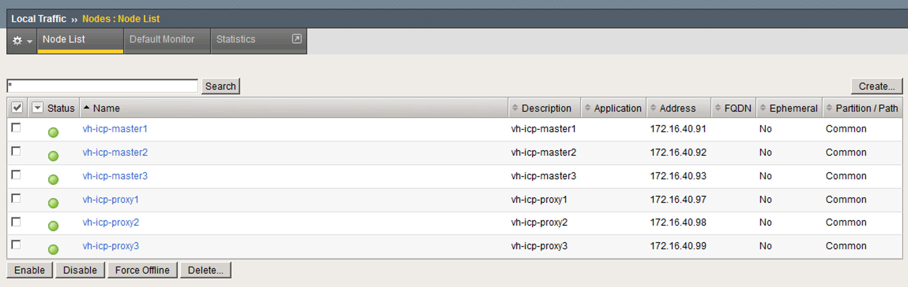
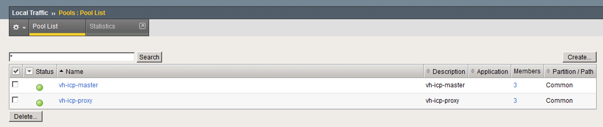
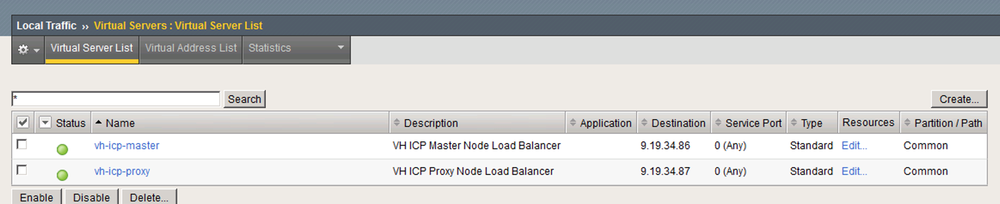
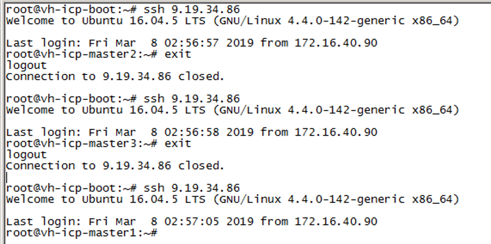

# Using F5 Load Balancer with ICP for HA Load Balancing

## Caveats
* This documentation makes use of the BIG-IP v14.1.0.2 Virtual Edition .ova on VMware ESXi.

* BIGIP installation will use a minimal install to prove the concept and will not get into complex configuration issues.

* The ICP version used in this document is ICP v3.1.1.

* All ICP nodes should be provisioned and configured with an IP address prior to beginning the configuration of the load balancer (called a Virtual Server by the F5 BIG-IP appliance).

## Installing F5 BIG-IP
* The F5 BIG-IP appliance expects four different subnets to exist. When installing the appliance you will be asked for network interfaces for internal, external, HA, and Management subnets.

  The _internal_ network is expected to be separated from the _external_ network by a firewall.

  The _management_ network is normally a separate subnet on which appliance management interfaces are exposed.  The separate subnet is normally on separate physical infrastructure such that if the normal data network fails, management interfaces of network and server appliances are still available to remediate failures.

  The _HA_ network is a separate subnet where redundant components of an HA cluster can communicate for reasons such as keep-alive messages and election of active masters, etc.  This network is normally not routable beyond the clusters that make use of it.

  * External - This subnet exists outside the firewall and is exposed to the larger company or general public.  Users of your ICP cluster will have direct access to this subnet.  In most instances, this is the corporate intranet but could also be the internet.

  * Internal - This subnet exists inside the firewall and is secured.  This is where your ICP instance will be installed. It is normally accessible only to system administrators and others with a specific need for access, but is kept mostly private for security reasons.

  * Management - This is the network you will use to access the management interface of the F5 BIG-IP appliance.

  * HA - If you have multiple F5 BIG-IP appliances, they will communicate on this subnet to elect active/standby roles.  If you only have one appliance this will be unused.  

* During the appliance deployment you will also need to specify the size of the appliance.  For this exercise, we chose 4 vCPUs, 8GB of RAM, and accepted the defaults for storage.

* Once the VM has been deployed, check the VMware console (on the Summary tab when the VM is selected in the vSphere web console) to find the DHCP address assigned to the the VM and point your browser to that IP address using https as the protocol (e.g. https://10.42.254.251).

  If you do not have DHCP available on your management network, you will need to login to the console and configure an IP address for your management interface.  Instructions for doing this are beyond the scope of this document, but are well documented in the F5 BIG-IP documentation.

* Login to the management console with a userid of `admin` and a password of `admin`.  On first login you will be prompted to change the default admin password.  After changing the password, it will put you back at the login prompt.  Proceed to login using the `admin` user and your newly provided password.

* The first page you are brought to asks you to push the `Next` button to begin the setup utility.

* The first task in setting up the appliance is providing the license key.  Click the `Activate` button and provide your registration key[s].

* This will drop you to the `Resource Provisioning` page.

* Accept the defaults and click `Next...`.

* Accept the default certificates (we can update it later, if needed) and click `Next...`

* It is recommended to leave the DHCP address in place for the management network until the initial setup is complete.  You can go back and set a static IP address at any time.  If you must, set the static IP address to be used for the management port (if you need to change it).

* If you changed the management IP address, you will need to change the IP in your browser URL to connect to it to continue the initial installation process.

* Set the hostname, Time Zone, and root password.  The rest you can leave at their defaults.

* At the next screen, under the "Standard Network Configuration" section, click "Next..."

* Leave the "Redundant Device Wizard Options", keep the defaults and click "Next..."

* Next, you will create the "Self IP" addresses of the various network interfaces. Specify a valid IP address for both the "Self IP" and "Floating IP".  Leave the "Port Lockdown:" parameter at the defaults.

  The "Self IP" is the IP address at which this appliance can always be reached.

  The "Floating IP" is the IP address that will be assigned to the current ACTIVE node.  If you are setting up an HA pair of appliances, the floating IP will be the same for both appliances.  The "Self IP" will be different, each unique appliance should have its own "Self IP".

* Under the "Internal VLAN Configuration" section, specify the VLAN Tag ID (if needed, or leave at "auto"), then specify the VLAN interface for the internal network (e.g. 1.1), specify whether the appliance should tag traffic with the VLAN ID, and click "Add".

  _Note:_ If the network switch (or VMware vSwitch virtual network port group) to which the appliance is connected applies the VLAN tag, you probably do not need to add it here.

  Interface 1.1 is the internal network interface, 1.2 is the external network interface, 1,3 is the HA network interface.  The management network typically does not use VLANs and there is no option to set one here.

* Repeat this process for the External network and HA network.  Note that the external network will also ask for a gateway address.  If you have multiple networks inside the firewall, you may need to add static routes under the "Network" menu item after initial installation is complete.

* When network interface definition is complete, it will ask you for a network time server.  It is very important that networks and servers are all in time sync specify one or more NTP servers and click "Next".

* On the next screen specify your DNS information and click "Next". Note that if you used DHCP for your management interface, this bit may already be filled in for you.  If necessary, make any needed changes and click "Next...".

* On the next screen, specify the interface that should be used for Config Sync.  Config sync makes sure the configuration of all appliances in a cluster have the same configuration.  Choose an interface and click "Next...".

* On the Failover and Mirroring screens, accept the defaults.

* On the Active/Standby Pair screen, if you are configuring an HA pair, under the "Standard Pair Configuration" section click the "Next..." button, otherwise, click the "Finished" button.

  For this tutorial, we will not use an HA pair, so we click "Finished".  Additional configuration of the HA pair involves finishing the initial configuration on the first device and then deploying and configuring a second appliance and at this section click "Next..." under the section entitled "Discover Configured Peer or Subordinate Device".

  Configuring an HA pair is beyond the scope of this document.

* When you have clicked "Finished" you are done with the initial F5 BIG-IP configuration and you will be dropped into the main F5 console screen.

## Configuring the BIGIP for pass-through load balancing.

There are several steps required to create the load balancer and you will need to carry out these steps for both the master nodes and the proxy nodes.

### Configure Nodes for all ICP Master and Proxy nodes
* From the main F5 console screen, click on "Local Traffic" -> Nodes -> Node List.

  This screen will show you your currently defined nodes.  If this is your first time doing this, the list will be empty.

  You will need to create entries in this list for all nodes across which traffic should be load balanced.

* At the top, right side, click the "Create..." button.

* Provide a name for your node (e.g. icp-master1), a description of the node (e.g. First ICP master node), and the IP address for the node.  Leave the "Configuration" section at the defaults.

* Repeat this process until all nodes are defined.  If you are creating a standard ICP configuration, this will normally consist of three master nodes and three proxy nodes.

* Once your nodes are properly defined, at the top of the window, click the "Default Monitor" tab.  In the "Available" box, choose "gateway_icmp" and click the "<<" button to move it over to the "Active" box, then click the "Update" button.

* A short time later, you should see the status of each node turn green on the "Status" column on the "Node List" screen.

  Your node list should look something like this:
  

### Configure Pools for all Master and Proxy nodes
* From the main F5 console screen, click on "Local Traffic" -> Pools -> Pool List.

* At the top, right, click the "Create..." button to create a pool of backend servers across which load should be balanced.

  * Under the "Configuration" section, leave "Basic" selected in the combo box and choose a name for your pool (e.g. icp-masters), a description of your new pool (e.g. "All ICP master nodes"), and then in the "Available" box, click on the "gateway_icmp" option and click the "<<" button to move it to the "Active" box.  Note that after the ICP install is complete, you may want to add "https" to the list of active health montiors.  This will ensure that not only does the node respond to a ping, but will also return a valid page to an http get request.

  * Under the Resources section, choose your load balancing method - we have chosen "Round Robin".  With this method, each successive call to the external IP address of your load balancer will be routed to the next available node in the pool.

  * In the "New Members" section, click the "Node List" radio button and choose one of the nodes previously defined.

    * For "Service Port", click on the "Select..." combo box and choose "* All Services".  ICP uses not only HTTPS, but also raw TCP sockets for communicating with the API server, docker, etc. and deployed applications may make connections to any given port.

    * Click "Add" to add the node to the pool.

    * Repeat this process until all nodes for this pool have been added.  For example, in your icp-master pool, you should have all of your master nodes listed.

  * When you are finished adding pool members to your pool, click the "Finished" button to create your pool.

  * Repeat this process to create a pool for your ICP proxy nodes.

  * If all of your nodes have a good health check, your status column should indicate green for your pools.

  * When you are done, your pool list should look something like this:

    

### Configure a Virtual Server (load balancer) for Master and Proxy Nodes

* From the main F5 console screen, click on "Local Traffic" -> Virtual Servers.

* At the top, right of the page, click the "Create..." button.

* In the General section:

  * Give your new Virtual Server a name (e.g. icp-master) and a description (e.g. "Load balancer for ICP master nodes").

  * In the "Source Address" blank put "0.0.0.0/0".  This will allow incoming traffic from any source.

  * In the "Destination Address/Mask" blank, put the IP address which should be used to reach your master nodes.  Remember this address becauase you will need it in your ICP config.yaml file.

  * In the "Service Port" blank, click "Select..." in the combo box and choose "* All Ports".

* In the Configuration section, leave the combo box at "Basic"

  * For Protocol, click the combo box and choose "* All Protocols" (you can change this later to be more strict if you like).

  * Next to "Any IP Profile", click "Select..." in the combo box and select "ipother".

  * Next to "Source Address Translation", click "None" and then click "Auto Map".  This will allow our master nodes to respond to requests back through the load balancer.

* In the Resources section, next to "Default Pool", click "None" and select the pool you created for your master nodes.

* When this is complete, click "Finished".

* Repeat this process to create a Virtual Server for your proxy nodes.

* When this is complete, you should see a list of Virtual Servers similar to the following:

  

* If everything was configured correctly, you should be able to ssh to the IP address of your virtual server and reach each of your nodes in succession:

  

  If this test is successful, you are ready to configure your config.yaml file and install ICP.

### Configure your config.yaml file to use your newly created load balancer.

* Edit your config.yaml file and look for the following section:

  ```
  ## External loadbalancer IP or domain
  ## Or floating IP in OpenStack environment
  cluster_lb_address: 10.19.34.86

  ## External loadbalancer IP or domain
  ## Or floating IP in OpenStack environment
  proxy_lb_address: 10.19.34.87
  ```

  Uncomment the lines containing "cluster_lb_address" and "proxy_lb_address" and enter the IP address of the external interface of your master and proxy virtual servers.

* You should not use a VIP for your master or proxy nodes if you are using a load balancer.  If using these lines in your config.yaml, the vip lines also in the config.yaml file should be commented out (they are by default):

  ```
  ## High Availability Settings for master nodes
  # vip_iface: eth0
  # cluster_vip: 127.0.1.1

  ## High Availability Settings for Proxy nodes
  # proxy_vip_iface: eth0
  # proxy_vip: 127.0.1.1
  ```

* If you are using NFS as your common filesystem for ICP HA, you will need to make sure your NFS server and clients are properly configured to avoid a docker "unknown blob" error while Installing

  1. On the NFS server, make sure you use the "sync" property
  ```
  admin@nfs-server:~$ cat /etc/exports
  /storage	*(rw,no_subtree_check,sync,insecure,no_root_squash)
  ```

  2. On each NFS client, ensure actimeo=0
  ```
  10.19.34.49:/storage/ha/registry	/var/lib/registry	nfs	auto,nofail,noatime,nolock,intr,tcp,actimeo=0	0 0
  10.19.34.49:/storage/ha/icp-audit	/var/lib/icp/audit	nfs	auto,nofail,noatime,nolock,intr,tcp,actimeo=0	0 0
  10.19.34.49:/storage/ha/log-audit	/var/log/audit		nfs	auto,nofail,noatime,nolock,intr,tcp,actimeo=0	0 0
  ```
  ```
  
* You can now install your ICP cluster as per normal.
