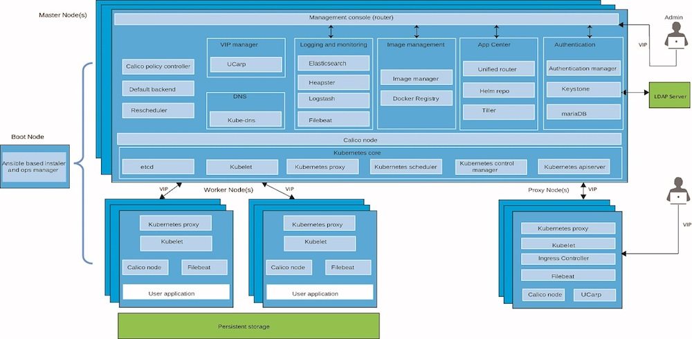

# IBM Private cloud

This project provides prescriptive guidance on how to efficiently deploy and operate IBM Private Cloud platform in the enterprise. We document the practical approach of planning enterprise private cloud environment, setting up DevOps tool chains, achieving HA/DR, securing the platform and monitoring your private cloud. The project contains assets and best practices to help accelerating the private cloud adoption.

## Architecture

## Sizing ICP

See the following page for recommended sizing of ICP environments: [Sizing](Sizing.md)

## Installing IBM Cloud Private

IBM Cloud Private (ICP) supports 64-bit Linux (Red Hat Enterprise Linux & Ubuntu 16.04 LTS) and Linux on Power. We provided some guidance on installing ICP on following virtualization and cloud platforms:

* VMware:
  *  [Installing ICP with Ubuntu](Installing_ICp_on_prem_ubuntu.md)
  *  [Installing ICP with RedHat Enterprise](Installing_ICp_on_prem.md)  
* AWS: [Installing ICP on AWS](Installing_ICp_on_aws.md)
* VirtualBow: [Installing ICP on VirtualBox](https://github.com/ibm-cloud-architecture/refarch-privatecloud-virtualbox)

### Deployment using TerraForm
* Terraform Module for provisioning ICP cluster: [terraform-module-icp-deploy](https://github.com/ibm-cloud-architecture/terraform-module-icp-deploy)
* Bluemix Infrastructure (formerly SoftLayer): [Deploy ICP Cluster to SoftLayer](https://github.com/ibm-cloud-architecture/terraform-icp-softlayer)

## Accessing IBM Cloud Private (ICP) through the CLI

[Accessing ICp](Accessing_ICp_through_CLI.md)

## Best practices

### Storage

[Storage Best Practices](ICp-Storage_best_practice.md)

See also the following article on working on storage in ICp: [Working with Storage](https://www.ibm.com/developerworks/community/blogs/fe25b4ef-ea6a-4d86-a629-6f87ccf4649e/entry/Working_with_storage?lang=en)

### LDAP

[LDAP Best Practices](ICP%20LDAP%20Best%20Practices.md)

### DevOps

[DevOps Best Practices](Implementing%20DevOps%20for%20IBM%20Cloud.private.md)
