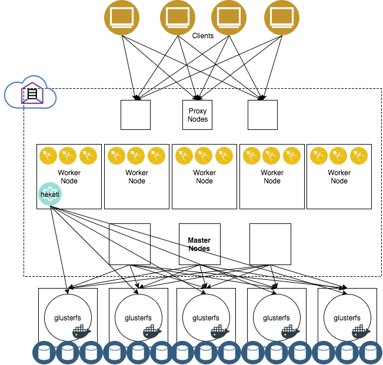

# Guidance on HA ICP Cluster Setup

This page provides guidance on how to setup a highly available, resilient ICP cluster with multiple master nodes and proxy nodes. As a pre-requisite, highly available shared storage needs to be created before installation for two directories that are shared on the master nodes, `/var/lib/registry` and `/var/lib/icp/audit`.  In this proof-of-concept, we provisioned [GlusterFS](https://www.gluster.org/) outside of the cluster as a low-cost option to demonstrate the feasibility of the solution, but the principle applies to other shared file system as well.  In a typical production deployment, the administrator is responsible for providing a vendor-supported highly available shared storage solution.

We will not provide detailed HA ICP installation steps here, for that, please reference the [IBM Cloud Private Knowledge Center](https://www.ibm.com/support/knowledgecenter/en/SSBS6K_2.1.0/installing/install_app_mod_HA.html)

## Topology overview

Here is the diagram for the validated Topology.



- There are three Proxy Nodes and three Master Nodes that are accessed using a Virtual IP.  The Virtual IP will forward the client to one of the master or proxy nodes in the cluster.  Using three nodes allows up to two hardware failures.

- GlusterFS is installed in at least three standalone nodes and can be scaled out as necessary by adding more storage nodes and/or block devices.  Since it is a distributed file system, it is resilient to hardware failures as it maintains redundant copies of data distributed throughout the cluster.  This is used to provide fault-tolerant storage for shared storage for the master nodes as well as application workloads.  In our test environment, we created three GlusterFS nodes so that a distributed volume can survive up to two hardware failures.

- If running ICP on VMware VMs, each of the master, GlusterFS, and proxy nodes should be in different Host Clusters, or to create DRS rules on the clusters so that each of the nodes in the HA group are on different physical hosts (and won't be migrated together).  This ensures that a hardware failure will only affect one member in the HA group.

The following table shows the test environment:

|hostname|IP addr|role|
|--------|-------|----|
|jk-glusterfs1|172.16.40.170|glusterfs|
|jk-glusterfs2|172.16.40.171|glusterfs|
|jk-glusterfs3|172.16.40.172|glusterfs|
|jk-master01|172.16.40.173|master|
|jk-master02|172.16.40.174|master|
|jk-master03|172.16.40.175|master|
|jk-proxy01|172.16.40.176|proxy|
|jk-proxy02|172.16.40.177|proxy|
|jk-proxy03|172.16.40.178|proxy|
|jk-mgmt01|172.16.40.179|management|
|jk-worker01|172.16.40.180|worker|
|jk-worker02|172.16.40.181|worker|
|jk-worker03|172.16.40.182|worker|
|jk-worker04|172.16.40.183|worker|
|n/a|172.168.40.188|jk-master-vip|
|n/a|172.16.40.189|jk-proxy-vip|

The shared directories `/var/lib/registry` and `/var/lib/icp/audit` are created as redundant storage on the three master nodes backed by a replicated volume in GlusterFS.

## Prerequisites

For these steps, we used [ansible](https://github.com/ansible/ansible) to run [ad-hoc commands](http://docs.ansible.com/ansible/latest/intro_adhoc.html) in parallel across multiple hosts.  This requires password-less SSH and a user that can `sudo` on the target hosts without passwords from the machine running the commands (usually the boot node).

We created a text file `hostlist.txt` as follows with each of the roles and IP addresses of the nodes in the cluster:

```
[gluster]
172.16.40.170
172.16.40.171
172.16.40.172

[master]
172.16.40.173
172.16.40.174
172.16.40.175

[proxy]
172.16.40.176
172.16.40.177
172.16.40.178

[management]
172.16.40.179

[worker]
172.16.40.180
172.16.40.181
172.16.40.182
172.16.40.183
```

### Install IBM Cloud Private EE in HA

Use the [documentation]((https://www.ibm.com/support/knowledgecenter/en/SSBS6K_2.1.0/installing/install_app_mod_HA.html) to install IBM Cloud Private in Highly Available configuration.

### kubectl

You will require the [kubectl](https://kubernetes.io/docs/tasks/tools/install-kubectl/) CLI.  Once installed, you can follow the [ICP documentation](https://www.ibm.com/support/knowledgecenter/en/SSBS6K_2.1.0/manage_cluster/cfc_cli.html) on how to use the `kubectl` CLI to manage the cluster.

# Install GlusterFS

Create three or more virtual machines for GlusterFS, each with one or more additional block devices on top of the OS disk that will be used to store the filesystem bricks.  On the GlusterFS nodes, we will run the gluster daemon in Docker containers.  Since GlusterFS runs in containers, the host operating system that the nodes are running is not important.  It can be either Ubuntu or RHEL.  The below steps are for Gluster nodes running on top of Ubuntu.

## Install Docker

Install Docker on all GlusterFS nodes.  Note that these steps will be different for RHEL hosts (using the [yum](http://docs.ansible.com/ansible/latest/yum_module.html) module instead of [apt](http://docs.ansible.com/ansible/latest/apt_module.html)).

```bash
ansible -i hostlist.txt gluster -b -m apt -a 'name=apt-transport-https state=present'
ansible -i hostlist.txt gluster -b -m apt -a 'name=ca-certificates state=present'
ansible -i hostlist.txt gluster -b -m apt -a 'name=curl state=present'
ansible -i hostlist.txt gluster -b -m apt -a 'name=software-properties-common state=present'
ansible -i hostlist.txt gluster -b -m apt_key -a 'url=https://download.docker.com/linux/ubuntu/gpg'
ansible -i hostlist.txt gluster -b -m apt_repository -a 'repo="deb [arch=amd64] https://download.docker.com/linux/ubuntu xenial stable" state=present'
ansible -i hostlist.txt gluster -b -m apt -a 'name=docker-ce state=present'
```

## Load the dm_thin_pool module at startup

GlusterFS uses `lvmthin` to manage volumes.  The GlusterFS hosts need to have the kernel module `dm_thin_pool` loaded in order to manage these thin pool volumes.

```bash
ansible -i hostlist.txt gluster -b -m raw -a 'modprobe dm_thin_pool'
ansible -i hostlist.txt gluster -b -m raw -a 'echo dm_thin_pool | sudo tee -a /etc/modules'
```

on RHEL, the command to add loading `dm_thin_pool` at startup is

```bash
ansible -i hostlist.txt gluster -b -m raw -a 'echo dm_thin_pool | sudo tee -a /etc/modules-load.d/modules.conf'
```

## Run GlusterFS in containers

We use the [gluster/gluster-centos:latest](https://hub.docker.com/r/gluster/gluster-centos/) image on each of the GlusterFS nodes to create the GlusterFS cluster.

The following commands create a directory for heketi-managed configuration, and starts GlusterFS in privileged containers with SSH listening on port 2222 using the host's `authorized_keys`.  This allows Heketi to manage the node over SSH.

```bash
ansible -i hostlist.txt gluster -b -m raw -a 'mkdir -p /var/lib/heketi'
ansible -i hostlist.txt gluster -b -m raw -a 'docker run \
  --restart always \
  -v /etc/glusterfs:/etc/glusterfs:z \
  -v /var/lib/glusterd:/var/lib/glusterd:z \
  -v /var/log/glusterfs:/var/log/glusterfs:z \
  -v /sys/fs/cgroup:/sys/fs/cgroup:ro \
  -v /root/.ssh:/root/.ssh:z \
  -v /var/lib/heketi:/var/lib/heketi:z \
  -v /dev/:/dev \
  -d \
  --privileged=true \
  --net=host \
  gluster/gluster-centos:latest'
```

In an air-gapped environment where there is no access to [Docker Hub](https://hub.docker.com), use the following command on the boot node to pull the image and push it to each of the Gluster nodes before running the above commands.

```bash
docker pull gluster/gluster-centos:latest
docker save gluster/gluster-centos:latest | gzip -c > gluster-centos.tar.gz
ansible -i hostlist.txt gluster -b -m copy -a 'src=gluster-centos.tar.gz dest=/tmp/gluster-centos.tar.gz'
ansible -i hostlist.txt gluster -b -m raw -a 'docker load < /tmp/gluster-centos.tar.gz'
```

# Install the GlusterFS client on all ICP nodes

In order to be able to mount the volumes created in GlusterFS, all ICP cluster nodes need the `glusterfs-client` package installed.  On RHEL this may be called `glusterfs`.

```bash
ansible -i hostlist.txt master,management,proxy,worker -b -m apt -a 'name=glusterfs-client state=present'
```

# Install heketi as a deployment on ICP

[Heketi](https://github.com/heketi/heketi) is a RESTful API used to manage GlusterFS nodes.  It can be run in a deployment in ICP so the container is managed by Kubernetes.

1. Create a secret containing the SSH private key used to connect to GlusterFS.  This key will be used to SSH as root into the GlusterFS *containers* running on the GlusterFS nodes (on port 2222).

   ```bash
   kubectl create secret generic heketi-ssh-key --from-file=<path-to-id_rsa>
   ```

2. Create the heketi deployment resources using the deployment yamls in the `heketi` directory in this repository.

  ```bash
  kubectl create -f heketi/
  ```

  This will create a heketi deployment in Kubernetes that manages the GlusterFS cluster.  The heketi database will be backed up to a Kubernetes secret called `heketi-db-backup`.

3. Create a file named `topology.json` used to describe the cluster nodes and disk devices.  This is used by Heketi to prepare the GlusterFS cluster.  Here is an example we used in our topology, where each of our GlusterFS nodes has two block devices, `/dev/sdb` and `/dev/sdc`.

   ```json
   {
     "clusters": [
       {
         "nodes": [
           {
             "node": {
               "hostnames": {
                 "manage": [
                   "172.16.40.170"
                 ],
                 "storage": [
                   "172.16.40.170"
                 ]
               },
               "zone": 1
             },
             "devices": [
               "/dev/sdb",
               "/dev/sdc"
             ]
           },
           {
             "node": {
               "hostnames": {
                 "manage": [
                   "172.16.40.171"
                 ],
                 "storage": [
                   "172.16.40.171"
                 ]
               },
               "zone": 1
             },
             "devices": [
               "/dev/sdb",
               "/dev/sdc"
             ]
           },
           {
             "node": {
               "hostnames": {
                 "manage": [
                   "172.16.40.172"
                 ],
                 "storage": [
                   "172.16.40.172"
                 ]
               },
               "zone": 1
             },
             "devices": [
               "/dev/sdb",
               "/dev/sdc"
             ]
           }
         ]
       }
     ]
   }
   ```

4. Load the Topology

   Find out the name of the heketi pod using the `kubectl` CLI.

   ```bash
   kubectl get pods  -l name=heketi
   NAME                     READY     STATUS    RESTARTS   AGE
   heketi-483281790-fb4t2   1/1       Running   0          1d
   ```

   Copy the `topology.json` into the pod and load it:

   ```bash
   kubectl cp ./topology.json heketi-483281790-7gdgn:/tmp/topology.json
   kubectl exec -it heketi-483281790-7gdgn -- heketi-cli topology load --json=/tmp/topology.json
   ```

   Heketi will initialize the GlusterFS storage devices.


# Create Highly Available volumes for shared directories in ICP

Create a shared volume for `/var/lib/registry` using the `heketi-cli`.  Here we created a 50GB volume that is replicated 3 times across nodes in the GlusterFS cluster.

```bash
kubectl exec -it heketi-483281790-7gdgn -- heketi-cli  volume create --name var_lib_registry --size 50
Name: var_lib_registry
Size: 50
Volume Id: 8d2ec04334caadaab214993cea8f8d3d
Cluster Id: f68c94b29fa6fe9cd487d7ba20d5737e
Mount: 172.16.40.170:var_lib_registry
Mount Options: backup-volfile-servers=172.16.40.171,172.16.40.172
Block: false
Free Size: 0
Block Volumes: []
Durability Type: replicate
Distributed+Replica: 3
```

Use the output of the command to mount the volume across all master servers, using the ansible [mount](http://docs.ansible.com/ansible/latest/mount_module.html) module.  Note that the heketi output uses commas (`,`) in the mount options, while the mount command uses colons (`:`).

```bash
ansible -i hostlist.txt master -b -m mount -a 'src=172.16.40.170:/var_lib_registry path=/var/lib/registry fstype=glusterfs opts=defaults,_netdev,backup-volfile-servers=172.16.40.171:172.16.40.172 state=mounted'
```

The GlusterFS client initially downloads the volume metadata from the source (172.16.40.170), and if that server is not available, will fall back to the other two servers specified in `backup-volfile-servers` (i.e. 172.16.40.171,172.16.40.172).  Note that this is only the initial metadata, and once it has been downloaded, the client will discover the rest of the cluster topology and mount the distributed volume.  If we need to expand or move the bricks used to create the distributed volume after it has been mounted, this will automatically be discovered by the client.

Repeat the above for the other shared directory, `/var/lib/icp/audit`:

```bash
kubectl exec -it heketi-483281790-7gdgn -- heketi-cli  volume create --name var_lib_icp_audit --size 5
Name: var_lib_icp_audit
Size: 5
Volume Id: e9556b487b9f9f191d7f86fdbd1bbf34
Cluster Id: f68c94b29fa6fe9cd487d7ba20d5737e
Mount: 172.16.40.170:var_lib_icp_audit
Mount Options: backup-volfile-servers=172.16.40.171,172.16.40.172
Block: false
Free Size: 0
Block Volumes: []
Durability Type: replicate
Distributed+Replica: 3

ansible -i hostlist.txt master -b -m mount -a 'src=172.16.40.170:/var_lib_icp_audit path=/var/lib/icp_audit fstype=glusterfs opts=defaults,_netdev,backup-volfile-servers=172.16.40.171:172.16.40.172 state=mounted'
```


# Create a dynamic storage class for GlusterFS

Kubernetes has a built-in storage class for using GlusterFS to create distributed volumes.  This can be used by clients to fulfill [PersistentVolumeClaims](https://kubernetes.io/docs/concepts/storage/persistent-volumes/#persistentvolumeclaims) for storage that is fault-tolerant.

Discover the ClusterIP of the `heketi` service using the `kubectl` CLI:

```bash
kubectl get svc heketi
NAME      CLUSTER-IP   EXTERNAL-IP   PORT(S)    AGE
heketi    10.0.0.220   <none>        8080/TCP   1d
```

Here we can see that heketi is available inside the cluster at http://10.0.0.220:8080.  Create a storageclass which will use the heketi endpoint to create persistent volumes.

```bash
echo "apiVersion: storage.k8s.io/v1beta1
kind: StorageClass
metadata:
  name: gluster-heketi
provisioner: kubernetes.io/glusterfs
parameters:
  resturl: http://10.0.0.220:8080" | kubectl create -f -
```

To test, create a PersistentVolumeClaim using the storage class:

```bash
echo "apiVersion: v1
kind: PersistentVolumeClaim
metadata:
 name: gluster1
 annotations:
   volume.beta.kubernetes.io/storage-class: gluster-heketi
spec:
 accessModes:
  - ReadWriteOnce
 resources:
   requests:
     storage: 5Gi" | kubectl create -f -
```

The request should have be bound by the provisioner and available to be used a volume by a pod in Kubernetes:

```bash
kubectl get pvc gluster1
NAME       STATUS    VOLUME                                     CAPACITY   ACCESSMODES   STORAGECLASS     AGE
gluster1   Bound     pvc-1ac1d5fd-d132-11e7-8b88-005056a56978   5Gi        RWO           gluster-heketi   5s
```

To make this storage class the default storage class, use the following command:

```bash
kubectl patch storageclass gluster-heketi -p '{"metadata": {"annotations":{"storageclass.kubernetes.io/is-default-class":"true"}}}'
```
