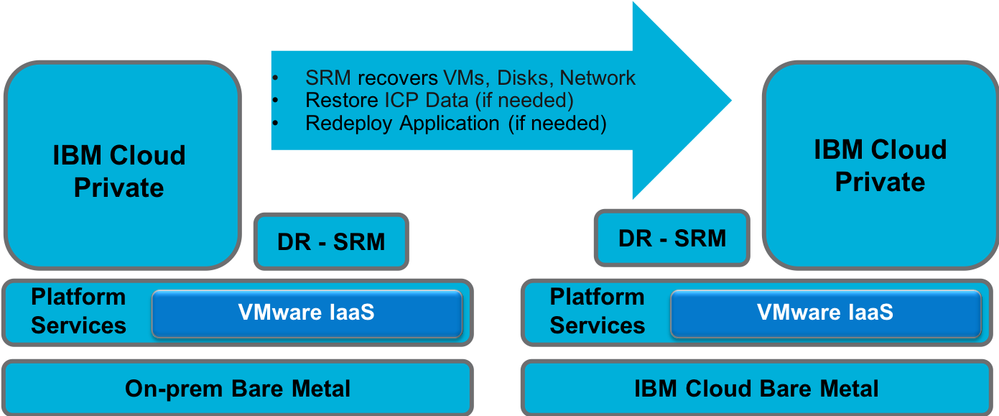

# Disaster Recovery of ICP on Vmware on-prem to Cloud

IBM Cloud Private is a packaged software offering which is used to setup a private cloud on the IaaS of the users choosing. Here we focus on a Disaster Recovery usecase where ICP is used to setup a Kubernetes based Private Cloud on Vmware as described in [ICP Backup](https://github.com/ibm-cloud-architecture/icp-backup)



The Disaster Recovery site is being simulated using another VMware vCenter Server on IBM Cloud (VCS)  with similar hardware. VMware Site Recovery Manager (SRM) is used to manage the Disaster Recovery of the VMs. SRM is expected to recover:
* Network
* VMs used as Nodes of the cluster
* Storage Volumes

In addition to recovery of the VMs, the following Kubernetes state may need to be recovered if the distributed state gets corrupted. Therefore it is a good practice to backup this state and restore it in the recovered VMs if needed. The backup and restore process is described in [ICP Component Backup](https://github.com/ibm-cloud-architecture/icp-backup/blob/master/docs/components.md)

* etcd DB
* Image Registry
* Cloudant DB
* MariaDB

## Test Environment Setup

The primary site is hosted on a VCS cluster. These servers are hosted in an isolated environment which is accessible via a Jump server. This simulates an on-prem environment. The specs of the VCS clusters are as follows:

```
2 Vmware ESXi 6.5.0 Servers
  - 56 2.2 GHz Logical CPU
  - 192 GB Mem
  - 4 TB Disk
```

The following [Terraform scripts](https://github.com/jkwong888/terraform-icp-vmware/) were used to deploy a Kubernetes cluster. The VM template was preconfigured to allow SSH access from the Boot node. Since these VM were in an environment with no external access, the VM template was pre-populated.

These terraform scripts were used to deploy the following VMs:

* 3 Master Nodes (4 vcpu, 16 Gb RAM)
* 3 Proxy Nodes (1 vcpu, 2 Gb RAM)
* 3 Worker Nodes (2 vcpu, 8 Gb RAM)
* 3 Management Nodes (4 vcpu, 16 Gb RAM)

An NFS server was setup to provide the shared storage needed on the Master nodes for the Registry. The same NFS server was also used to provide the PVs for the PVCs needed for Cloudant and MariaDB backups.

SRM is used to manage the Disaster Recovery of the VMs. In this test SRM was configured as follows, and these values should be adjusted based on time it takes to create a Replication Instance and Syncronization to the target site:

* Recovery Point Objective of 4 Hours
* Point in Time Replication Instances - 1 (older instances are deleted)
* Recovery Time Objective 15 Minutes

The following tests are deployed to simulate a workload on the cluster. However these can be substituted with any other application that will be deployed in the environment needing DR.

* Script to generate persistent state as configmaps <https://github.com/ibm-cloud-architecture/icp-backup/blob/master/scripts/createConfigMaps.sh>
* Script to add load to the worker nodes through deployment and draining of the worker nodes <https://github.com/hassenius/k8s-etcd-loadgenerator/blob/master/load-generator.sh>

## ICP Component Backup

### etcd
The cluster state as stored in etcd was backuped up using etcdctl as described in the these steps <https://github.com/ibm-cloud-architecture/icp-backup/blob/master/docs/etcd.md> executed in one of the master nodes. In this DR scenario, SRM is expected to recover the master nodes and therefore the backup file was left on the master nodes in case it is needed to be restored. For a production deployment, the backup files should be stored off the cluster.

### Registry
Several images were added to the Docker registry as this was an isolated environment where the external registries were inaccessible. The registry is backed up by saving all contents of `/var/lib/registry` as described in these <https://github.com/ibm-cloud-architecture/icp-backup/blob/master/docs/registry.md>. Since the private registry is hosted on a shared NFS file system which is expected to be available on the target environment, this step was skipped for this test.

### Cloudant
The Cloudant backup requires a PV and a PVC backed by an NFS share was created for backup up Cloudant data as described here <https://github.com/ibm-cloud-architecture/icp-backup/blob/master/docs/cloudant.md>. Since an NFS share accessible on the target environment is being used, the backed up data was left on the NFS share. In this isolated environment, the Docker images needed for the Cloudant backup had to be populated in the private registry of the cluster.

### MariaDB
Similar to Cloudant backup a PVC backed by an NFS share was created for backup of MariaDB data as described here <https://github.com/ibm-cloud-architecture/icp-backup/blob/master/docs/mariadb.md>. The backup data was left on the NFS share to be used for restore in the target environment. Similar to Cloudant backup, the Docker images needed for MariaDB backup had to be populated in the private registry.

## DR Test

### SRM Metrics

| VM | Provision Space | Used Space | Snapshot |
|:------------:|:------------:|:------------:|:------------:
| Management 1 | 534 GB | 184 GB | 8.6 GB |
| Management 2 | 534 GB | 184 GB | 7.7 GB |
| Management 3 | 536 GB | 186 GB | 9.8 GB |
| Master 1 | 336 GB | 136 GB | 3.1 GB |
| Master 2 | 337 GB | 137 GB | 3.9 GB |
| Master 3 | 336 GB | 136 GB | 2.8 GB |
| Proxy 1 | 320 GB | 120 GB | 432 MB |
| Proxy 2 | 320 GB | 120 GB | 415 MB |
| Proxy 3 | 320 GB | 120 GB | 432 MB |
| Worker 1 | 334 GB | 134 GB | 691 MB |
| Worker 2 | 334 GB | 134 GB | 723 MB |
| Worker 3 | 334 GB | 134 GB | 449 MB |

* The maximum time observed for the initial replication was 90 seconds, with additional point in time replications taking between 5 - 35 seconds.
* Time to start the VMs on the recovery site was 3 - 5 minutes. There was a 10Gbps network between the two sites for data transfer.

### ICP Verification

After recovery of the VMs using SRM, the ICP components did not need to be recovered individually as the cluster was confirmed to be in an healthy state based on the following:

* The health check on etcd returned healthy.
* The test application PODs were running still running on the recovered cluster. 
* The test application PODs were deleted and redeployed without error, proving new workloads can be deployed as well from the registry.
* The configmaps created by the test application were present
* The mysql command was used to connect to MariaDB to confirm it was up.
* The helm repositories were accessible from the dashboard.

In the event, one ore more ICP components is corrupted on the recovered VMs, the state can be restored using the backup. Similarly the application can also be re-deployed if needed.
