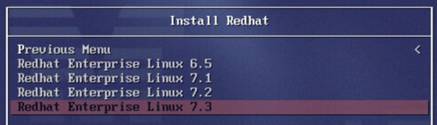
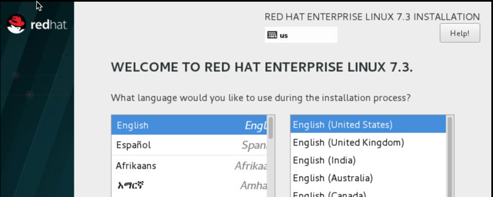
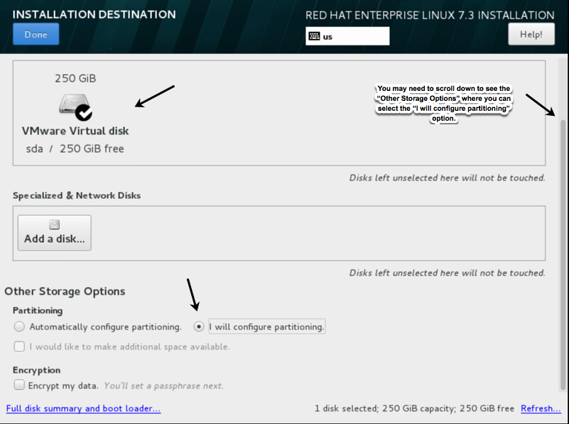
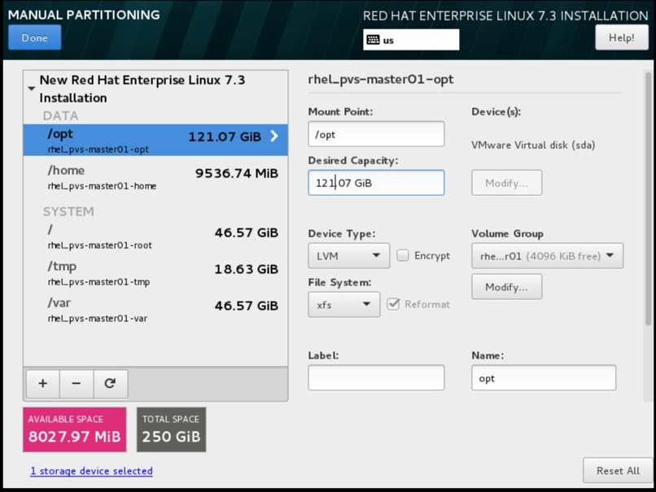
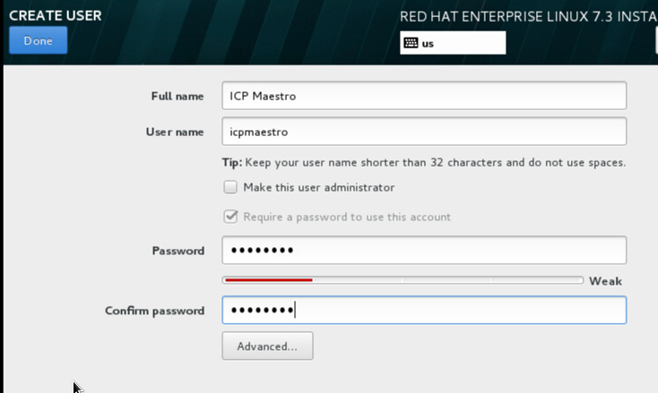

# Installing RHEL 7 - a sample
For those of you who may need to build your own VMs, this section provides a step-by-step look at installing RHEL v7 on a VM created in a vCenter cluster.  Obviously, some details may be different due to differences in hypervisor or your specific environment.  The intent of this section is to provide enough guidance to get you through the RHEL 7 installation process, particularly if you are not an experienced RHEL system administrator.

- In a vCenter console, a VM is initially created in the "Hosts and Clusters" navigation pane.  You can right-click on a cluster folder and select "New Virtual Machine...". Follow the bouncing ball from there.  You will shortly get to a screen that lets you configure the VMs resources. (See figure below.)

*NOTE:* A more realistic ICP master node resource allocation is 8 core, 32 GB of memory, 250 GB storage. We used smaller core and memory for this sample deployment. See the resource allocation table in section [A production ICP installation in a nutshell](#A production ICP installation in a nutshell) for suggested production deployment resource allocations for the various ICP machine roles.

*NOTE:* When creating VMs in a "cloud" environment, it is usually appropriate to select "thin provisioning" for the disks as shown in the figure above.

- Continue to follow the bouncing ball until you hit finish.

- Power on the VM and right-click on it and select the "Open console" item.  Once the console is open you should see something in the console that looks like the figure below.

- Choose the most recent version of RHEL available.

- A lot of logging will scroll by on the console as some initial installation steps occur.

- You will be presented with a screen where you can choose the language you want to use.  (See figure below.)

- Once you choose the language, click on the Continue button in the lower right corner.

- The next screen is where all the action is. (See figure below)  You will likely need to scroll to see all the installation configuration options.

- Things to take particular note of in this screen are:
  - Software Selection: For an ICP node a "minimal install" is sufficient.  Anything else you need can be picked up from a RHEL yum repository.  A minimal install keeps the VM small and fast to boot.  If you want to look at the other options click on the Software Selection icon.

  - Installation Destination: This is where you configure disk partitions and file system layout. See RHEL 7 documentation section: [Installation Destination](https://access.redhat.com/documentation/en-us/red_hat_enterprise_linux/7/html/installation_guide/sect-disk-partitioning-setup-x86) for guidance on disk partitioning.  Consult your operations team for the standard disk partitioning and file system layout used for RHEL images. See the subsection below for steps for laying out the file system partitions.

  - Security Policy: (In this sample, no security profile is selected. Use of the security profiles is currently beyond the scope of this installation guide.)

  - Network and Host Name: You will likely want to choose a non-default host name.  Consult your operations team to find out what host naming conventions are used in your data center.  This is also where additional NICs can be configured. For this sample only 1 NIC was configured.

## RHEL v7 installation disk partitioning

When you select "Installation Destination" in the installation summary screen, you will see the option, "I will configure partitioning".  You may need to scroll down to expose that option. (See figure below.)

- Once you have indicated that you want to customize the disk partitions, click on the blue Done button in the upper left corner.

- The next screen will allow you define multiple mount points and file system size for each mount point.  (See figure below.)

*NOTE:* The partitions are configured to use LVM except for the boot and swap partitions.  The boot partition needs to be a "standard disk" partition.  The recommended boot partition size is relatively small: 250 MB. It only needs to hold the boot loader, the kernel and some other low level system files. The swap space is also a standard disk partition.

The following table is a summary of the sample disk partitions.

| File System Name          |  Mount Point      |  Size (GB)    |
|:--------------------------|:------------------|--------------:|
|   system (aka root)       |   /               |    50         |
|   boot                    |   /boot           |   256 MB      |
|   swap                    |                   |     8         |
|   var                     |   /var            |   160         |
|   tmp                     |   /tmp            |    50         |
|   home                    |   /home           |    10         |
|   opt                     |   /opt            |    10         |

The figure below is a screen shot after the disk has been fully partitioned.  (The partition sizes in the screen shot are different from those in the table above.)

- Once you finish defining the disk partitions, click on the Done button in the upper left corner of the screen.  You will be returned to the Software Summary screen.

- At this point you can click on "Begin Installation" in the lower right corner of the Software Summary screen.

- In the next screen you need to provide the root password.

- Create a default user. In this sample, a user named "ICP Maestro" with user ID `icpmaestro` is created.

- Once the installation has completed, a reboot button will appear in the lower right corner of the final installation screen. The reboot completes the installation.

- Using the console, log in and get the IP address (`ip addr` or `ifconfig -a`) of the new VM and record it in your machine inventory.

- At this point you should be able to `ssh` to the machine either as root or as the default user you defined.
