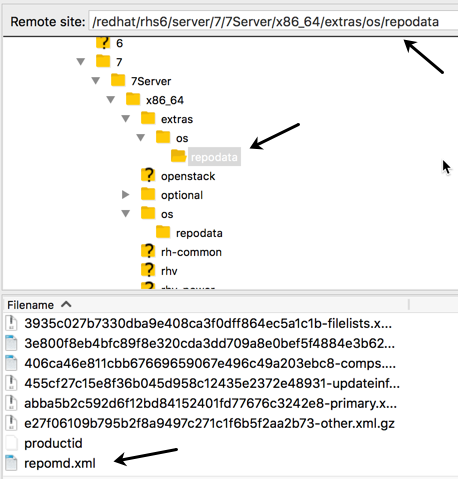
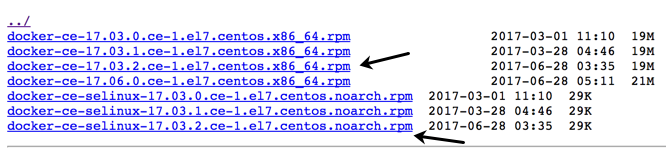
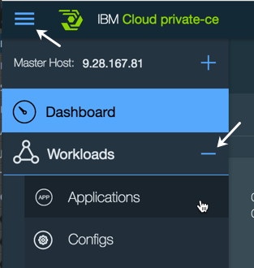

Install IBM Cloud Private v2.1 on Red Hat Enterprise Linux v7
=============================================
# Introduction
This is a guide to creating a small IBM Cloud Private (ICP) cluster on RHEL v7.x.  It is intended to enhance the installation instructions available in the [ICP Knowledge Center (KC)](https://www.ibm.com/support/knowledgecenter/SSBS6K_2.1.0/kc_welcome_containers.html).

The phrase "ICP instance" is used in this document to refer to an installation of ICP.

The term "cluster" is used to mean the VMs that are under the control of a given ICP instance.  At times in this guide the word "cloud" is used to mean the same thing as cluster.

This instruction guide assumes the VMs to be used for the ICP instance are provided to you by some providing entity.

Root access must be available to the person doing the ICP installation for all of the ICP machines (VMs) that will be members of the ICP cluster.  An ICP installation as non-root is beyond the scope of this document.

IBM Cloud Private is built on Docker and Kubernetes.  Cloud Foundry may also be part of an ICP instance.  The installation and deployment of Cloud Foundry is outside the scope of this guide.  

IBM Cloud Private has certain components (the "master" and "proxy" nodes, for example) that may be deployed as singletons in a simple installation as described in this guide. An installation that includes redundancy of all components is beyond the scope of this guide.

The installation described in this document uses Docker CE.  Installing Docker EE is outside the scope of this document.

*NOTE:* As of March 2017, Docker broke out two builds, one referred to as Community Edition (CE) and the other referred to as Enterprise Edition (EE).  Docker EE is intended to be used on RHEL.  Docker EE requires a subscription and payment for a license.  Docker CE and Docker EE are intended to be functionally identical.  Docker EE comes with full support as opposed to Docker CE, which only has "community" support, i.e., if you run into a problem you may not be able to get support in a timely manner.

*NOTE:* If you want to use Docker CE on RHEL, get the [Docker CE packages built for Centos](https://download.docker.com/linux/centos/7/x86_64/stable/Packages/).  Packages built for Centos have binary compatibility with RHEL.

For Docker on RHEL information see: ["Get Docker EE for Red Hat Enterprise Linux"](https://docs.docker.com/engine/installation/linux/docker-ee/rhel/).

# Getting started overview

This section provides a big picture summary of the installation process.

* An IBM Cloud Private (ICP) installation is usually made up of multiple virtual machines that are collectively referred to as a cluster.  (This document may also refer to the collection of machines as a cloud or an ICP instance.) Individual machines are referred to as nodes.  An ICP installation includes machines with a special role as itemized here:
  * Boot-master - The machine where the ICP control is installed. (It is typical to combine the "boot" and "master" into one machine.)
  * Management - The simple installation used to create this document combines the management role with the boot-master node.
  * Proxy - Machine used for request routing
  * Multiple worker nodes

* The ICP v2.1 Knowledge Center section [Supported operating systems and platforms](https://www.ibm.com/support/knowledgecenter/SSBS6K_2.1.0/supported_system_config/supported_os.html), has a list of supported operating systems.  ICP is supported on RHEL 7. ICP is not supported on RHEL 6.

* System requirements: The ICP v2.1 Knowledge Center section [Hardware Requirements and Recommendations](https://www.ibm.com/support/knowledgecenter/SSBS6K_2.1.0/supported_system_config/hardware_reqs.html), has a table describing the system requirements for each of the types of nodes in an ICP instance. The installation described in this document is a "multi-node cluster".

* It is a really good idea that all machines used for ICP have access to a yum repository in order to install various RHEL packages that are pre-requisites for ICP.  Many data centers have a Red Hat Satellite server available.

* It is a really good idea for all the machines in the ICP cluster to have access to the public Internet.  The public Docker yum repository makes it convenient to install the latest version of Docker CE. Docker Hub is convenient for access to commonly available Docker images.

## The ICP installation in a nutshell:
1. Customize RHEL for Docker and ICP.
2. Install Docker on the Boot-Master.
3. Set up RSA based ssh login from the Boot-Master to all nodes in the cluster.
4. Run the ICP inception on the boot-master.

Some other steps may need to be taken depending on specific circumstances:
* Configure access to yum repositories.
* Configure /etc/hosts files on all cluster members if DNS is not available to resolve host names and IP addresses.
* Update RHEL to the latest patch level.
* Install NTP.

# Basic RHEL configuration

The sub-sections in this section describe some basic RHEL configuration required to support ICP cluster members.  We are calling this "basic" configuration because it is typical that a RHEL VM will be configured as described in these sub-sections.

If you are creating your own virtual machine, you can do all these steps on your initial VM before cloning it.

If you are using VMs that were deployed for you, then it is likely the VMs are already configured as described in these sub-sections.  You may want to confirm that all the VMs that are going to be part of the ICP cluster have been configured as described in these sub-sections.

## Configure network interface to start on boot

*NOTE:* This section describes steps you won't need to do for a virtual machine deployed for you in a typical virtualization platform.  If you are building your own VM, you will likely need to complete these steps.

By default, RHEL 7 network interfaces are not started at boot time.  This tends to be inconvenient.  This section describes the steps to configure a network interface to start at boot time.

To find out the names of the network interfaces on a machine you can use the `iconfig` command.  The name of each network interface is in the first column.

The network interface configuration files are in `/etc/sysconfig/network-scripts/`.  The file names include the name of the network interface as seen in the `ifconfig` command output.

1.	Edit the file in `/etc/sysconfig/network-scripts` associated with the network interface to be started at boot time, e.g., `/etc/sysconfig/network-scripts/ifcfg-ens33`.

2.	Change the value of `ONBOOT` from no to yes: `ONBOOT=yes`

3.	Save the changes.

4.	If desired, test by rebooting:

    shutdown -r now

When the VM comes back up the network interface should be UP/RUNNING. The ifconfig command includes the status of each interface.

## Configure the host name
This section describes the configuration of the host name for RHEL 7 VMs.

*NOTE:* This step is unnecessary and is **not advisable** in scenarios where the VMs were provided to you. Check with your VM provider, system administrator and/or network administrator before changing a host name.

Host name considerations usually involve using naming conventions provided by the network and system administrators.

Be sure to use a fully qualified domain name (FQDN) for the value of the host name.

Some sample "toy" host names: `bootmaster`, `proxy`, `worker01`, etc.  

There are a couple of different places where the host name is specified.

For RHEL 7 the host name can be set using the `hostnamectl` command.

    hostnamectl set-hostname bootmaster01.site.org.com

See the man pages for hostnamectl for more information.

Additional notes on host name:
1.	The host name is stored in the `/etc/hostname` file.  (NOTE: This file should only have the text of the host name on a single line with no newline character.)

2.	There may be a HOSTNAME directive in the /etc/sysconfig/network file.

3.	A reboot is needed to have the host name change take effect: `shutdown -r now`

## Enable remote login for root via ssh

*NOTE:* For RHEL v7.x, by default root can login via ssh using a password.

The configuration for ssh is in /etc/ssh/sshd_config.  You will notice that PermitRootLogin is commented out.  However, UsePAM is set to yes.  A PAM configuration file for sshd is in /etc/pam.d. Configuration of the PAM plugin for sshd is beyond the scope of this document.

## Yum repository configuration

*NOTE:* A RHEL virtual machine provided for you will very likely already have a yum repository configured, most likely using a Red Hat Satellite (RHS) server.  This section is intended to provide guidance for those who need to configure a yum repository.

*NOTE:* You may need to provide a userid and password as part of the yum repository URL. If you are using an ID with an @ character in it, e.g., an Internet email address, use %40 in place of the @ character.  Otherwise the repository URL is misinterpreted because an @ character marks the beginning of the host name in the URL.

You need to set up the repos for yum to be able to install additional packages and get OS updates.

The yum repo definition files are in `/etc/yum.repos.d/`. Any file in that directory with a .repo extension will be treated as a repo definition.

Each file may have multiple repositories defined.

Each repo definition typically has at least 5 attributes:

    [rhel-os]
    name=Red Hat Enterprise Linux at my site
    enabled=1
    gpgcheck=0
    baseurl=<protocol>://<userid>:<password>@<repo_host>/<repo_path>

The `<protocol>` could be ftp or http(s) for remote repos, or file for a local repo.

If the repository requires a `<userid>` and `<password>`, that is included in the URL as shown.

See the Red Hat documentation [Configuring Yum and Yum Repositories](https://access.redhat.com/documentation/en-us/red_hat_enterprise_linux/7/html/system_administrators_guide/sec-configuring_yum_and_yum_repositories) for more details.

The <repo_path> needs to point to a directory with a `repodata` sub-directory where a file named `repomd.xml` is found.  If you need to explore a repository to determine the <repo_path>, something like Filezilla is very handy to use for exploration.  You can also confirm your user ID and password in getting to the repo.  (See figure below.)

In the figure above the `<repo_path>` text would be:  `/redhat/rhs6/server/7/7Server/x86_64/extras/os/`

You may need to explore a given collection of yum repositories in order to figure out where various packages are located.  Packages are typically spread across multiple directories such as "os", "optional" and "extras".

Depending on how DNS is configured, you may need to add an entry in the `/etc/hosts` file for the `<repo_host>`.

Once you have configured the yum repository you can do a quick test to confirm the configuration file is correct:

    yum repolist

Yum caches its repository information as a performance enhancement. If you want to "clean" the cache to make sure you are not using stale information about yum repositories, use:

    yum clean all

Once you have the desired yum repositories configured, you can proceed with any RHEL configuration that requires additional packages (rpms) to be installed.

## Update RHEL
This is an optional step and may not be necessary depending on the virtual machine that has been provided to you.

If you are building a VM from scratch, then you should do a full RHEL update to pick up updates since the release of the RHEL image you are using for the initial install.

It is assumed you have configured your VM with yum repositories.

1. Do a yum update (`yum -y update`) - This gets all the latest patches for everything already installed.

2. Then reboot. (`shutdown -r now`). You need to reboot to get to the latest kernel.

## Install NTP

This step is only needed if you are building a virtual machine.  NTP will be installed on a VM provided to you.

NTP is needed to keep the time synchronized with the rest of the world.  All of the VMs in the ICP cluster will need to share a common notion of time, and the usual approach to keeping time is to use NTP.  

*NOTE*: If you are using virtual machines provided to you, it is very likely NTP is already installed and enabled for startup at machine boot.

1.	Install NTP

        yum -y install ntp

2.	Check the NTP configuration in `/etc/ntp.conf`

See the Red Hat documentation, [Configure NTP](https://access.redhat.com/documentation/en-us/red_hat_enterprise_linux/7/html/system_administrators_guide/s1-configure_ntp), for more detailed guidance.

*NOTE*: The default `/etc/ntp.conf` content is likely sufficient.  You may want to add one or more local time providers to the list of servers provided by Red Hat:

	server 0.rhel.pool.ntp.org iburst
	server 1.rhel.pool.ntp.org iburst
	server 2.rhel.pool.ntp.org iburst
	server 3.rhel.pool.ntp.org iburst

3.	Enable the NTP daemon.  (This will make sure ntpd starts up when the machine is booted.)

*NOTE*: The name of the service is **ntpd**, not ntp.  (Go figure.)

	systemctl enable ntpd

4.	Start the NTP service.

	systemctl start ntpd

5.	Check the NTP service status.

	systemctl status ntpd

* If you need to stop the NTP service:

	systemctl stop ntpd

* To get a list of peer servers in use:

	ntpq -p

NOTE: Leave NTPD started and enabled (so that it starts at boot time).

# Special RHEL configuration

The sub-sections in this section describe RHEL configuration that is not typical.  Even on a VM provided to you, you will very likely need to take the steps described in these sub-sections in order to prepare the machine to be a member of an ICP cluster.

## vm.max\_map\_count

Docker requires that the vm.max_map_count be substantially greater than the default.  This section describes the steps to setting the `vm.max_map_count` to an appropriate number.

To make an immediate (but ephemeral) change to the `vm.max_map_count` system parameter:

    sysctl -w vm.max_map_count=262144

NOTE: The above command does not persist the setting to any configuration file.

In order to have the `vm.max_map_count` carry over through a reboot, edit the `/etc/sysctl.conf` file and add a line to define the value:

    vm.max_map_count=262144

If you want to see the value of a system control variable just use: `sysctl <name>`, e.g.,

	sysctl vm.max_map_count

### Some background on RHEL system parameters

RHEL system parameters can be configured in several places with a well-defined precedence.  The `/etc/sysctl.conf` file is intended for use by the "local" system administrator.  Parameter settings in `/etc/sysctl.conf` have the highest precedence with respect to the value settings.  Other locations where system configuration parameters are read in order of precedence are: `/etc/sysctl.d/*.conf`, `/run/sysctl.d/*.conf` and `/usr/lib/sysctl.d/*.conf`. There are other locations for system configuration parameters as well. See the man pages for sysctl and sysctl.d for more details.

NOTE: It is recommended that configuration parameter file names have a leading 2-digit number followed by a dash in order to clearly indicate the ordering in which the files should be processed at the time the machine is booted.  (The files are processed in the lexical ordering of their names.)

The following observations apply to a default RHEL image. The specific VM you are using may be configured differently.

* On a default RHEL image, the `/etc/sysctl.conf` file has nothing in it, and comments in `/etc/sysctrl.conf` refer to using files in `/usr/lib/sysctl.d`.  

* On a default RHEL image, `/usr/lib/sysctl.d` has three files:

	ls /usr/lib/sysctl.d/
	00-system.conf  50-default.conf  60-libvirtd.conf

* On a default RHEL image, none of the above files has anything in it having to do with `vm.max_map_count`.

* On a default RHEL image, there is nothing in `/run/sysctl.d/`  (The sysctl.d directory doesn't exist.)
The `/etc/sysctl.d` has only the file, `99-sysctl.conf`, but that file has nothing in it except the preface comments.

## Delete the /var/lib/mysql directory

If the `/var/lib/mysql` directory exists on any of the ICP cluster VMs, the install will fail on that VM. At least on some RHEL 7 installations, it seems mysql gets a directory in /var/lib even if it isn't used for anything.  

* On all VMs in the cluster/cloud, make sure there is no `mysql` directory in `/var/lib`, i.e.,

    rmdir /var/lib/mysql

# Installing docker community edition using a yum repository

You have two options for intalling Docker:
1. Install Docker only on the boot-master macchine and let Docker be installed on all of the other cluster members as part of the ICP installation.
2. Install Docker on the boot-master and all of the cluster members.  This install guide uses this option because it tends to be faster to install Docker on each machine.  It also allows for a pre-install of the ICP images in the Docker registry which is another trick to speed up the ICP installation.  

This section describes the steps to install Docker Community Edition on RHEL v7 using a yum repository. If you have access to the Internet and can get to **download.docker.com** you can use the yum repository defined there.  Otherwise, it is assumed you have access to a yum repository with a recent version of Docker Community Edition available.  

Docker Community Edition is identical in behavior to Docker Enterprise Edition.  IBM Cloud Private is supported on Docker Community Edition or older versions of Docker before the differentiation occurred between Docker editions.  For notes on installing Docker Enterprise Edition, see the section "Installing docker enterprise edition".

A typical RHEL yum repository may have the docker RPMs, but they may not be the current version.  It is recommended that the docker version available at download.docker.com be used.

NOTE: This installation scenario assumes Internet connectivity and access to **docker.com**.

The Docker documentation, [*Get Docker CE for CentOS*](https://docs.docker.com/engine/installation/linux/docker-ce/centos/) has detailed information on [Docker Community Edition installation](https://docs.docker.com/engine/installation/linux/docker-ce/centos/). The instructions here are derived from the Docker documentation.

*NOTE*: The yum-config-manager utility is part of the yum-utils RPM.  If your machine doesn't have yum-config-manager then you need to install yum-utils.  (A RHEL "minimal install" does not include yum-utils.)

1.	Set up the docker yum repository

	yum-config-manager --add-repo https://download.docker.com/linux/centos/docker-ce.repo

You should see output similar to this:

	Loaded plugins: langpacks, product-id
	adding repo from: https://download.docker.com/linux/centos/docker-ce.repo
	grabbing file https://download.docker.com/linux/centos/docker-ce.repo to /etc/yum.repos.d/docker-ce.repo
	repo saved to /etc/yum.repos.d/docker-ce.repo

2.	Install docker CE.

        yum -y install docker-ce

*NOTE*: The docker-ce install has a pre-req of container-selinux.  If there is no container-selinux in your yom repositories the above command will fail.  (The container-selinux package is in the RHEL "extras" repo.)

A work-around to the above install is described here: [https://github.com/docker/for-linux/issues/20If](https://github.com/docker/for-linux/issues/20If) The following command was taken from the work-aournd.

        yum -y install --setopt=obsoletes=0 docker-ce-17.03.2.ce-1.el7.centos.x86_64 \
        docker-ce-selinux-17.03.2.ce-1.el7.centos.noarch

3.	Start and enable the docker daemon

	systemctl start docker
	systemctl enable docker

4.	Run the usual docker run hello-world to confirm the installation.

	docker run hello-world

The main thing to check for in the output from hello-world:

	Hello from Docker!
	This message shows that your installation appears to be working correctly.

You shouldn't see any errors when running the docker hello-world smoke test.

## Things that can go wrong with docker install

1.	Your RHEL install doesn't have a `container-selinux` version greater than 2.9.  See [https://stackoverflow.com/questions/45272827/docker-ce-on-rhel-requires-container-selinux-2-9](https://stackoverflow.com/questions/45272827/docker-ce-on-rhel-requires-container-selinux-2-9)

2. Your RHEL install doesn't have yum-config-manager.  You need to install yum-utils (`yum install -y yum-utils`)

# Installing docker community edition using RPMs

In some contexts, you may not be able to get access to the Docker repo site or any other external site that has the docker packages.  In that case you need to install using the RPMs.

For RHEL, get the Centos RPMS.  You can get the Centos RPMs here: [https://download.docker.com/linux/centos/7/x86_64/stable/Packages/](https://download.docker.com/linux/centos/7/x86_64/stable/Packages/)

You need the SELinux RPM.

See the ICP Knowledge Center section, [Supported Docker versions](https://www.ibm.com/support/knowledgecenter/SSBS6K_2.1.0/supported_system_config/supported_docker.html) for a list of supported Docker versions.

1. Copy a container-selinux package to the machine where Docker is to be installed.
2. Copy the RPMs to the machine where the Docker install is to be completed.
3. The install oder is container-selinux, docker-ce-selinux

This sample command line is intended to be executed in the directory where the RPMs are located:

    yum -y install container-selinux-1.12.5-14.el7.x86_64.rpm
    yum -y install docker-ce-selinux-17.03.2.ce-1.el7.centos.noarch.rpm
    yum -y install docker-ce-17.03.2.ce-1.el7.centos.x86_64.rpm

That should complete the Docker installation.  

To finish things off, start and enable docker and run the hello-world smoke test as described in the above section.

# Install docker.py and other supporting Python tools

Along with docker itself, the docker Python module is needed.  

*NOTE*: Usually the docker.py module is installed when docker itself is installed.

You can confirm that docker.py is installed with:

    ls -l /usr/lib/python2.7/site-packages/sos/plugins/docker.py

If the docker.py module is not present in your Python plugins then you need to install it.

- Install Python setup tools (Python setuptools should already be installed.)

        yum -y install python-setuptools
        Loaded plugins: langpacks, product-id, search-disabled-repos, subscription-manager
        Package python-setuptools-0.9.8-4.el7.noarch already installed and latest version
        Nothing to do

- Install pip

        easy_install pip
        Searching for pip
        Reading https://pypi.python.org/simple/pip/
        Best match: pip 9.0.1
        ...
        Adding pip 9.0.1 to easy-install.pth file
        Installing pip script to /usr/bin
        Installing pip2.7 script to /usr/bin
        Installing pip2 script to /usr/bin

        Installed /usr/lib/python2.7/site-packages/pip-9.0.1-py2.7.egg
        Processing dependencies for pip
        Finished processing dependencies for pip

- Install docker.py

	pip install docker-py>=1.7.0

Docker.py gets put in:

		/usr/lib/python2.7/site-packages/sos/plugins/docker.py

# MountFlags in docker.service

The MountFlags setting needs to be done on all machines in the cluster/cloud.  

It is assumed that docker has been installed.  (You won't see a docker.service file in /lib/systemd/system if docker has not been installed.)

1.	Edit the docker.service file in /lib/systemd/system

2.	To the Service section, add the line:

	MountFlags=shared

Here is the Service section of docker.service after the MountFlags property has been added at the end of the section.

	[Service]
	Type=notify
	# the default is not to use systemd for cgroups because the delegate issues still
	# exists and systemd currently does not support the cgroup feature set required
	# for containers run by docker
	ExecStart=/usr/bin/dockerd
	ExecReload=/bin/kill -s HUP $MAINPID
	# Having non-zero Limit*s causes performance problems due to accounting overhead
	# in the kernel. We recommend using cgroups to do container-local accounting.
	LimitNOFILE=infinity
	LimitNPROC=infinity
	LimitCORE=infinity
	# Uncomment TasksMax if your systemd version supports it.
	# Only systemd 226 and above support this version.
	#TasksMax=infinity
	TimeoutStartSec=0
	# set delegate yes so that systemd does not reset the cgroups of docker containers
	Delegate=yes
	# kill only the docker process, not all processes in the cgroup
	KillMode=process
	MountFlags=shared

# Starting and enabling Docker

This section has commands for starting and enabling docker and checking its status.

After Docker is installed, you need to start it.

To start docker:

	# systemctl start docker

To get docker status:

	# systemctl status docker

To enable docker (so that it starts on machine reboot):

    # systemctl enable docker
    Created symlink from /etc/systemd/system/multi-user.target.wants/docker.service to /usr/lib/systemd/system/docker.service.

To stop docker:

	# systemctl stop docker

# Configure passwordless ssh among cluster/cloud members

The "boot master" VM needs to have root access via ssh to the other members of the cloud.

*NOTE*: In the description below it is assumed that DNS is in use and the host names for the ICP cluster VMs are registered in the DNS.  If DNS is not in use, then the /etc/hosts files on each of the ICP cluster VMs must have been set up to map host names to IP addresses.  Hence, host names are used in the samples. (The ssh-copy-id command requires the use of host names.)

*NOTE*: Substitute your actual host names In the sample commands in this section.
For the IPC KC instructions to do this work, see "Sharing SSH keys among cluster nodes": https://www.ibm.com/support/knowledgecenter/SSBS6K_2.1.0/installing/ssh_keys.html

- Login to the boot-master node as root

- On the boot-master, as root, from root’s home directory (/root) execute:

        # ssh-keygen -t rsa -P ''

    Upper case P and two single quotes for no password.

    Accept the default location of:

        # /root/.ssh/id_rsa

    for the new key file.

- Now, executing a directory listing on /root/.ssh should show two files: id_rsa, id_rsa.pub. (A known_hosts file may also be present.)

	    # ls -l ./.ssh
	    total 8
	    -rw-------. 1 root root 1675 Jun 30 12:11 id_rsa
	    -rw-r--r--. 1 root root  402 Jun 30 12:11 id_rsa.pub

- From root's home directory, copy the resulting id_rsa key file to each node in the cluster (including the boot-master node on which you are currently operating).

*NOTE*: The copy of the SSH ID to other hosts requires the use of the target host name in the ssh-copy-id command.  Do not use an IP address, you will not be able to get past the authentication step when you attempt to enter the password for root on the target host.

In the command below <master> is used as a placeholder for the actual host name.

    # ssh-copy-id -i ./.ssh/id_rsa root@<master>

You will be prompted to confirm that you want to connect to the <master>.
Then you will be prompted for root's password on <master>, which is the target for this first passwordless ssh configuration.

*NOTE*: If you are not prompted to confirm that you wan to connect to the target machine and for the root password of the target machine, then make sure the target machine has a .ssh directory in /root.  The permissions on the .ssh directory should be 700. Also make sure you can ping the target host by host name.  (DNS or /etc/hosts on the boot-master needs to be configured to allow the target host name to be resolved.)

- Now try logging into the machine, with: `ssh root@<master>` and check to make sure that only the key(s) you wanted were added.

At this point you should see two additional files in the .ssh directory:

	# ls -l .ssh
	total 16
	-rw-------. 1 root root  402 Jun 30 12:17 authorized_keys
	-rw-------. 1 root root 1675 Jun 30 12:11 id_rsa
	-rw-r--r--. 1 root root  402 Jun 30 12:11 id_rsa.pub
	-rw-r--r--. 1 root root  191 Jun 30 12:17 known_hosts

-	Repeat for each additional server in the cluster/cloud.  (As above, you will need to answer yes to add the ECDSA key for each host to the known_hosts file and provide the root password of the target host.)

In the commands below, `<proxy>` and `<worker_##>` is used as a placeholder for the actual host names for machines in the cluster.

	# ssh-copy-id -i ./.ssh/id_rsa root@<proxy>
	# ssh-copy-id -i ./.ssh/id_rsa root@<worker_01>
	# ssh-copy-id -i ./.ssh/id_rsa root@<worker_02>
	etc

- When this is complete, you should be able to ssh from the boot-master node to each of the other nodes as root without having to provide a password. You can test this by executing and ssh from the boot-master host to any of the other members of the ICP cluster:

	    [root@<master> ~]# ssh root@<proxy>
	    Last login: Thu Jun 29 14:44:34 2017
	    [root@<proxy> ~]# exit
	    logout
	    Connection to <proxy> closed.
	    [root@<master> ~]# ssh root@<worker_01>
	    Last login: Fri Jun 30 09:39:31 2017
	    [root@<worker_01> ~]# exit
	    logout
	    Connection to <worker_01> closed.
	    [root@<master> ~]#
	    etc

If you cannot gain access via SSH without a password, check the known_hosts and authorized_keys files on the hosts other than the boot-master.

# Install IBM Cloud Private v2.1

This is the start of the description of the steps to install IBM Cloud Private.

## Prerequisite steps
1. If you are building you own VM, you should have already created a clone of the ICP base VM for each VM in the cluster.  At a minimum, this would be the boot-master, the proxy and a couple of worker nodes.

2. If you are using VMs provided to you, then you should have completed all the steps to getting Docker running on at least the boot-master machine. The install process includes installing Docker on each cluster member.  As an expedient we recommend pre-installing Docker on each cluster member.  (See the *Copy and load ICP docker image tar ball to all cluster VMs* section below for details.)

3. DNS or the /etc/hosts file on each VM should be configured with the proper entries so that each VM can resolve the address of the other members of the cluster/cloud.

4. SSH needs to have been set up such that the "boot master" VM can ssh to each of the other VMs in the cluster/cloud as root without using a password.

5. The product install image should be available on the boot-master machine. If not, download the product archives from Passport Advantage (IBM customer) or eXtreme Leverage (IBM internal).  You can find the GA release by searching on, *IBM Cloud Private*.

6. The ICP Knowledge Center (KC) installation instructions for ICP Cloud Private Enterprise are rooted in the section: [Intalling ICP Cloud Private Enterprise](https://www.ibm.com/support/knowledgecenter/SSBS6K_2.1.0/installing/install_appmod.html).

7. On all VMs in the ICP cluster, if firewalld is running, stop it and disable it until after the ICP install completes.

To see if firewalld is running, use:

    # systemctl status firewalld

To stop and disable firewalld, use:

    # systemctl stop firewalld
    # systemctl disable firewalld
    Removed symlink /etc/systemd/system/dbus-org.fedoraproject.FirewallD1.service.
    Removed symlink /etc/systemd/system/basic.target.wants/firewalld.service.

NOTE: The firewall only needs to be disabled during install.  It gets enabled again on all members of the cluster/cloud after the install has completed.  

*NOTE* If you are creating an ICP cluster with VMs (members) on more than one network segment/VLAN, then there may be physical firewalls that need to be configured to allow the ICP installation to proceed. See the ICP Knowledge Center section, [Default ports](https://www.ibm.com/support/knowledgecenter/SSBS6K_2.1.0/supported_system_config/required_ports.html), for the list of ports that must be open for installation and configuration of an ICP instance.

## Some additional "boot master" pre-installation steps

This section has some steps that need to be taken on the boot master before the actual installation command can be run.

*NOTE*: In these instructions, the root directory of the installation is referred to as `<ICP_HOME>`.  A common convention is to install ICP in a directory that includes the ICP version in the directory name.

- (On the boot-master) Extract the ICP boot meta-data to the `<ICP_HOME>/cluster` directory:

        # cd <ICP_HOME>
        # docker run -v $(pwd):/data -e LICENSE=accept ibmcom/icp-inception:2.1.0-ee cp -r cluster /data  

The above command creates a directory named `cluster` in `<ICP_HOME>`.  The `cluster` directory has the following contents:

        # ls -l cluster
        -rw-r--r--. 1 root root 3998 Oct 30 06:37 config.yaml
        -rw-r--r--. 1 root root   88 Oct 30 06:37 hosts
        drwxr-xr-x. 4 root root   39 Oct 30 06:37 misc
        -r--------. 1 root root    1 Oct 30 06:37 ssh_key

- Add the IP address of all the cluster/cloud members to the `hosts` file in `<ICP_HOME>/cluster`.

NOTE: The ICP hosts file must use IP addresses.  Host names are not used.  

- Copy the ssh key file to the <ICP_HOME>/cluster. (This overwrites the empty ssh_key file already there.)

    \# cp ~/.ssh/id_rsa ssh_key
    cp: overwrite ‘ssh_key’? y
    #

- Check the permissions on the ssh_key file and make sure they are read-only for the owner (root). If necessary, change the permissions on the ssh_key file in `<ICP_HOME>/cluster` to "read-only" by owner, i.e., root.

Check the access:

    # ls -l ssh_key
    -r--------. 1 root root 1675 Jun 30 13:46 ssh_key

If the access is not read-only by owner, then change it:

    # chmod 400 ssh_key

Check again to make sure you changed it correctly.

- Copy/move the "image" archive (`ibm-cloud-private-x86_64-2.1.0.tar.gz`) to the images directory in `<ICP_HOME>/cluster`. (You first need to create the images directory.) In the command below it is assumed the image archive is located initially in `<ICP_HOME>`.

From `<ICP_HOME>/cluster`:

    # mkdir images
    # mv `<ICP_HOME>/ibm-cloud-private-x86_64-2.1.0.tar.gz` images

Working with the config.yaml file is described in the next section.

## Configuring config.yaml on the boot master

For information on the content of config.yaml, see the ICP KC section, [Cluster configuration settings](https://www.ibm.com/support/knowledgecenter/SSBS6K_2.1.0/installing/config_yaml.html).

For a simple sandbox deployment, the content of config.yaml can remain as is.

Things that can be left as-is for a small sandbox environment:

1. network_type calico
2.	network_cidr: 10.1.0.0/16
3.	service_cluster_ip_range: 10.0.0.1/24
4.	cluster_domain: cluster.local
5.	Everything else in config.yaml is usually left as is.  

There are many parameters that may be set in config.yaml.  It is a good idea to read through the file to become familiar with the options.  

##Other things that you may need to check

This section has a collection of items that have led to a failure in the installation process. This is a work in progress and is a place to keep track of this sort of stuff that seems a bit random.

- Make sure all the VMs in the cluster/cloud are running.  

You may want to double check the following on each VM that is a member of the cluster:
- The network interface on each VM is started.
- The firewall on each VM is disabled.
- If you pre-installed Docker on each VM, then check that Docker is running on each VM.  

## Copy and load ICP docker image tar ball to all cluster VMs

This section assumes that Docker is pre-installed on all of the cluster member VMs. Installing Docker on each VM uses the same steps as installing Docker on the boot-master VM.

It is expedient to pre-load the Docker registry on each VM that is a member of the ICP cluster.  The installation process run from the boot-master machine will recognize that the Docker registry is up-to-date on the other cluster member machines and skip the step of copying and loading the image tar ball to the Docker registry on the given machine.  The gain in the time it takes to load the registry is achieved because you can open as many shells as needed to do the copy and load operations concurrently.

1. Copy the ICP image tar ball to all machines.  (You can open multiple shells on the boot-master machine and start an `scp` of the image tar ball to each machine in the cluster.)

2. Open a shell on each VM in the cluster and extract the docker images and load them into the docker registry:

        tar -xvf ibm-cloud-private-x86_64-2.1.0-beta-2.tar.gz -O | docker load

*NOTE*: If you are building an ICP virtual machine, you can run the extract and load on the base VM image so that all cloned VMs have the docker registry pre-loaded with the ICP images.

## Run the ICP install command

Docker is used to run the install for all members of the cluster/cloud.  The command is shown below after some introductory notes. (This takes some time depending on the number of machines in the cluster.  If you haven't pre-loaded the Docker images used by ICP, the image file gets copied to each VM and the images get loaded as part of the installation.) Run the install from `<ICP_HOME>/cluster` directory.

*NOTE*: In the docker commands below, $(pwd) is the current working directory of the shell where the command is run, i.e. `<ICP_HOME>/cluster`.  It is assumed there are no space characters in the current working directory path.  (It is a really bad idea to use space characters in directory and file names.)  If you happen to have space characters in the current working directory path, then surround the $(pwd) with double quotes.

*NOTE*: It is OK to run this command multiple times to get things installed on all members of the cluster/cloud should problems show up with a particular cluster/cloud member.  At least for basic problems, the error messages are very clear about where the problems are, e.g., network connectivity, firewall issues, docker not running.

*NOTE*: During the installation all information messages go to stdout/stderr.  If you want to capture a log of the installation process, you need to direct output to a file.  The docker command line below uses `tee` to capture the log and also allow it to be visible in the shell window. The log file will have escape character sequences in it for color coding the text output, but it is readable.

    # docker run --net=host -t -e LICENSE=accept -v $(pwd):/installer/cluster ibmcom/icp-inception:2.1.0-ee install -v | tee /tmp/install-1.log

A common convention (not shown here) is to include a date stamp in the file name of the install log that gets written to /tmp (in this case) as well as a log number (in this case 1).  The log number can be incremented each time the command is rerun if you want to save each log file.

NOTE: If you need to get more detail for installation problem determination purposes add a `-vvv` to the command line after the install verb, e.g.,

    # docker run -e LICENSE=accept --net=host --rm -t -v $(pwd):/installer/cluster ibmcom/icp-inception:2.1.0-ee install -vvv | tee icp_install-2.log

- When the install completes, grep/search the install log for "failure" to determine if there were any failures.  

- Problem determination is based on the installation log.  The error messages are relatively clear.

-	Assuming the install went correctly move on to some basic "smoke tests" described in the section below.

-	Once the installation completes successfully, enable the firewall on each member VM.

## Start and enable the firewalld on all cluster members

You may want to hold off on this step until some basic smoke tests have been executed.  See the "Basic ICP smoke tests" section below.

After the install completes, start and enable firewalld on each cluster/cloud member.

# Simple ICP "smoke" tests

This section documents some basic measures to confirm correct ICP operation.

1.	The simplest "smoke test" is to fire up the ICP admin console:

    `https://<boot_master>:8443/`

Default user ID and password: admin/admin

2.	Check that all processes are "available".  In the ICP admin console you can see the workloads via the "hamburger" menu in the upper left corner margin. (See figure below.)

# Troubleshooting installation issues

This section is a holding area for a collection of troubleshooting tips.

1.	Install using the `-vvv` and piping output to tee to a log file is the first step.  Examine the log file for the first sign of an error.  Attempt the same command manually as the log indicates is having a problem to try to get to root cause.  

2.	Make sure the docker images repository has the correct images in it. For example, kubernetes-ee may not be present.  Or the wrong version of kubernetes or some other image is in the docker images registry/repository.

# Uninstall IBM Cloud Private

This section describes the steps to uninstalling ICP.  You may need to do this if things go wrong and you want to do a clean install.

    # docker run -e LICENSE=accept --net=host --rm --name=installer -t -v $(pwd):/installer/cluster ibmcom/icp-inception:2.1.0-ee uninstall

The following directories should not exist on any nodes in the cluster/cloud:

    /var/lib/etcd/
    /var/lib/kubelet/
    /etc/cfc/

# Miscellaneous useful docker commands

This section holds a collection of sub-sections where various useful docker commands are documented.

## Getting a list of docker container status
The `docker ps` command is likely one of the first commands you will want to know and you will use it often.  You can add the -a option to see all containers, i.e., those that have exited as well as those still running.

	# docker ps
or

	# docker ps -a

use

	# docker help ps

to get more information on ps options.

## Getting a shell inside the container

The command below will open a shell console in a container for the given docker image.  (You will need to use an appropriate image name for the local docker registry.)

    # docker run -e LICENSE=accept --net=host --rm -it -v "$(pwd)":/installer/cluster --entrypoint=/bin/bash ibmcom/icp-inception:2.1.0-ee

## Getting a list of local docker registry content

It is useful to get a list of what is in the local docker registry.  (The term registry is misused by docker.  The docker registry is really a repository, i.e., it holds the docker images, not just a list of where the images are located.)

The docker command is simple:

    docker images

Once ICP is loaded into the local docker repository, there are a lot of images. You will likely want to grep for some string that is part of the image of interest to cut down the amount of output from a full docker images list.

# RHEL 7 network interface overview
This section describes some basic information about networking for RHEL 7.

RHEL 7 networking is controlled by the Network Manager (network service). Normally the network service will be running and it will be started at boot time.

The usual `systemctl` commands are used for dealing with the network service.

    systemctl status|start|stop|restart network

For example:

    systemctl status network
    network.service - LSB: Bring up/down networking
    Loaded: loaded (/etc/rc.d/init.d/network; bad; vendor preset: disabled)
    Active: active (exited) since Thu 2017-06-29 16:51:39 EDT; 2 days ago
    Docs: man:systemd-sysv-generator(8)
    ...

Even though the network service may be running, that does not mean a particular network interface is running.

To view the status of the network interfaces on a machine (and to get the names of the interfaces) use the `ifconfig` command.

    ifconfig -a

The commands for starting and stopping a network interface are `ifup` (start), `ifdown` (stop).  You need to provide the interface name.

For example, suppose the name of the interface is `ens33`.

To stop the ens33 interface:

    ifdown ens33
    Device 'ens33' successfully disconnected.

To start the ens33 interface:

    ifup ens33
    Connection successfully activated (D-Bus active path: /org/freedesktop/NetworkManager/ActiveConnection/5)

The `ifup` and `ifdown` commands work through the Network Manager (i.e., the network service).

For a lot more details on RHEL 7 networking see the various sections in the [Introduction to Red Hat Enterprise Linux Networking](https://access.redhat.com/documentation/en-us/red_hat_enterprise_linux/7/html/networking_guide/ch-introduction_to_rhel_networking) chapter of the RHEL documentation.
