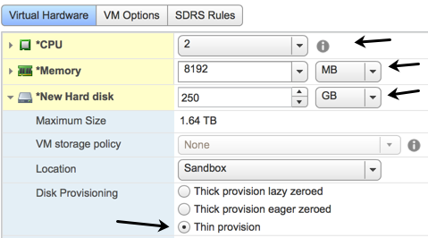
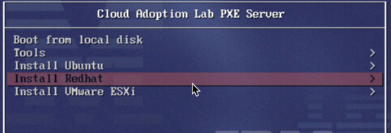
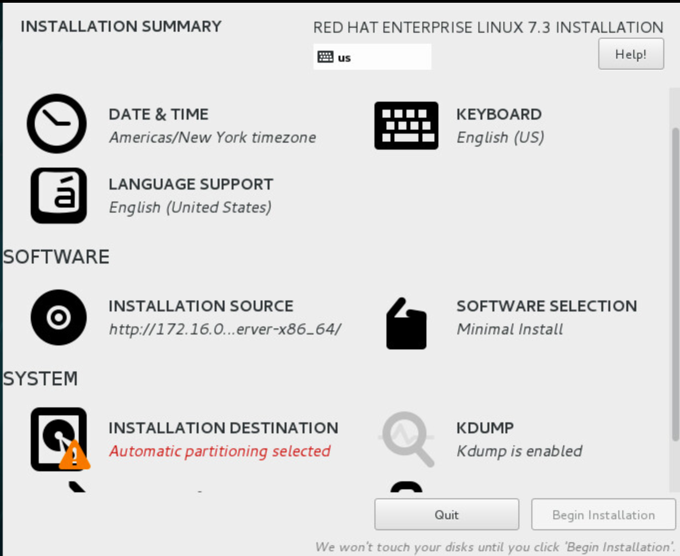
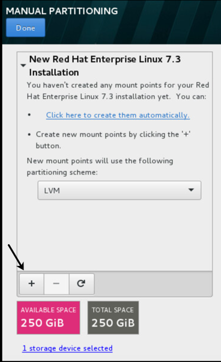

Install IBM Cloud Private v2.1 on Red Hat Enterprise Linux v7
=============================================
# Introduction
This is a guide to creating an IBM Cloud Private (ICP) cluster on RHEL v7.x.  It is intended to enhance the installation instructions available in the [ICP Knowledge Center (KC)](https://www.ibm.com/support/knowledgecenter/SSBS6K_2.1.0/kc_welcome_containers.html).

The phrase "ICP instance" is used in this document to refer to an installation of ICP.

The term "cluster" is used to mean the VMs that are under the control of a given ICP instance.  At times in this guide the word "cloud" is used to mean the same thing as cluster.

This instruction guide assumes the VMs to be used for the ICP instance are provided to you by some providing entity.

Root access, either directly or through sudo, must be available to the person doing the ICP installation for all of the ICP machines (VMs) that will be members of the ICP cluster.  If sudo is used, it is recommended that passwordless sudo is configured.  Otherwise, the cluster configuration file (config.yml) will need the sudoer's password specified.  An ICP installation as non-root is beyond the scope of this document.

IBM Cloud Private is built on Docker and Kubernetes.  

IBM Cloud Private Cloud Foundry (ICP-CF) is packaged as part of the IBM Cloud Private product.  However, ICP-CF has a completely separate installation process. In addition ICP-CF is a completely separate run-time environment that has no direct integration points or any dependencies on ICP itself. The installation and deployment of IBM Cloud Private Cloud Foundry is outside the scope of this guide.  

IBM Cloud Private has certain components (the "master" and "proxy" nodes, for example) that may be deployed as singletons in a simple, "sandbox" installation.  A production installation should include three (3) or five (5) master nodes and (3) proxy nodes.  A simple installation of ICP will combine the boot, master and "management" components into a single node.  A production installation will separate the management nodes from the master nodes to provide sufficient resources to each and avoid resource contention.  A simple ICP installation may use a singleton NFS server to provide a shared, persistent storage service to all of the worker nodes.  A production ICP installation will use something more sophisticated such as GlusterFS or IBM Spectrum Storage for persistent storage.  (This guide provides a reference to a GlusterFS install guide.)

| Deployment | Sandbox Instance     | Production Instance                                    |
|------------|----------------------|--------------------------------------------------------|
|  Boot      | Combined w/ Master   | Possibly separate, but usually combined with Master01  |
|  Master    | 1                    | 3 or 5 (odd number required to support quorum voting ) |
|  Proxy     | 1                    | 3                                                      |
|  Worker    | 1 to 3               | Typically, 5 or more                                   |
|  Management| Combined w/Master    | 2 or 3                                                 |
|  File Store| Singleton NFS server | GlusterFS (independent server cluster of 3 nodes)      |

The installation described in this document uses Docker CE.  Installing Docker EE is outside the scope of this document.

*NOTE:* As of March 2017, Docker broke out two builds, one referred to as Community Edition (CE) and the other referred to as Enterprise Edition (EE).  Docker EE is intended to be used on RHEL.  Docker EE requires a subscription and payment for a license.  Docker CE and Docker EE are intended to be functionally identical.  Docker EE comes with full support as opposed to Docker CE, which only has "community" support, i.e., if you run into a problem you may not be able to get support in a timely manner.

*NOTE:* If you want to use Docker CE on RHEL, get the [Docker CE packages built for Centos](https://download.docker.com/linux/centos/7/x86_64/stable/Packages/).  Packages built for Centos have binary compatibility with RHEL.

For Docker on RHEL information see: ["Get Docker EE for Red Hat Enterprise Linux"](https://docs.docker.com/engine/installation/linux/docker-ee/rhel/).

*NOTE:* In this document the standard root prompt `#` for sample shell commands is replaced with `>` to avoid having random sample commands show up in the Atom editor's markdown section navigation pane.  There are some file snippets where comment lines start with `#` that do continue to show up in the section navigation pane.

# Getting started overview

This section provides a big picture summary of the installation process.

* An IBM Cloud Private (ICP) installation is usually made up of multiple virtual machines that are collectively referred to as a cluster.  (This document may also refer to the collection of machines as a cloud or an ICP instance.) Individual machines are referred to as nodes.  An ICP installation includes machines with a special role as itemized here:
  * Boot-master - The machine where the ICP control is installed. (It is typical to combine the "boot" and "master" into one machine.)
  * Management - The simple installation used to create this document combines the management role with the boot-master node.
  * Proxy - Machine used for request routing
  * Multiple worker nodes


* The ICP v2.1 Knowledge Center section [Supported operating systems and platforms](https://www.ibm.com/support/knowledgecenter/SSBS6K_2.1.0/supported_system_config/supported_os.html), has a list of supported operating systems.  ICP is supported on RHEL 7. ICP is not supported on RHEL 6.

* System requirements: The ICP v2.1 Knowledge Center section [Hardware Requirements and Recommendations](https://www.ibm.com/support/knowledgecenter/SSBS6K_2.1.0/supported_system_config/hardware_reqs.html), has a table describing the system requirements for each of the types of nodes in an ICP instance. The installation described in this document is a "multi-node cluster".

* It is a really good idea that all machines used for ICP have access to the RHEL yum repositories (os, optional and extras) in order to install various RHEL packages that are pre-requisites for ICP.  Many data centers have a Red Hat Satellite server available. (A public Centos yum repository is available at http://mirror.centos.org/.)

* It is recommended that static IP addresses be allocated for all VMs that will be associated with the ICP cluster or supporting systems, e.g., GlusterFS servers, LDAP server.  If DHCP is providing the IP addresses, the address reservation policy should protect against a given VM inadvertently getting a new IP address if it has to be power booted. A sandbox ICP deployment can get away with using DHCP assigned IP addresses, but a production ICP deployment should use statically assigned IP addresses.  

* It is a really good idea for all the machines in the ICP cluster to have access to the public Internet.  The public Docker yum repository makes it convenient to install the latest version of Docker CE. Docker Hub is convenient for access to commonly available Docker images. The latest Gluster images are also easily retrieved from public sources.

* The details of an "air-gap" install are not covered in this document.  Needless to say, doing an air-gap installation is more challenging due to the inconvenience of pulling together all of the RPMs and other artifacts needed to do an installation.  An air-gap install will take at least an extra day, more likely 2 days, to do the installation.

## The simple, "sandbox" ICP installation in a nutshell:
See the ICP Knowledge Center section, [Installing an IBM Cloud Private Enterprise environment](https://www.ibm.com/support/knowledgecenter/SSBS6K_2.1.0/installing/install_app_mod.html)

1. Customize RHEL for Docker and ICP.
2. Install Docker on the boot-master.
3. Set up RSA based ssh login from the Boot-Master to all nodes in the cluster.
4. Run the ICP inception installer on the boot-master.

Suggested ICP "sandbox" deployment resource allocations are described in the table below.

| Machine Role       | Number |  vCPU/Core   | Memory (GB)  | Storage<br/>Disks x Size (GB)|
|--------------------|:------:|-------------:|-------------:|---------------------------:|
|   Boot/Master/Mgmt | 1      |  2           |  8           |  1 x 250                   |
|   Proxy            | 1      |  2           |  4           |  1 x 100                   |
|   Worker           | 2 or 3 |  2           |  8           |  1 x 100                   |
|   NFS Server       | 1      |  2           |  8           |  1 x 100                   |

## A production ICP installation in a nutshell:
See the ICP Knowledge Center section, [Installing an IBM Cloud Private Enterprise HA environment](https://www.ibm.com/support/knowledgecenter/SSBS6K_2.1.0/installing/install_app_mod_HA.html)

1. Customize RHEL for Docker and ICP.
2. Install Docker on the boot-master.
3. Set up RSA based ssh login from the Boot-Master to all nodes in the cluster.
4. Run the ICP inception installer on the boot-master.
5. Install GlusterFS server on the GlusterFS nodes.
6. Install GlusterFS client on all ICP cluster members.
7. Install Heketi for storeage administration.
8. Configure the shared Docker repository and audit log for the master nodes.
9. Configure LDAP registry from authentication and role based access control.

Suggested ICP production deployment resource allocations are described in the table below.

| Machine Role     | Number |  vCPU/Core   | Memory (GB)  | Storage<br/>Disks x Size (GB) |
|------------------|:------:|-------------:|-------------:|------------------------------:|
|   Master         | 3 or 5 |  8           |  32          |  1 x 260  (1 x 270 if VA enabled) |
|   Proxy          |   3    |  2           |   4          |  1 x 230  (1 x 240 if VA enabled) |
|   Management     | 2 or 3 |  8           |  32          |  1 x 260  (1 x 270 if VA enabled) |
|   Vulnerability Advisor   |  3  |  8     |  32          |  1 x 500                          |
|   Worker         |  5+    |  4           |  32          |  1 x 200  (1 x 210 if VA enabled) |
|   GlusterFS      |  3+    |  4           |  16          |  1 x 40 (/dev/sda)<br/>1 x 128 (/dev/sdb)<br/>1 x 128 (/dev/sdc) |

*NOTE:* If Vulnerability Advisor (VA) is enabled, then all (non-VA) nodes need at least an additional 10 GB for `/var` as `/var/lib/kubelet` will need additional space.  The VA nodes need an additional 200 GB of `/var` disk space.  See the ICP 2.1.0.2 Knowledge Center [Hardware requirements and recommendations](https://www.ibm.com/support/knowledgecenter/SSBS6K_2.1.0.2/supported_system_config/hardware_reqs.html)

*NOTE:* For a production VM, be sure to use Logical Volume Manager (LVM) for all file systems other than those that require a physical partition, e.g., `/boot`, swap.

**ICP Master** and **ICP Management** nodes suggested disk partitioning (300 GB disk).  For master and management nodes we recommend that `/var` be at least 60 GB which is larger than what is specified in the ICP Knowledge Center documentation.

*NOTE:* ICP 2.1.0.3 moves to using /var instead of /var and /opt.  The tables below reflect disk sizings as of ICP 2.1.0.2.

| File System Name          |  Mount Point      |  Size (GB)    |
|:--------------------------|:------------------|--------------:|
|   system (aka root)       |   /               |    20         |
|   boot                    |   /boot           |   256 MB      |
|   swap                    |                   |     8         |
|   var                     |   /var            |    70         |
|   tmp                     |   /tmp            |    50         |
|   home                    |   /home           |    10         |
|   opt                     |   /opt            |   120         |

**ICP Vulnerbility Advisor** nodes disk partitioning (500 GB disk) For the VA nodes we recommend that `/var` be 300 GB.

| File System Name          |  Mount Point      |  Size (GB)    |
|:--------------------------|:------------------|--------------:|
|   system (aka root)       |   /               |     40        |
|   boot                    |   /boot           |       256 MB  |
|   swap                    |                   |      8        |
|   var                     |   /var            |    300        |
|   tmp                     |   /tmp            |     20        |
|   home                    |   /home           |     10        |
|   opt                     |   /opt            |    120        |

**ICP Proxy** node suggested disk partitioning (230 GB disk).

| File System Name          |  Mount Point      |  Size (GB)    |
|:--------------------------|:------------------|--------------:|
|   system (aka root)       |   /               |    20         |
|   boot                    |   /boot           |   256 MB      |
|   swap                    |                   |     4         |
|   var                     |   /var            |    70         |
|   tmp                     |   /tmp            |    10         |
|   home                    |   /home           |    10         |
|   opt                     |   /opt            |   120         |

**ICP Worker** node suggested disk partitioning (200 GB disk)

| File System Name          |  Mount Point      |  Size (GB)    |
|:--------------------------|:------------------|--------------:|
|   system (aka root)       |   /               |    20         |
|   boot                    |   /boot           |   256 MB      |
|   swap                    |                   |     4         |
|   var                     |   /var            |    50         |
|   tmp                     |   /tmp            |    10         |
|   home                    |   /home           |    10         |
|   opt                     |   /opt            |   110         |

*NOTE:* Lack of file system space particularly in `/var` is a common problem during the installation and upgrade/update of ICP.  Particularly on master and management nodes, the `/var/lib/docker` directory can consume 40 GB to 50 GB.  The `/var/lib/kubelet` directory typically consumes ~10 GB.

## When is a separate boot node needed?

We recommend that a separate boot node be used for convenience reasons. This is particularly true for scenarios where the ICP cluster is isolated from access to the public Internet.  When the number of deployed VMs is to be minimized, the master node can be used as the boot server.

A separate boot node is appropriate if the nodes in the cluster are not permitted to have direct access to the public Internet.  A separate boot node that has access to the Internet and to the ICP cluster nodes can serve as an intermediate staging node for getting content from the Internet to the ICP cluster nodes.

The resources needed for a boot node are something on the order of 2 vCPU, 8 GB memory, 250 GB disk.

## Additional steps depending on specific circumstances and requirements:
* Configure access to RHEL yum repositories or Red Hat Satellite (RHS).
* Configure `/etc/hosts` files on all cluster members if DNS is not available to resolve host names and IP addresses.
* Update RHEL to the latest patch level.
* Install NTP.
* Install Docker on each cluster member VM in addition to the boot-master VM. (This gives you full control over what version of Docker is installed, but more importantly, Docker on each VM is needed for the next step.)
* Use Docker on each cluster member VM to pre-load the ICP Docker images rather than let the inception installation load the ICP Docker images.  (It turns out to be expedient to copy the ICP image tar-ball to each cluster member VM and then load the local Docker registry from that tar-ball rather than waiting for the inception installer to do that part of the installation.)
* Install `kubectl` on the boot-master node.  `Kubectl` is useful for interacting with the ICP cluster.
* Install the ICP CLI.  (Pre-req for running helm.)
* Install `helm` on the boot or boot-master node.  Helm is useful for installing additional software on the cluster.
* Install Ansible on the boot or boot-master node or, even better, on the administrator's desktop/laptop.  Ansible is very useful for administration when dealing with multiple machines. (The instructions in the [Install and configure the GlusterFS server cluster](#Install and configure the GlusterFS server cluster) section assumes the availability of Ansible.) See the [Installing Ansible](#Installing Ansible) section for guidance on installing and configuring Ansible.
* Install Python Docker modules on the boot master node to support the convenient use of Docker APIs in Python scripts.

# Basic RHEL configuration

The sub-sections in this section describe some basic RHEL configuration required to support ICP cluster members.  We are calling this "basic" configuration because it is typical that a RHEL VM will be configured as described in these sub-sections.

If you are creating your own virtual machine, you can do all these steps on your initial VM before cloning it.

If you are using VMs that were deployed for you, then it is likely the VMs are already configured as described in these sub-sections.  You should confirm with your VM provider or by doing the basic checks described below, that all the VMs that are going to be part of the ICP cluster have been configured as described in these sub-sections.

## Configure network interface

*NOTE:* This section describes steps you won't need to do for a virtual machine deployed for you in a typical virtualization platform.  If you are building your own VM, you will likely need to complete these steps.

*NOTE:* People familiar with configuring the network interface on Ubuntu will see that the concepts are the same, but the details are different.  In particular, some of the files that contain the configuration are different and the syntax, names and values of the configuration parameters are different.

Ideally, ICP VMs should use a static IP address, particularly the master and proxy nodes.  A static IP address ensures that a VM does not get a new IP address when it is restarted using a power down and power up.  With DHCP assigned IP addresses there may be a possibility that a VM will get a new address when it is powered down.  DHCP lease times are intended to avoid unintended changes in an IP address assigned to a given VM, but you can't count on it.

When configuring static IP addresses you need to collect the following information:
- IP address to use for the VM.
- Prefix or Netmask (Prefix is preferred.)
- The gateway server address
- DNS server addresses (usually at least 2)
- DNS search domain

*NOTE:* The BROADCAST and NETWORK attributes are unnecessary for RHEL 7.

Various sources of information on static IP address configuration for RHEL:
- See [Editing Network Configuration Files](https://access.redhat.com/documentation/en-us/red_hat_enterprise_linux/7/html/networking_guide/sec-editing_network_configuration_files)
- See [Linux Network Configuration](http://www.yolinux.com/TUTORIALS/LinuxTutorialNetworking.html#ASSIGNIP)
- See [How to configure static IP address on CentOS 7/RHEL 7](https://www.cyberciti.biz/faq/howto-setting-rhel7-centos-7-static-ip-configuration/)
- See [How to configure Static IP Addresses in CentOS 7/RHEL 7/Fedora 27/26](https://www.itzgeek.com/how-tos/linux/centos-how-tos/how-to-configure-static-ip-address-in-centos-7-rhel-7-fedora-26.html)

The options for network configuration are all defined in `sysconfig.txt`.  Use `find / -name sysconfig.txt` to find where it is located on your machine.

To find out the names of the network interfaces on a machine you can use the `iconfig` (or `ip addr`) command.  The name of each network interface is in the first column.

The network interface configuration files are in `/etc/sysconfig/network-scripts/`.  The file names include the name of the network interface as seen in the `ifconfig` command output.

- Edit the file in `/etc/sysconfig/network-scripts` associated with the network interface to be started at boot time, e.g., `/etc/sysconfig/network-scripts/ifcfg-ens192`.  (See example content below.)

- The value of `ONBOOT` should be  `yes`.
- For static IP address on RHEL:
  - `BOOTPROTO` value should be `none`.  (The value `static` is not a valid option as of RHEL 6.)
  - Be sure to include attributes for:
    - IPADDR
    - PREFIX
    - GATEWAY
    - DNS servers (DNS1, DNS2)
    - DOMAIN

```
NAME="ens192"
DEVICE="ens192"
ONBOOT=yes
NETBOOT=yes
UUID="1a89d56d-935e-49f9-81de-4287291b7708"
IPV6INIT=yes
BOOTPROTO=none
TYPE=Ethernet

# IPv4 network configuration
IPADDR=xxx.xxx.xxx.xxx
# PREFIX=16 equivalent NETMASK=255.255.0.0
PREFIX=16
GATEWAY xxx.xxx.xxx.xxx

# DNS servers
# By default the DNS servers get copied to /etc/resolv.conf
DNS1=xxx.xxx.xxx.xxx
DNS2=xxx.xxx.xxx.xxx

# Default domain search
DOMAIN=somedomain.whatever
```

- Save the changes.

- Test by restarting the network service:
```
systemctl restart network
```

*NOTE:* If you are setting the static IP address to something different from what the VM is currently using, then you will lose your ssh connection to the machine.  Reconnect using the new network address.

When the network service comes back up the network interface should be UP/RUNNING. The `ifconfig` command includes the status of each interface.  You should see the static address assigned to the interface that has been configured.

Another test is to reboot the VM and see that it comes up correctly.
```
shutdown -r now
```

## Configure the host name
This section describes the configuration of the host name for RHEL 7 VMs.

If you are cloning VMs, then you will need to change the host name on the cloned VM.

*NOTE:* This step is unnecessary and is **not advisable** in scenarios where the VMs were provided to you. Check with your VM provider, system administrator and/or network administrator before changing a host name.

Host name considerations usually involve using naming conventions provided by the network and system administrators.

Be sure to use a fully qualified domain name (FQDN) for the value of the host name.

Some sample "toy" host names: `bootmaster`, `proxy`, `worker01`, etc.  

There are a couple of different places where the host name is specified.

For RHEL 7 the host name can be set using the `hostnamectl` command. For example:
```
hostnamectl set-hostname bootmaster01.site.org.com
```

See the man pages for `hostnamectl` for more information.

Additional notes on host name:
1.	The host name is stored in the `/etc/hostname` file.  (NOTE: This file should only have the text of the host name on a single line with no newline character.)

2.	There may be a HOSTNAME directive in the `/etc/sysconfig/network` file.

3.	A reboot is needed to have the host name change take effect: `shutdown -r now`


## Enable remote login for root via ssh

*NOTE:* For RHEL v7.x, by default root can login via ssh using a password.

The configuration for ssh is in `/etc/ssh/sshd_config`.  You will notice that `PermitRootLogin` is commented out.  However, `UsePAM` is set to yes.  A PAM configuration file for `sshd` is in `/etc/pam.d`. Configuration of the PAM plugin for `sshd` is beyond the scope of this document.


## Update RHEL
This section describes the steps to update RHEL.

*NOTE:* This is an optional step and may not be necessary depending on the virtual machine that has been provided to you.  You may also not be permitted to do a full update, as that may move your RHEL to a version that is not yet supported by your operations team.  For example, if the VM is running RHEL 7.3 a full update will result in RHEL 7.4.

If you are building a VM from scratch, then you should do a full RHEL update to pick up updates since the release of the RHEL image you are using for the initial install.

It is assumed you have configured your VM with yum repositories. See [Yum Repository Configuration](yum-repository-configuration.md)

1. Do a yum update (`yum -y update`) - This gets all the latest patches for everything already installed.

2. Then reboot. (`shutdown -r now`). You need to reboot to get to the latest kernel.

[Additional (optional) Packages to Install](additional-packages.md)


## Configure /etc/hosts

This section describes the steps to add entries to the `/etc/hosts` file of each cluster member for all the hosts in the cluster.

*NOTE:* This section can be skipped if DNS is being used for host name resolution.  You can use `nslookup` on the IP addresses of a sampling of cluster members to determine if there are DNS entries for the cluster member VMs.  If not, then you need to configure `/etc/hosts`.

*NOTE:* The "minimal" RHEL install does not include `bind-utils`, which is the RPM that contains the `nslookup` command.  If you are using a minimal RHEL image, then you need to install `bind-utils` if you want to use `nslookup`.  (`yum -y install bind-utils`)

- For each VM in the cluster, edit `/etc/hosts` and add an entry for each VM in the cluster.

In some circumstances you can edit `/etc/hosts` once on the boot-master and then `scp` the hosts file to the other members of the cluster. This expedient is only feasible if the all VMs in the cluster are freshly deployed VMs and they all have the same content in `/etc/hosts` when they are initially deployed, e.g., the default content.  

## Check the file system sizing

The file system size minimum requirements are described in the ICP v2.1 Knowledge Center section, [Hardware requirements and recommendations](https://www.ibm.com/support/knowledgecenter/SSBS6K_2.1.0/supported_system_config/hardware_reqs.html)(See Table 3). The "important" note following the table suggests mounting `/var/lib/etcd`, `/var/lib/registry` and `/opt/ibm/cfc` on separate paths associated with larger disks.

*NOTE:* Do not use `/opt/ibm/cfc` as a file system mount point.  The ICP uninstall has a step that deletes the `/opt/ibm/cfc` directory.  If that directory is a mount point for a file system, the delete operation will fail.  Use either `/opt` or `/opt/ibm` as the mount point for the file system.

*TDB*: What mount point should be used for `/var/lib/etcd`, `/var/lib/registry` and the other ICP related content in `/var/lib`? (The safe thing to do is mount the file system at `/var` or `/var/lib`.)

The file system requirements as described in the ICP v2.1 KC documentation are reproduced in the following table:

| **Location**         |  **Minimum Disk Space**                       |
|---------------------:|:----------------------------------------------|
| `/var/lib/docker`    | on master and mgmt nodes: >60 GB (This is more than the KC calls for.)<br/>on worker nodes: 40 GB|
| `/var/lib/etcd`      | >1 GB                                         |
| `/var/lib/registry`  | Large enough to host the Docker images you expect to load into the local registry.  |
| `/opt/ibm/cfc`       | >100 GB                                       |
| `/var/lib/kubelet`   | >10 GB w/o Vulnerbility Advisor               |
| `/var/lib/kubelet`   | >100 GB w/ Vulnerability Advisor              |

*NOTE:* See the section in the ICP v2.1 Knowledge Center, [Specifying a default Docker storage directory by using bind mount](https://www.ibm.com/support/knowledgecenter/SSBS6K_2.1.0/installing/docker_dir.html)

*NOTE:* If you are creating your own RHEL VMs, there is a step at the point where the install is being set up where you can customize the disk partitions rather than take the automatic defaults. It is recommended that you choose to customize the disk partitions to ensure the VM meets the ICP file system sizing requirements. The RHEL 7 documentation for installation that describes the file system configuration is in the section [Installation Destination](https://access.redhat.com/documentation/en-us/red_hat_enterprise_linux/7/html/installation_guide/sect-disk-partitioning-setup-x86) Scroll down to the "Manual Partitioning" section to get to the details that describe the manual partitioning steps. The section below, [Installing RHEL 7 - a sample](#Installing RHEL 7 - a sample) provides a step-by-step example of installing RHEL 7, including creating custom disk partitions.

The RHEL 7 documentation for [Mounting a file system](https://access.redhat.com/documentation/en-us/red_hat_enterprise_linux/7/html/storage_administration_guide/sect-using_the_mount_command-mounting) provides detailed information about the mount command.

# Special RHEL configuration

The sub-sections in this section describe RHEL configuration that is not typical.  Even on a VM provided to you, you will very likely need to take the steps described in these sub-sections in order to prepare the machine to be a member of an ICP cluster.

## vm.max_map_count

The map_max_count determines the maximum number of memory map areas a process can have. Docker requires that the max_map_count be substantially greater than the default (65530).  This section describes the steps to setting the `vm.max_map_count` to an appropriate number.

*NOTE:* Do not confuse the `sysctl` command with the `systemctl` command. The command for getting and setting system (kernel) parameters is `sysctl` not `systemctl`.

To make an immediate change to the `vm.max_map_count` system parameter:
```
sysctl -w vm.max_map_count=262144
```

*NOTE:* The above command writes the value of max_map_count to the file `/proc/sys/vm/max_map_count`. However, the `vm.max_map_count` will revert to its default value on reboot.

*NOTE:* Consult your system administrator to determine the preferred place to persist the value of `vm.max_map_count`.

In order to have the `vm.max_map_count` carry over through a reboot, edit the `/etc/sysctl.conf` file and add a line to define the value:
```
vm.max_map_count=262144
```
or
```
echo "vm.max_map_count=262144" >> /etc/sysctl.conf
```

If you want to see the value of a system control variable just use: `sysctl <name>`, e.g.,
```
sysctl vm.max_map_count
```

## Delete the /var/lib/mysql directory

If the `/var/lib/mysql` directory exists on any of the ICP cluster VMs, the install will fail on that VM. At least on some RHEL 7 installations, it seems mysql gets a directory in `/var/lib` even if it is not used for anything.  

- On all VMs in the cluster/cloud, make sure there is no `mysql` directory in `/var/lib`, i.e.,

  ```
  rmdir /var/lib/mysql
  ```

# Installing Docker using the Passport Advantage executable

*WARNING:* For ICP 2.1.0.2 on RHEL, you must install Docker provided in Passport Advantage for ICP.  Search Passport Advantage using `IBM Cloud Private 2.1.0.2 Docker`.  The part number is `CNR72EN`

- Install a pre-req: `yum -y install policycoreutils-python`
- Make `icp-docker-17.09_x86_64.bin` executable: `chmod +x icp-docker-17.09_x86_64.bin`
- Run the install: `./icp-docker-17.09_x86_64.bin --install`

# Installing Docker CE using the public Docker yum repository

*WARNING:* For ICP 2.1.0.2 on RHEL, you must install Docker provided in Passport Advantage for ICP.  Search Passport Advantage using `IBM Cloud Private 2.1.0.2 Docker`.  The part number is `CNR72EN`

You have two options for installing Docker:
1. Install Docker only on the boot-master machine and let Docker be installed on all of the other cluster members as part of the ICP installation.

2. Install Docker on the boot-master and all of the cluster members.  This install guide uses this option because it tends to be faster to install Docker on each machine.  Once Docker is installed on each machine, the ICP Docker images can be loaded into the local Docker registry on each machine, which is another trick to speed up the ICP installation.  

This section describes the steps to install Docker Community Edition on RHEL v7 using the public Docker yum repository.  It is assumed the VM(s) where Docker is to be installed have access to the Internet and can get to **download.docker.com** and you can use the yum repository defined there.  

Docker Community Edition is identical in behavior to Docker Enterprise Edition.  IBM Cloud Private is supported on Docker Community Edition, or older versions of Docker before the differentiation occurred between Docker editions.  The installation of Docker Enterprise Edition is beyond the scope of this document.

A typical RHEL yum repository may have the docker RPMs, but they may not be the current version.  It is recommended that the docker version available at **download.docker.com** be used.

*NOTE:* This installation scenario assumes Internet connectivity and access to **docker.com**.

The Docker documentation, [*Get Docker CE for CentOS*](https://docs.docker.com/engine/installation/linux/docker-ce/centos/) has detailed information on [Docker Community Edition installation](https://docs.docker.com/engine/installation/linux/docker-ce/centos/). The instructions here are derived from the Docker documentation.

*NOTE:* The yum-config-manager utility is part of the yum-utils RPM.  If your machine doesn't have yum-config-manager then you need to install yum-utils (`yum -y install yum-utils`). (A RHEL "minimal install" does not include yum-utils. Yum-utils has some Python related pre-reqs that also get installed.)

-	Set up the public docker yum repository

  ```
  yum-config-manager --add-repo https://download.docker.com/linux/centos/docker-ce.repo
  ```

  You should see output similar to this:

  ```
  Loaded plugins: langpacks, product-id
	adding repo from: https://download.docker.com/linux/centos/docker-ce.repo
	grabbing file https://download.docker.com/linux/centos/docker-ce.repo to /etc/yum.repos.d/docker-ce.repo
	repo saved to /etc/yum.repos.d/docker-ce.repo
  ```

-	Install Docker CE.

  ```
  yum -y install docker-ce
  ```

*NOTE:* The docker-ce install has a pre-req of container-selinux.  If there is no container-selinux in your yum repositories the above command will fail.  (The container-selinux package is in the RHEL "extras" repo.)

A work-around to the above install is described here: [https://github.com/docker/for-linux/issues/20If](https://github.com/docker/for-linux/issues/20If) The following command was taken from the work-aournd:
```
yum -y install --setopt=obsoletes=0 docker-ce-17.03.2.ce-1.el7.centos.x86_64 docker-ce-selinux-17.03.2.ce-1.el7.centos.noarch
```

- Start and enable the docker daemon.
```
systemctl enable docker --now
```

-	Run the usual `docker run hello-world` to confirm the installation.
```
docker run hello-world
```

- The main thing to check for in the output from hello-world:
```
Hello from Docker!
This message shows that your installation appears to be working correctly.
```
You shouldn't see any errors when running the docker hello-world smoke test.

As an installation expedient, it is recommended that you repeat the Docker installation on all the other VMs in the ICP cluster.

## Things that can go wrong with Docker install

1.	Your RHEL install doesn't have a `container-selinux` version greater than 2.9.  See [https://stackoverflow.com/questions/45272827/docker-ce-on-rhel-requires-container-selinux-2-9](https://stackoverflow.com/questions/45272827/docker-ce-on-rhel-requires-container-selinux-2-9)

2. Your RHEL install doesn't have yum-config-manager.  You need to install yum-utils (`yum -y install yum-utils`)

# Installing Docker CE using the docker install binary from Passport Advantage
If your VM doesn't have access to the public docker repository, then you can install Docker using the Docker install binary available on Passport Advantage along with the ICP install archive.

- If you don't already have it, download the Docker install binary from Passport Advantage. (It is very small so that won't take long.)
- Copy the Docker install binary to some staging directory on your VM.
- Run the following commands as root:
```
chmod +x icp_docker_17.09_rhel_x86_64.bin
sudo ./icp_docker_17.09_rhel_x86_64.bin
```
The actual name of the docker install binary available at Passport Advantage may be different due to version differences.

- To finish things off, start and enable docker and run the hello-world smoke test as described in the above section.

- As an installation expedient, it is recommended that you repeat the Docker installation on all the other VMs in the ICP cluster.

# Installing docker community edition using RPMs

In some contexts, you may not be able to get access to the Docker repo site or any other external site that has the docker packages.  In that case you need to install using the RPMs.

For RHEL, get the Centos RPMS.  You can get the Centos RPMs here: [https://download.docker.com/linux/centos/7/x86_64/stable/Packages/](https://download.docker.com/linux/centos/7/x86_64/stable/Packages/)


You need the SELinux RPM.

See the ICP Knowledge Center section, [Supported Docker versions](https://www.ibm.com/support/knowledgecenter/SSBS6K_2.1.0/supported_system_config/supported_docker.html) for a list of supported Docker versions.

1. Copy a container-selinux package to the machine where Docker is to be installed.
2. Copy the RPMs to the machine where the Docker install is to be completed.
3. The install oder is container-selinux, docker-ce-selinux

This sample command line is intended to be executed in the directory where the RPMs are located:
```
yum -y install container-selinux-1.12.5-14.el7.x86_64.rpm
yum -y install docker-ce-selinux-17.03.2.ce-1.el7.centos.noarch.rpm
yum -y install docker-ce-17.03.2.ce-1.el7.centos.x86_64.rpm
```
That should complete the Docker installation.  

To finish things off, start and enable docker and run the hello-world smoke test as described in the above section.

As an installation expedient, it is recommended that you repeat the Docker installation on all the other VMs in the ICP cluster.

# MountFlags in docker.service

The Kubernetes kubelet process that runs on each VM in the ICP cluster needs `MountFlags=shared` in docker.service configuration file.

The MountFlags setting needs to be done on all machines in the cluster/cloud.  

It is assumed that docker has been installed.  (You won't see a `docker.service` file in `/lib/systemd/system` if docker has not been installed.)

- Edit the file: `/lib/systemd/system/docker.service`

- To the `Service` section, add the line:
```
MountFlags=shared
```

# Starting, stopping and enabling Docker

This section has commands for starting, stopping and enabling docker and checking its status.

After Docker is installed, you need to start it.  You need root privileges to start, stop and enable a service.

To enable docker so that it starts on machine reboot and start docker immediately:
```
> systemctl enable docker --now
```
To start docker:
```
> systemctl start docker
```
To get docker status:
```
> systemctl status docker
```
To enable docker (so that it starts on machine reboot):
```
> systemctl enable docker
Created symlink from /etc/systemd/system/multi-user.target.wants/docker.service to /usr/lib/systemd/system/docker.service.
```
To stop docker:
```
> systemctl stop docker
```

# Install IBM Cloud Private v2.1

This is the start of the description of the steps to install IBM Cloud Private.

## Prerequisite steps to Install IBM Cloud Private v2.1

1. If you are building your own VM, you should have already created a clone of the ICP base VM for each VM in the cluster.  At a minimum, this would be the boot-master, the proxy and a couple of worker nodes.

2. If you are using VMs provided to you, then you should have completed all the steps to getting Docker running on at least the boot-master machine. The install process includes installing Docker on each cluster member.  As an expedient we recommend pre-installing Docker on each cluster member.  (See the section [Copy and load ICP docker image tar ball to all cluster VMs](#Copy and load ICP docker image tar ball to all cluster VMs) below for details.)

3. DNS or the `/etc/hosts` file on each VM should be configured with the proper entries so that each VM can resolve the address of the other members of the cluster/cloud.

4. SSH needs to have been set up such that the "boot master" VM can ssh to each of the other VMs in the cluster/cloud as root without using a password.

5. The product install image should be available on the boot-master machine. If not, download the product archives from Passport Advantage (IBM customer) or eXtreme Leverage (IBM internal).  You can find the GA release by searching on, *IBM Cloud Private*.

6. The ICP Knowledge Center (KC) installation instructions for ICP Cloud Private Enterprise are rooted in the section: [Intalling ICP Cloud Private Enterprise](https://www.ibm.com/support/knowledgecenter/SSBS6K_2.1.0/installing/install_appmod.html).

7. On all VMs in the ICP cluster, if firewalld is running, stop it and disable it until after the ICP install completes.

To see if firewalld is running, use:
```
> systemctl status firewalld
```
To stop and disable firewalld, use:
```
> systemctl stop firewalld
> systemctl disable firewalld
Removed symlink /etc/systemd/system/dbus-org.fedoraproject.FirewallD1.service.
Removed symlink /etc/systemd/system/basic.target.wants/firewalld.service.
```
NOTE: The firewall only needs to be disabled during install.  It gets enabled again on all members of the cluster/cloud after the install has completed.  

*NOTE* If you are creating an ICP cluster with VMs (members) on more than one network segment/VLAN, then there may be physical firewalls that need to be configured to allow the ICP installation to proceed. See the ICP Knowledge Center section, [Default ports](https://www.ibm.com/support/knowledgecenter/SSBS6K_2.1.0/supported_system_config/required_ports.html), for the list of ports that must be open for installation and configuration of an ICP instance.

## Some additional "boot master" pre-installation steps

This section has some steps that need to be taken on the boot master before the actual installation command can be run.

*NOTE:* In these instructions, the root directory of the installation is referred to as `<ICP_HOME>`.  A common convention is to install ICP in a directory that includes the ICP version in the directory name, e.g., `/opt/icp2101`.

- It is assumed that Docker is installed and running on the boot-master machine.
- It is assumed that the ICP images archive has been loaded into the Docker registry on the boot-master machine. (*NOTE:* The actual archive file name may be different depending on the version of ICP you are installing.)
```
tar -xf ibm-cloud-private-x86_64-2.1.0.1.tar.gz -O | docker load
```
- (On the boot-master) Extract the ICP boot meta-data to the `<ICP_HOME>/cluster` directory:
```
> cd <ICP_HOME>
> docker run -v $(pwd):/data -e LICENSE=accept ibmcom/icp-inception:2.1.0.1-ee cp -r cluster /data  
```
*NOTE:* You may need to using a different version tag for the `icp-inception` image. Use `docker images | grep icp-inception` to see the version tag in your image repository.

The above command creates a directory named `cluster` in `<ICP_HOME>`.  The `cluster` directory has the following contents:
```
> ls -l cluster
  -rw-r--r--. 1 root root 3998 Oct 30 06:37 config.yaml
  -rw-r--r--. 1 root root   88 Oct 30 06:37 hosts
  drwxr-xr-x. 4 root root   39 Oct 30 06:37 misc
  -r--------. 1 root root    1 Oct 30 06:37 ssh_key
```
- Add the IP address of all the cluster/cloud members to the `hosts` file in `<ICP_HOME>/cluster`.

    NOTE: The ICP hosts file must use IP addresses.  Host names are not used.  

- Copy the ssh key file to the <ICP_HOME>/cluster. (This overwrites the empty ssh_key file already there.)
```
> cp ~/.ssh/id_rsa ssh_key
cp: overwrite ‘ssh_key’? y
```

- Check the permissions on the ssh_key file and make sure they are read-only for the owner (root). If necessary, change the permissions on the ssh_key file in `<ICP_HOME>/cluster` to "read-only" by owner, i.e., root.

- Check the access:
```
> ls -l ssh_key
  -r--------. 1 root root 1675 Jun 30 13:46 ssh_key
```

- If the access is not read-only by owner, then change it:
```
> chmod 400 ssh_key
```

- Check again to make sure you changed it correctly.

- Copy/move the "image" archive (`ibm-cloud-private-x86_64-2.1.0.1.tar.gz`) to the images directory in `<ICP_HOME>/cluster`. (You first need to create the images directory.) In the command below it is assumed the image archive is located initially in `<ICP_HOME>`.

From `<ICP_HOME>/cluster`:
```
> mkdir images
> mv `<ICP_HOME>/ibm-cloud-private-x86_64-2.1.0.1.tar.gz` images
```

Working with the config.yaml file is described in the next section.

## Configuring `config.yaml` on the boot master

For information on the content of `config.yaml`, see the ICP KC section, [Cluster configuration settings](https://www.ibm.com/support/knowledgecenter/SSBS6K_2.1.0/installing/config_yaml.html).

For a simple sandbox deployment, the content of `config.yaml` can remain as is.

*NOTE:* The network_cidr and service_cluster_ip_range are set to "10." IP networks.  If your cloud provide is using that same address range, then change the values to something else, e.g., some other "10." subnet or the "172.16." networks.

Things that can be left as-is for a small sandbox environment:

- network_type calico
- network_cidr: 10.1.0.0/16
- service_cluster_ip_range: 10.0.0.1/24
- For a simple cluster, everything else in `config.yaml` remains commented out.  

There are many parameters that may be set in `config.yaml`.  It is a good idea to read through the file to become familiar with the options.

Additional things that need to be set for a production environment:

- vip_iface, cluster_vip
- proxy_vip_iface, proxy_vip

You may want to include a `version` attribute in `config.yaml`.  I if you do, be sure it matches the version of the images in the docker registry that you want to use.  You can do a `docker images` list to check the version tags of the available images.  The version that will be deployed is set to an appropriate default in a YAML file in the icp-inception container so it setting the `version` value in `config.yaml` is intended for cases where the docker registry being used contains images from more than one version.  

Likewise, you may want to include a `backup_version` attribute value in the `config.yaml`.  Again, make sure the value of `backup_version` makes sense for the docker registry in use in that it matches the tag on the images that are intended to be the backup version.

*NOTE:* Gluster configuration in config.yml is not necessary when the Gluster servers are set up outside the ICP cluster, which is the topology used in this guide.  **Do not** do any Gluster configuration in `config.yaml`.

## Other things that you may need to check

This section has a collection of items that have led to a failure in the installation process. This is a work in progress and is a place to keep track of this sort of stuff that seems a bit random.

- Make sure all the VMs in the cluster/cloud are running.  

You may want to double check the following on each VM that is a member of the cluster:
- The network interface on each VM is started.
- The firewall on each VM is disabled.
- If you pre-installed Docker on each VM, then check that Docker is running on each VM.
- Docker must be installed and running on the boot-master VM.
- The ICP docker images must be loaded into the Docker registry on the boot-master VM.  


## Copy and load ICP Docker images tar ball to all cluster VMs

This section assumes that Docker is pre-installed on all of the cluster member VMs. Installing Docker on each VM uses the same steps as installing Docker on the boot-master VM.

*NOTE:* The need to do this step will likely go away with ICP releases starting with v2.1.0.2.  The icp-inception process will configure a docker hub on the boot/master and the other nodes will pull images from it as needed.  The local docker hub approach will make the image deployment process significantly more efficient.

It is expedient to pre-load the Docker registry on each VM that is a member of the ICP cluster.  The installation process run from the boot-master machine will recognize that the Docker registry is up-to-date on the other cluster member machines and skip the step of copying and loading the image tar ball to the Docker registry on the given machine.  The gain in the time it takes to load the registry is achieved because you can open as many shells as needed to do the copy and load operations concurrently.

- Copy the ICP image tar ball to all machines.  (You can open multiple shells on the boot-master machine and start an `scp` of the image tar ball to each machine in the cluster.)

- Open a shell on each VM in the cluster and extract the docker images and load them into the docker registry:
```
tar -xvf ibm-cloud-private-x86_64-2.1.0-beta-2.tar.gz -O | docker load
```
If you run out of file system space during the above command, use `df -h` to view file system utilization.  You can use `df -ih` to view inode utilization. Make sure the file systems are adequately provisioned as described in the [Check the file system sizing](#Check the file system sizing) section above.

- On all but the boot-master machine, the ICP image tar file can be removed once the docker load completes.  On the boot-master machine the ICP image tar file gets moved to an images directory in `<ICP_HOME>/cluster`.

*NOTE:* If you are building an ICP virtual machine, you can run the extract and load on the base VM image so that all cloned VMs have the docker registry pre-loaded with the ICP images.

### No space left on device
During the load of the ICP images you may get something like:
```
Error processing tar file(exit status 1): write /opt/ibm/wlp/output/.classCache/C280M4F1A64P_liberty-root_G33: no space left on device
```
Do a `df -H` to see what is happening with file space.

## Run the ICP install command

Docker is used to run the install for all members of the cluster/cloud.  The command is shown below after some introductory notes. (This takes some time depending on the number of machines in the cluster.  If you haven't pre-loaded the Docker images used by ICP, the image file gets copied to each VM and the images get loaded as part of the installation.) Run the install from `<ICP_HOME>/cluster` directory.

*NOTE:* It is assumed Docker is installed on the boot-master VM.

*NOTE:* It is assumed the ICP v2.1 images have been loaded into the local docker registry on the boot-master VM.

*NOTE:* In the docker commands below, $(pwd) is the current working directory of the shell where the command is run, i.e. `<ICP_HOME>/cluster`.  It is assumed there are no space characters in the current working directory path.  (It is a really bad idea to use space characters in directory and file names.)  If you happen to have space characters in the current working directory path, then surround the $(pwd) with double quotes.

*NOTE:* It is OK to run this command multiple times to get things installed on all members of the cluster/cloud should problems show up with a particular cluster/cloud member.  At least for basic problems, the error messages are very clear about where the problems are, e.g., network connectivity, firewall issues, docker not running.

*NOTE:* As of ICP v2.1.0.2, an uninstall is recommended after a failed installation.  The installation detects that some lock files are still present if an uninstall has not been done and prompts you to do an uninstall.

*NOTE:* During the installation all information messages go to stdout/stderr.  If you want to capture a log of the installation process, you need to direct output to a file.  The docker command line below uses `tee` to capture the log and also allow it to be visible in the shell window. A logs directory in `<ICP_HOME>/cluster>` was created to hold the log files. The log file will have escape character sequences in it for color coding the text output, but it is readable.
```
> cd <ICP_HOME>/cluster
> mkdir logs
> docker run --net=host -t -e LICENSE=accept -v $(pwd):/installer/cluster ibmcom/icp-inception:2.1.0.1-ee install -v | tee logs/install-1.log
```

A common convention (not shown here) is to include a date stamp in the file name of the install log that gets written to /tmp (in this case) as well as a log number (in this case 1).  The log number can be incremented each time the command is rerun if you want to save each log file.

NOTE: A single `-v` option is recommended to include a useful amount of trace information in the log.  If you need to get more detail for installation problem determination purposes add a `-vv` or `-vvv` to the command line after the install verb for progressively more information, e.g.,
```
> docker run -e LICENSE=accept --net=host --rm -t -v $(pwd):/installer/cluster ibmcom/icp-inception:2.1.0.1-ee install -vvv | tee logs/icp_install-2.log
```

- When the install completes, you want to see all "ok" and no "failed" in the recap. (The play recap sample below is from a sandbox deployment.  A production cluster will obviously have a lot more machines listed.)
```
PLAY RECAP *********************************************************************
xxx.xx.xxx.50              : ok=109  changed=36   unreachable=0    failed=0   
xxx.xx.xxx.52              : ok=109  changed=36   unreachable=0    failed=0   
xxx.xx.xxx.57              : ok=137  changed=36   unreachable=0    failed=0   
xxx.xx.xxx.60              : ok=163  changed=55   unreachable=0    failed=0   
localhost                  : ok=216  changed=114  unreachable=0    failed=0   
```

- Problem determination is based on the installation log.  The error messages are relatively clear. If the recap contains a non-zero failed count for any of the cluster members or something is unreachable, then grep/search the install log for `FAIL` or `fatal` to begin the problem determination process.

-	Assuming the install went correctly move on to some basic "smoke tests" described in the section below.

-	Once the installation completes successfully and you have performed some basic tests, the firewall on each cluster member will need to be configured to open ports as described in the ICP Knowledge Center section, [Default ports.](https://www.ibm.com/support/knowledgecenter/SSBS6K_2.1.0/supported_system_config/required_ports.html) Port 8443 on the master needs to be open to get to the ICP console.

## Start and enable the firewalld on all cluster members

You may want to hold off on this step until some basic smoke tests have been executed.  See the [Simple ICP smoke tests](#Simple ICP "smoke" tests) section below.

After the install completes, configure firewall rules on each cluster member according to the ICP Knowledge Center section, [Default ports.](https://www.ibm.com/support/knowledgecenter/SSBS6K_2.1.0/supported_system_config/required_ports.html).  Then start and enable firewalld on each cluster/cloud member.

# Simple ICP "smoke" tests

This section documents some basic measures to confirm correct ICP operation.

1.	The simplest "smoke test" is to fire up the ICP admin console:
```
https://<boot_master>:8443/
```
Default user ID and password: admin/admin

2.	Check that all processes are "available".  In the ICP admin console you can see the workloads via the "hamburger" menu in the upper left corner margin. (See figure below.)


# Troubleshooting installation issues

This section is a holding area for a collection of troubleshooting tips.

1.	Install using the `-vvv` and piping output to tee to a log file is the first step.  Examine the log file for the first sign of an error.  Attempt the same command manually as the log indicates is having a problem to try to get to root cause.  

2.	Make sure the docker images repository has the correct images in it. For example, kubernetes-ee may not be present.  Or the wrong version of kubernetes or some other image is in the docker images registry/repository.

# Configure a Kubernetes StorageClass

In order to use the shared storage provided by the GlusterFS cluster, some additional Kubernetes artifacts need to be created.  The ICP cluster needs to be up and running in order to create these artifacts.

*NOTE:* It appears that you need to be logged in as admin to the Kubernetes/ICP cluster to work with Storage Classes.

## Create a secret for Heketi admin

[Kubernetes documentation on secrets](https://kubernetes.io/docs/concepts/configuration/secret/)

The Heketi admin secret holds the admin user and password defined in the `/etc/heketi/heketi.json` file used to configure the Heketi server.  The secret is needed to create a Kubernetes Storage Class as described in the next sub-section.

The user and key attributes must be base64 encoded.  The `base64` utility is handy for encoding and decoding strings.

*NOTE:* Make sure you use the -n option to echo so that the string to be encoded does not include a newline character.

```
> echo -n passw0rd | base64
cGFzc3cwcmQ=
```
```
> echo -n admin | base64
YWRtaW4=
```

Here is a sample YAML for a secret named `heketi-secret` defined in the default namespace.  (Be careful about proper indenting if you cut-and-paste to a file.)

```
---
apiVersion: v1
type: kubernetes.io/glusterfs
kind: Secret
metadata:
  name: heketi-secret
  namespace: default
data:
  user: YWRtaW4=
  key: cGFzc3cwcmQ=
```

Assuming the above content is in a file named `heketi-secret.yml`, the command to create the secret:
```
kubectl create -f heketi-secret.yml
```

## Create a storage class for persistent volume claims

[Kubernetes Storage Class documentation](https://kubernetes.io/docs/concepts/storage/storage-classes/)
[Kubernetes Persistent Volume and Persistent Volume Claim documentation](https://kubernetes.io/docs/concepts/storage/persistent-volumes/)

When a Persistent Volume Claim (PVC) is made in Kubernetes, a Storage Class (SC) is needed to satisfy the claim.

To create a storage class you need:
1. The GlusterFS cluster ID of the GlusterFS cluster to be used.
2. The URL that points to the Heketi server to be used to manage the storage.  (If the Heketi server is running in a Kubernetes pod, then the host name (FQDN) or IP address will be the proxy server virtual host name or VIP.)
3. The name and namespace of the Kubernetes secret that holds the Heketi server admin user and password.
4. Other optional configuration parameters. (It is best to err on the side of explicitly defining attributes rather than relying on default values.)

The following YAML can be used to create a storage class named cluster.shared.storage in the default namespace.  (Be careful about proper indenting if you cut-and-paste to a file.)
```
apiVersion: storage.k8s.io/v1
kind: StorageClass
metadata:
  name: cluster.shared.storage
provisioner: kubernetes.io/glusterfs
parameters:
  resturl: "http://172.16.25.100:8081"
  clusterid: "042e3eb4b386b086c17d9d947e8ba885"
  restuser: "admin"
  secretNamespace: "default"
  secretName: "heketi-secret"
  volumetype: "replicate:3"
```
*WARNING:* Be very careful not to include a trailing slash on the `resturl` for the Heketi server.  For example, `http://172.16.25.100:8081/` will fail when you use the storage class to create a PVC with a cryptic error message. The storage class will fail when creating a volume.  The state of the PVC will be "pending". You can see the error in the "events" associated with the PVC.

Assuming the above content is in a file named `cluster-shared-storage.yml`, the command to create the storage class:
```
> kubectl create -f cluster-shared-storage.yml
```

At least one StorageClass object should be set as the `default`.  To make the `cluster.shared.storage` the default StorageClass use the following command:
```
> kubectl patch storageclass cluster.shared.storage -p '{"metadata": {"annotations":{"storageclass.kubernetes.io/is-default-class":"true"}}}'
```

Once the storage class is created and made the default, confirm that it works by created a test PVC using `kubectl` or the ICP console.

# Uninstall IBM Cloud Private

This section describes the steps to uninstalling ICP.  You may need to do this if things go wrong and you want to do a clean install.
```
> docker run -e LICENSE=accept --net=host --rm --name=installer -t -v $(pwd):/installer/cluster ibmcom/icp-inception:2.1.0.1-ee uninstall
```

The following directories should not exist on any nodes in the cluster/cloud:
```
/var/lib/etcd/
/var/lib/kubelet/
/etc/cfc/
```

*NOTE:* When you are using an HA configuration you will have multiple master nodes using a shared volume mounted at `/var/lib/registry`.  You will probably need to unmount that volume on each master node (`umount /var/lib/registry`).  (*TBD:* It doesn't seem to be the case that `/var/lib/icp/audit` needs to be unmounted.)

# Getting started with Ansible
Ansible is very useful for administration of a collection of machines such as an ICP cluster.  We recommend installing it to ease general administration of the ICP cluster.  

See the Ansible documentation for [installation instructions](http://docs.ansible.com/ansible/latest/intro_installation.html#id26). The installation instructions are very detailed and complete for virtually every platform.

Your RHEL yum repository is likely to have the Ansible RPM in the "extras" directory. If so, then you don't need to get it from the public repository.

## Configuring the public Ansible yum repository

If your RHEL yum repository doesn't have the Ansible RPM, or you want a newer version than what is available in your RHEL repo, then you can get Ansible from the public yum repository, here: https://releases.ansible.com/ansible/rpm/release/epel-7-x86_64/.

NOTE: Install `yum-utils` to get `yum-config-manager`.

To add the public Ansible yum repo do:
```
> yum-config-manager --add-repo https://releases.ansible.com/ansible/rpm/release/epel-7-x86_64/
```
The above command should add a repo to `/etc/yum.repos.d/` that will be named something like: `releases.ansible.com_ansible_rpm_release_epel-7-x86_64_.repo`
```
> ls /etc/yum.repos.d/
docker-ce.repo  redhat.repo  releases.ansible.com_ansible_rpm_release_epel-7-x86_64_.repo  rhel.repo
```
Yum will not access the public Ansible repository unless you install its public key.  The public key did not appear to be available anywhere obvious at the Ansible releases site.  The simple thing to do is edit the repo file and set `gpgcheck=0`.
```
[releases.ansible.com_ansible_rpm_release_epel-7-x86_64_]
name=added from: https://releases.ansible.com/ansible/rpm/release/epel-7-x86_64/
baseurl=https://releases.ansible.com/ansible/rpm/release/epel-7-x86_64/
gpgcheck=0
enabled=1
```
## Installing Ansible
Install yum from your RHEL "extras" repo, or the public Ansible repo, you configured in the previous section.

```
> yum -y install ansible
```

## Configuring Ansible
This section describes some very basic steps required to get Ansible configured to the point where you can start to do things with it.

The Ansible documentation is very good.  Use it to find answers to your questions.  The [Getting Started](http://docs.ansible.com/ansible/latest/intro_getting_started.html) describes what you need to do to get started. The [Introduction to Ad-Hoc Commands](http://docs.ansible.com/ansible/latest/intro_adhoc.html) provides a quick overview on running ad hoc commands through Ansible.

Some things to decide when using Ansible:
- The machine (or machines) to be an Ansible "control machine", e.g., administrator desktop, a "staging" or "jump" server, the ICP "boot" server.  See the Ansible documentation for [Control Machine Requirements](http://docs.ansible.com/ansible/latest/intro_installation.html#control-machine-requirements). If you use your ICP boot server (boot/master0) as an Ansible control server, it already has things set up for root to be able to run Ansible commands to all other nodes in the ICP cluster.
- What user to set up on the control machine(s) and all of the managed nodes that will be used by Ansible to access the managed nodes via SSH using SSH keys. It is recommended (but not required) that the SSH authentication use keys. (We refer to this user as the "*Ansible user*".) The Ansible user needs to be able to use sudo without providing a password to run commands that require root privileges.

The primary configuration tasks:
- Make sure each managed node has the Ansible user ID defined. The Ansible user will need to be able to use passwordless sudo to get root privileges.
- Create an `ssh` key for the Ansible user on the control machine.
- Use `ssh-copy-id` (or something that does the equivalent) to get the public key (`id_rsa.pub`) of the Ansible user on each Ansible control machine in the SSH `authorized_users` file for the Ansible user on each managed node.
- Set up the Ansible `hosts` (in `/etc/ansible` by default) file to defined the managed nodes.

*NOTE:* Use fully qualified domain names (FQDN) or the IP address for the hosts when using the `ssh-copy-id` command or whatever you use to get the Ansible user's SSH key spread around to the managed nodes. If you use the short host name, you will likely get *The authenticity of host 'myhost.mysite.com (xxx.xxx.x.xx)' can't be established.* errors when you try something even as simple as an Ansible ping. Check the SSH `known_hosts` file for the Ansible user on the Ansible control machine to confirm that that the FQDN, and the IP address is listed with the host key if you are not sure about what will be recognized.

*NOTE:* A simple way to provide the Ansible user with passwordless sudo privileges to run any command is to add the Ansible user to the wheel group.  For RHEL the command, `usermod -a -G wheel <ansible_user>` will add the `<ansible_user>` to the wheel group.  You will likely need to edit the `/etc/sudoers` file (using `visudo`) to comment out the default `wheel` entry and uncomment the `NOPASSWD` `wheel` entry.  See sample below:
```
## Allows people in group wheel to run all commands
# %wheel        ALL=(ALL)       ALL

## Same thing without a password
%wheel  ALL=(ALL)       NOPASSWD: ALL
```

- Edit the hosts file in `/etc/ansible/hosts` (convenient) or create your own hosts file that you provide as an argument on the command line (less convenient).

- The ansible `ping` module is the simplest thing to use to smoke test that things are working as desired.

# Docker basics

The following collection of sub-sections is intended to provide enough information about Docker to get you started. The commands described tend to be things that come up frequently in the operation of IBM Cloud Private.  Your favorite Internet search engine is your friend when it comes to learning Docker and Docker command idioms.

## Getting a list of docker container status
The `docker ps` command is likely one of the first commands you will want to know and you will use it often.  You can add the -a option to see all containers, i.e., those that have exited as well as those still running.
```
> docker ps
```
or
```
> docker ps -a
```
use
```
> docker help ps
```
to get more information on ps options.

## Getting a list of local docker registry content

It is useful to get a list of what is in the local docker registry.  (The term registry is misused by docker.  The docker registry is really a repository, i.e., it holds the docker images, not just a list of where the images are located.)

```
docker images
```

Once ICP is loaded into the local docker repository, there are a lot of images. You will likely want to grep for some string that is part of the image of interest to cut down the amount of output from a full docker images list.

## Open a shell in a Docker container.
It is assumed the container includes a bash shell.  (Every once in awhile you run into one that doesn't.)
```
docker exec -it <container_id>|<container_name> /bin/bash
```

## Getting a shell inside the icp-inception container

The command below will open a shell console in a container for the given docker image.  (You will need to use an appropriate image name for the local docker registry.)
```
> docker run -e LICENSE=accept --net=host --rm -it -v "$(pwd)":/installer/cluster --entrypoint=/bin/bash ibmcom/icp-inception:2.1.0.1-ee
```
## Delete docker containers using an image with a given tag
When you get a list of all containers (running and terminated) using `docker ps -a`, the first column is the container ID, which is the primary argument to `docker rm`, that removes a container.

You may find that you need to remove all containers using a particular image (with a particular tag) in order to remove the image from the local docker registry.
```
> docker rm $(docker ps -a | grep 2.1.0.2-rc2-ee | awk '{print $1}')
```

## Delete images from the local Docker registry with a given tag

In order to free up file system space you may want to delete a bunch of images with a given tag.  In the example images associated with a particular ICP release are deleted.

When you get a list of docker images using `docker images`, the third column is the image ID, which is the primary argument to `docker image rm`.
```
> docker image rm $(docker images | grep 2.1.0.2-rc1 | awk '{print $3}')
```

# Kubernetes in a nutshell

The following collection of sub-sections is intended to provide enough information about kubernetes to get you started.  Obviously, to become proficient with kubernetes, you will need to gain experience through use and you will need to consult more complete sources of information, including the kubernetes documentation.

## Installing kubectl on the ICP boot-master node

Copying kubectl from a container to the host /usr/local/bin
It is very useful to be able to have kubectl available at the shell on the ICP boot-master or boot machine.  

You can get kubectl from the kubernetes container already installed as part of ICP.  (*NOTE:* In the command sample below you may need to modify the version tag on kubernetes.  Use `docker images | grep kubernetes` to see your actual version tag for kubernetes.)
```
> docker run --net=host -v /usr/local/bin:/data ibmcom/kubernetes:v1.8.3-ee cp /kubectl /data
```

## Kubernetes basics

The command line tool for working with Kubernetes is `kubectl`.

Kubernetes [Getting Started](https://kubernetes.io/docs/reference/generated/kubectl/kubectl-commands)

A quick source of kubectl help: [Kubernetes kubectl "cheat sheet"](https://kubernetes.io/docs/reference/kubectl/cheatsheet/)

When working with kubectl you need to be authenticated in your shell.  Authentication involves a number of steps.

To set up authentication in your shell:
1. Log into the ICP console. The client setup command stream is available under the user name in the upper right margin of the ICP console.  
2. Click on the user name, then click on "Configure client" and in the pop-up window, click on the copy icon next to the "kubectl config" commands in the pop-up window.  
3. Do a paste in the shell window you are using.  At that point, the shell is configured to properly use `kubectl` commands.

The authentication token is good for 12 hours.  You have to log out of the ICP console and log back in to get a new token using the same procedure described in the steps above.

You can see your kubectl context using the `kubectl config view` command.

### Get a list of namespaces
```
kubectl get namespaces
```

### Get a list of pods
```
kubectl get pods --all-namespaces
```
*NOTE:* A newly deployed ICP cluster typically has pods defined only in the kube-system namespace.

You can limit the pod listing to a specific namespace with the `--namespace=NAMESPACE_NAME`, e.g.,
```
kubectl get pods --namesapce=kube-system
```

*NOTE:* If you want to see the terminated pods, i.e., those that have completed or errored out, then use the `-a (--show-all)` option with the `get` command.

### Get info about a pod
```
kubectl describe pod <pod_name>
```
The describe command is particularly useful on any of the different kinds of Kubernetes objects.

### Get a list of deployments
```
kubectl get deployments
```

### Get a log associated with a pod or container
```
kubectl logs pod/<pod_name> | tee -a mypod.log
```
or
```
kubectl logs pod/<pod_name> --container=<container_name> | tee -a mycontainer.log
```
If a pod has more than one container in it, then you need the `--container (-c)` option.

Check out the usage information for the logs command (`kubectl logs --help`) for details on all the options.

### Combining kubectl commands
You can use all the usual Linux idioms for combining commands with `kubectl`.

Here is an example of deleting a bunch of pods with `bluecompute-ce` in the pod name:
```
kubectl delete pods $(kubectl get pods -a | grep bluecompute-ce | awk '{print $1}')
```

### Change the current namespace preference

Typically the namespace associated with a given kubeconfig will be the default namespace.  However you can change it to some other namespace.

The following command changes the currently preferred namespace to `kube-system`.  By doing so the `--namespace` option for `kubectl` commands is not needed if the namespace if interest is `kube-system`.
```
kubectl config set-context $(kubectl config current-context) --namespace kube-system
```

For more detailed information on Kubernetes namespaces, see the Kubernetes [Namespaces](https://kubernetes.io/docs/concepts/overview/working-with-objects/namespaces/) documentation.

### `kubectl` without logging in
There may be times when you can get the "client config" command line content from the ICP console, but you still want to be able to use `kubectl`.  In those cases get on the one of the master nodes (with kubectl installed) and use `-s localhost:8888` as one of the command line options to `kubectl` followed by the command you want to run.

For example:
```
> kubectl -s localhost:8888 --namespace=kube-system get pods
```

# Helm basics
It is useful to have Helm installed somewhere convenient.  Helm can be used to install applications that are described by Helm charts. Helm is the client for a server named Tiller.  ICP includes a Tiller server running in a pod.

*NOTE:* As of ICP v2.1.0.2, the helm configuration is complicated by the use of encrypted connections.  Only the version of Helm supplied with ICP may be used.  (TBD Provide the links to the KC that describe the install and config of Helm.)

*NOTE:* Be careful about working with a version of Helm that is more recent than the version of Tiller deployed in ICP.  It is recommended that you install the version of Helm that matches the version of Tiller.

Helm is often installed on the boot/master01 node of the ICP cluster.  Another recommended place to install Helm is on the workstation of the cluster administrator(s).

Instructions for installing helm are available in github.  See [Installing Helm](https://github.com/kubernetes/helm/blob/master/docs/install.md)

The "From Script" approach works well for RHEL nodes.  Access to the public Internet is a requirement for running the script.  There are other options for an air-gap installation.

It is a good idea to be logged into the ICP cluster at the time Helm is installed (or at least when `helm init` is run) as the Helm initialization process checks for a Kubernetes context and determines if Tiller installed is and running in the cluster.

In general, when working with Helm, you need to be logged into a Kubernetes cluster in order to connect to the Tiller server.  (For example, `helm version` will provide the version of Helm, but then fail to connect to the Tiller server if you don't have a Kubernetes context established.)

# Install Python Docker support

This section describes the steps for installing Python Docker support modules.  The Docker modules that get installed allow all the usual Docker commands to be used within a Python script.

*NOTE:* This section may be skipped. Installing the Python Docker support modules is optional. If you don't intend to use Python for scripting of Docker operations, then this section can be skipped. It is **not** necessary to install pip as a pre-requisite to installing ICP.  

*NOTE:* Python has a `docker` package and a `docker-py` package. The documentation gives the impression they are synonymous.  However, in comparing the effects of doing the install of docker vs docker-py, they do not appear to be equivalent. The installation of the `docker` package appears to include the `docker-py` package, but not vice versa. More investigation is needed.

In order to install the Python Docker support modules, pip needs to be installed.  (Pip is the Python package manager.) In order to install pip, the python-setuptools package needs to be installed.

- Install Python setup tools. (Python setuptools may already be installed.)
  ```
  yum -y install python-setuptools
  Loaded plugins: langpacks, product-id, search-disabled-repos, subscription-manager
  Package python-setuptools-0.9.8-4.el7.noarch already installed and latest version
  Nothing to do
  ```
- Install pip.
  ```
  easy_install pip
  Searching for pip
  Reading https://pypi.python.org/simple/pip/
  Best match: pip 9.0.1
  ...
  Adding pip 9.0.1 to easy-install.pth file
  Installing pip script to /usr/bin
  Installing pip2.7 script to /usr/bin
  Installing pip2 script to /usr/bin

  Installed /usr/lib/python2.7/site-packages/pip-9.0.1-py2.7.egg
  Processing dependencies for pip
  Finished processing dependencies for pip
  ```

- Install Python Docker support modules.

	```
  pip install docker
  ```

After the install of the Python Docker support modules you should see the following directories:
```
> ls -l /usr/lib/python2.7/site-packages/docker*
/usr/lib/python2.7/site-packages/docker:
api   auth.py   client.py   constants.py   errors.py   __init__.py   models      tls.py   transport  utils       version.pyc
auth  auth.pyc  client.pyc  constants.pyc  errors.pyc  __init__.pyc  ssladapter  tls.pyc  types      version.py

/usr/lib/python2.7/site-packages/docker-2.5.1.dist-info:
DESCRIPTION.rst  INSTALLER  METADATA  metadata.json  RECORD  top_level.txt  WHEEL

/usr/lib/python2.7/site-packages/docker_py-1.10.6.dist-info:
DESCRIPTION.rst  INSTALLER  METADATA  metadata.json  RECORD  top_level.txt  WHEEL

/usr/lib/python2.7/site-packages/dockerpycreds:
constants.py  constants.pyc  errors.py  errors.pyc  __init__.py  __init__.pyc  store.py  store.pyc  version.py  version.pyc

/usr/lib/python2.7/site-packages/docker_pycreds-0.2.1.dist-info:
DESCRIPTION.rst  INSTALLER  METADATA  metadata.json  RECORD  top_level.txt  WHEEL
```
## Things that can go wrong with the Python Docker support installation

- Pip needs access to the public Internet to get the modules.  Public access to the Internet may not be available in all contexts.  In such cases, you need to configure a private pip repo.

# RHEL 7 network interface overview
This section describes some basic information about networking for RHEL 7.

RHEL 7 networking is controlled by the Network Manager (network service). Normally the network service will be running and it will be started at boot time.

The usual `systemctl` commands are used for dealing with the network service.
```
systemctl status|start|stop|restart network
```
For example:
```
systemctl status network
network.service - LSB: Bring up/down networking
Loaded: loaded (/etc/rc.d/init.d/network; bad; vendor preset: disabled)
Active: active (exited) since Thu 2017-06-29 16:51:39 EDT; 2 days ago
Docs: man:systemd-sysv-generator(8)
...
```
Even though the network service may be running, that does not mean a particular network interface is running.

To view the status of the network interfaces on a machine (and to get the names of the interfaces) use the `ifconfig` command.
```
ifconfig -a
```

The commands for starting and stopping a network interface are `ifup` (start), `ifdown` (stop).  You need to provide the interface name.

For example, suppose the name of the interface is `ens33`.

To stop the ens33 interface:
```
ifdown ens33
Device 'ens33' successfully disconnected.
```
To start the ens33 interface:
```
ifup ens33
Connection successfully activated (D-Bus active path: /org/freedesktop/NetworkManager/ActiveConnection/5)
```
The `ifup` and `ifdown` commands work through the Network Manager (i.e., the network service).

For a lot more details on RHEL 7 networking see the various sections in the [Introduction to Red Hat Enterprise Linux Networking](https://access.redhat.com/documentation/en-us/red_hat_enterprise_linux/7/html/networking_guide/ch-introduction_to_rhel_networking) chapter of the RHEL documentation.

# RHEL system parameters overview

This section provides some background how system parameters are managed.

RHEL system parameters can be configured in several places with a well-defined precedence.  The `/etc/sysctl.conf` file is intended for use by the "local" system administrator.  Parameter settings in `/etc/sysctl.conf` have the highest precedence with respect to the value settings.  Other locations where system configuration parameters are read in order of precedence are: `/etc/sysctl.d/*.conf`, `/run/sysctl.d/*.conf` and `/usr/lib/sysctl.d/*.conf`. There are other locations for system configuration parameters as well. See the man pages for sysctl and sysctl.d for more details.

*NOTE:* It is recommended that configuration parameter file names have a leading 2-digit number followed by a dash in order to clearly indicate the ordering in which the files should be processed at the time the machine is booted.  (The files are processed in the lexical ordering of their names.)

The following observations apply to a default RHEL image. The specific VM you are using may be configured differently.

* On a default RHEL image, the `/etc/sysctl.conf` file has nothing in it, and comments in `/etc/sysctl.conf` refer to using files in `/usr/lib/sysctl.d`.  

* On a default RHEL image, `/usr/lib/sysctl.d` has three files:
  ```
	ls /usr/lib/sysctl.d/
	00-system.conf  50-default.conf  60-libvirtd.conf
  ```
* On a default RHEL image, none of the above files has anything in it having to do with `vm.max_map_count`.

- On a default RHEL image, there is nothing in `/run/sysctl.d/`  (The sysctl.d directory does not exist.)
The `/etc/sysctl.d` has only the file, `99-sysctl.conf`, but that file has nothing in it except the preface comments.

# Installing RHEL 7 - a sample
For those of you who may need to build your own VMs, this section provides a step-by-step look at installing RHEL v7 on a VM created in a vCenter cluster.  Obviously, some details may be different due to differences in hypervisor or your specific environment.  The intent of this section is to provide enough guidance to get you through the RHEL 7 installation process, particularly if you are not an experienced RHEL system administrator.

- In a vCenter console, a VM is initially created in the "Hosts and Clusters" navigation pane.  You can right-click on a cluster folder and select "New Virtual Machine...". Follow the bouncing ball from there.  You will shortly get to a screen that lets you configure the VMs resources. (See figure below.)



*NOTE:* A more realistic ICP master node resource allocation is 8 core, 32 GB of memory, 250 GB storage. We used smaller core and memory for this sample deployment. See the resource allocation table in section [A production ICP installation in a nutshell](#A production ICP installation in a nutshell) for suggested production deployment resource allocations for the various ICP machine roles.

*NOTE:* When creating VMs in a "cloud" environment, it is usually appropriate to select "thin provisioning" for the disks as shown in the figure above.

- Continue to follow the bouncing ball until you hit finish.

- Power on the VM and right-click on it and select the "Open console" item.  Once the console is open you should see something in the console that looks like the figure below.



- Choose the most recent version of RHEL available.


- A lot of logging will scroll by on the console as some initial installation steps occur.

- You will be presented with a screen where you can choose the language you want to use.  (See figure below.)


- Once you choose the language, click on the Continue button in the lower right corner.

- The next screen is where all the action is. (See figure below)  You will likely need to scroll to see all the installation configuration options.



- Things to take particular note of in this screen are:
  - Software Selection: For an ICP node a "minimal install" is sufficient.  Anything else you need can be picked up from a RHEL yum repository.  A minimal install keeps the VM small and fast to boot.  If you want to look at the other options click on the Software Selection icon.

  - Installation Destination: This is where you configure disk partitions and file system layout. See RHEL 7 documentation section: [Installation Destination](https://access.redhat.com/documentation/en-us/red_hat_enterprise_linux/7/html/installation_guide/sect-disk-partitioning-setup-x86) for guidance on disk partitioning.  Consult your operations team for the standard disk partitioning and file system layout used for RHEL images. See the subsection below for steps for laying out the file system partitions.

  - Security Policy: (In this sample, no security profile is selected. Use of the security profiles is currently beyond the scope of this installation guide.)

  - Network and Host Name: You will likely want to choose a non-default host name.  Consult your operations team to find out what host naming conventions are used in your data center.  This is also where additional NICs can be configured. For this sample only 1 NIC was configured.

## RHEL v7 installation disk partitioning

When you select "Installation Destination" in the installation summary screen, you will see the option, "I will configure partitioning".  You may need to scroll down to expose that option. (See figure below.)


- Once you have indicated that you want to customize the disk partitions, click on the blue Done button in the upper left corner.

- The next screen will allow you define multiple mount points and file system size for each mount point.  (See figure below.)



*NOTE:* The partitions are configured to use LVM except for the boot and swap partitions.  The boot partition needs to be a "standard disk" partition.  The recommended boot partition size is relatively small: 250 MB. It only needs to hold the boot loader, the kernel and some other low level system files.

*TBD:* The swap space is also a standard disk partition.

The following table is a summary of the sample disk partitions.

| File System Name          |  Mount Point      |  Size (GB)    |
|:--------------------------|:------------------|--------------:|
|   system (aka root)       |   /               |    40         |
|   boot                    |   /boot           |   256 MB      |
|   swap                    |                   |     8         |
|   var                     |   /var            |    60         |
|   tmp                     |   /tmp            |    20         |
|   home                    |   /home           |    20         |
|   opt                     |   /opt            |   120         |

The figure below is a screen shot after the disk has been fully partitioned.  (The partition sizes in the screen shot are slightly different from those in the table above.)


- Once you finish defining the disk partitions, click on the Done button in the upper left corner of the screen.  You will be returned to the Software Summary screen.

- At this point you can click on "Begin Installation" in the lower right corner of the Software Summary screen.

- In the next screen you need to provide the root password.

- Create a default user. In this sample, a user named "ICP Maestro" with user ID `icpmaestro` is created.


- Once the installation has completed, a reboot button will appear in the lower right corner of the final installation screen. The reboot completes the installation.

- Using the console, log in and get the IP address (`ip addr` or `ifconfig -a`) of the new VM and record it in your machine inventory.

- At this point you should be able to `ssh` to the machine either as root or as the default user you defined.

# File system space work-arounds

With Linux there are a number of things you can do when you run low on file system space in a particular partition (file system).  

With ICP installations the most common file system that fills up (possibly unexpectedly) is `/var`.

Sometimes file system space issues arise because a naive VM deployment has most of the disk allocated to some default that is inappropriate for an ICP runtime, e.g., a large amount of the disk allocated to `/home`.

## Logical Volume Manager is your friend

*NOTE:* The VMs in a production deployment of ICP should have been created using the Logical Volume Manager for all file systems other than those that must use a physical partition, e.g., `/boot`.

If the file system that needs more space is defined using the Logical Volume Manager (LVM) it is relatively straight-forward to add more physical disk to your VM and then use that to expand the file systems that need more space.  Have your system administrator assist you if you don't have the appropriate access to your hosting environment or the specific VM to carry out the necessary steps.

If you cat out `/etc/fstab`, you can easily tell which file systems are configured to use LVM:
```
> cat /etc/fstab
...
/dev/mapper/rhel_pvs--master01-root /                      xfs     defaults        0 0
UUID=25c62d51-b6a0-4de6-ba27-74eba4dbcec2 /boot            xfs     defaults        0 0
/dev/mapper/rhel_pvs--master01-home /home                  xfs     defaults        0 0
/dev/mapper/rhel_pvs--master01-opt /opt                    xfs     defaults        0 0
/dev/mapper/rhel_pvs--master01-tmp /tmp                    xfs     defaults        0 0
/dev/mapper/rhel_pvs--master01-var /var                    xfs     defaults        0 0
UUID=4c83db4c-bb2a-4867-8494-56b20cf8bc1f swap             swap    defaults        0 0

...
```

In the above listing, all file systems that have a line that starts with `/dev/mapper` are using LVM.

Those file systems with a line starting with `UUID=uniquifier_string` are a physical partition. In the above listing that would be `/boot` and `swap`, both of which are required to be physical partitions.

TODO: Add a description of the steps to do add disk and expand a file system.

## Symlinks can be your friend

If one file system on a VM needs more space, e.g., `/var`, and another file system has a lot of free space, then one work-around is to use a symlink to allow directory trees to be moved to the file system where there is plenty of space.  Keep in mind this is a bit of a hack and not generally recommended.  But for some situations, e.g., non-production deployments, this is a reasonable work-around.

This section describes the steps to rearrange the file system space in `/var` which was running out of space during an upgrade of ICP to a newer version.

The `du -h` command is very useful in determining which directories are consuming space.  The output of `du` is verbose so it is a good idea to tee it out to a file and then look at the results in the file.
```
du -h /var | tee -a du-var.out
```

On an ICP VM, the two big hitters in `/var` are going to be `/var/lib/docker` and `/var/lib/kubelet`.  In this example, the `/var/lib/docker` directory is moved to `/opt/var/lib`.  (Assume the `/opt` file system has a lot of available space.)

Since docker is using files and directories in `/var/lib/docker`, the docker process needs to be stopped before messing with its files.

- Stop docker  (and check that it is stopped) (`systemctl stop docker`   and `systemctl status docker`)
- Create a directory in `/opt`.  Here a similar path was used to make its purpose clear.
```
> mkdir -p /opt/var/lib
```

- Tar up the `/var/lib/docker` directory tree into `/opt/var/lib/docker.tar`.  In this case the tar ball will be rooted at `docker`.
```
> cd /var/lib
> tar cvf /opt/var/lib/docker.tar docker
```

- Extract the `docker.tar` archive in `/opt/var/lib`
```
> cd /opt/var/lib
> tar xvf docker.tar
```

- Go back to `/var/lib` and delete the `docker` directory tree
```
cd /var/lib
rm -rf docker
```
Now, at this point there may be 1 to several directories that you get a "device or resource busy" error.  Usually an `umount` on those directories cleans that up and you can `rm -rf docker`.  

You may run into a situation where the `umount` command does not unmount the offending directory, as it claims it is not mounted.  

It may be in use by some process in which case `fuser -k` on that directory is intended to kill any process with a handle on anything in that directory tree.  If you want ot be more careful about things, then `fuser -m` will list PIDS and a special access type letter for all processes accessing the directory tree.  (See fuser man page for more details.)  (The `fuser` command is the modern equivalent to `lsof`.  Neither `fuser` nor `lsof` are typically installed on a base RHEL image.  To get `fuser`, use `yum -y install psmisc`. To get `lsof`, use: `yum -y install lsof`.)  

If all else fails a disable docker (`systemctl disable docker`) so that it does not start on boot-up, and reboot (`shutdown -r now`) the VM to clean things up. Then you can finally `rm -rf /var/lib/docker`.  Be sure to enable docker (`systemctl enable docker`).  (Do not start docker, yet.)

Once the original `/var/lib/docker` directory is deleted you can set up a symlink to the new location for the docker directory tree content.

- Create a symlink to `/opt/var/lib/docker` from `/var/lib/docker`.
```
> ln -s /opt/var/lib/docker /var/lib/docker
```

- Check the symlink.
```
ls -l /var/lib
```
You should see in `/var/lib` a link to docker: `docker -> /opt/var/lib/docker`.

- Start docker, `systemctl start docker` and check that it started, `systemctl status docker`.

- Delete the `docker.tar` file in `/opt/var/lib`.

Now there should be sufficient space available to grow the docker lib directory.

# Sample HA install step-by-step

- Create the VMs
  - Allocate the disk to the file systems
  - Disk for Docker (devicemapper, direct-lvm or overlay2?)
  - Most of the VMs are created by cloning the first one
- Configure network on each VM with static IP
- Set the hostname
- Configure DNS with cluster host names or create /etc/hosts on boot-master and copy to all nodes
- Configure passwordless SSH for root from boot-master to all nodes, including boot-master
- Install Ansible on boot-master
- (optional) Configure a non-root Ansible user for all nodes
  - The Ansible user needs passwordless sudo on all nodes including boot-master.
  - Configure passwordless SSH for the non-root Ansible user including the boot-master.
  - Configuring a non-root Ansible user is commonly required due to restrictions on who has root.
- Configure yum repos or RHS (preferred)
- Update to latest RHEL RPMs (e.g., 7.5) Reboot all nodes to pick up kernel updates.
- Install NTP on all nodes
  - Start and enable ntpd service
- Set vm.max_map_count on all nodes
  - Set immediately and for reboot in `/etc/sysctl.conf`
  - Ansible lineinfile path=`/etc/sysctl.conf` line='vm.max_map_count=262144' insertafter=EOF state=present
- Install Docker on all nodes
  - Start and enable Docker service
  - Ansible lineinfile path=`/lib/systemd/system/docker.service` line='MountFlags=shared' insertafter=`StartLimitInterval=*` state=present
  - Restart docker on all nodes
- Install ICP
  - Load docker images from ICP install tar ball on the boot-master node.
  - Get the initial ICP install artifacts
  - Configure ICP hosts file; copy root ssh id_rsa to ssh_key; edit config.yaml
  - Stop firewalld on all nodes
  - Move ICP install tar ball to images directory in <ICP_HOME>/cluster
  - Kick off the install
- Install kubectl on all of the master nodes (at a minimum on the boot-master node)
  - `docker run --net=host -v /usr/local/bin:/data ibmcom/kubernetes:v1.9.1-ee cp /kubectl /data`
- Install ICP CLI on boot master. (See [Installing the IBM Cloud Private CLI](https://www.ibm.com/support/knowledgecenter/SSBS6K_2.1.0.2/manage_cluster/install_cli.html)) (TBD - need link for 2.1.0.3)
- Install Helm on the boot master.  (Particularly for ICP 2.1.0.2, see [Setting up Helm CLI](https://www.ibm.com/support/knowledgecenter/SSBS6K_2.1.0.2/app_center/create_helm_cli.html)) (TBD - need link for 2.1.0.3)
