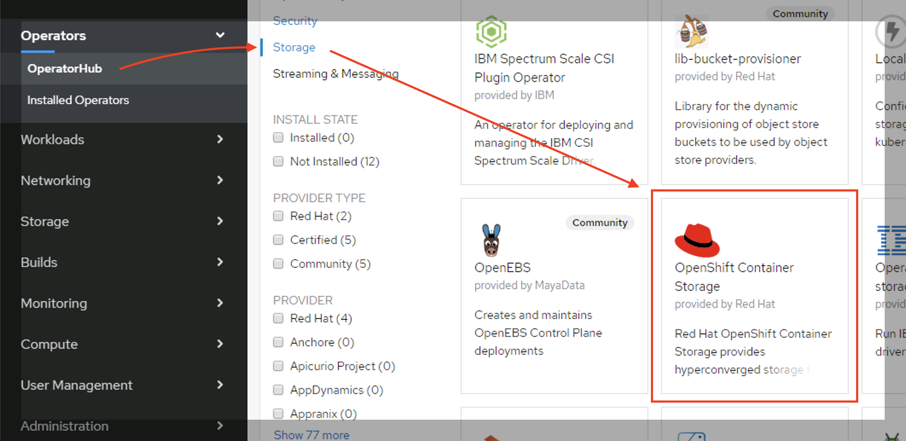
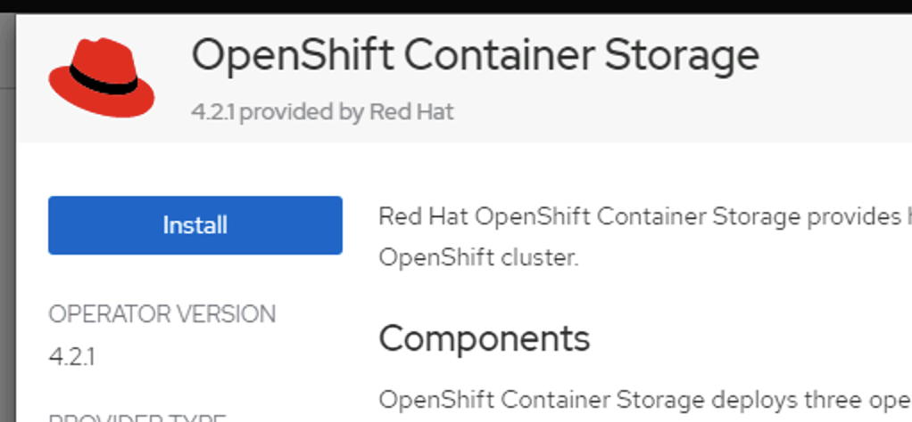
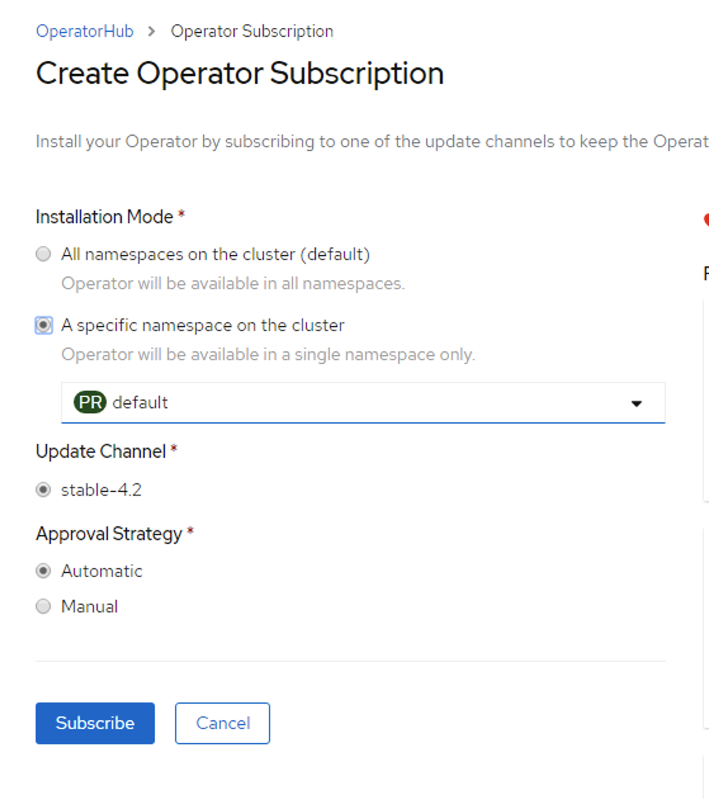
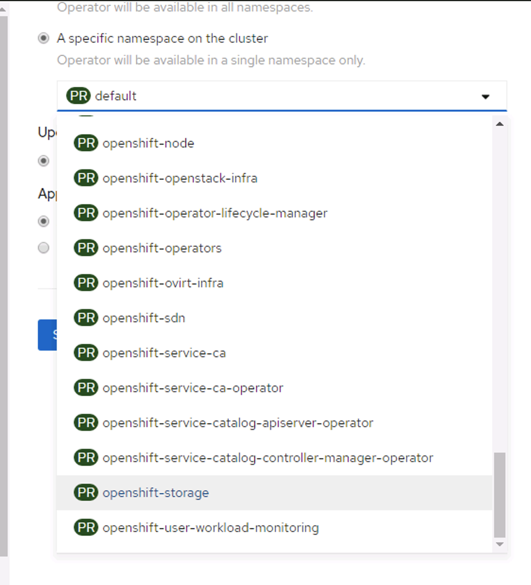
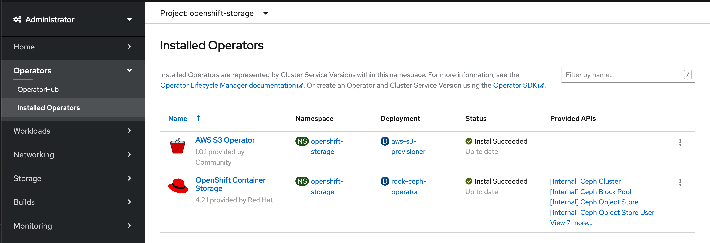

# Implementing OpenShift Container Storage (OCS) 4.2 on VMware

With version 4.2, OCS only supports AWS and VMware.  This document describes implementing for VMware.

OCS is a Ceph implementation published by Red Hat specifically for their OpenShift 4.x platform.  It includes Redos Block Devices (RBD), CephFS devices, and Ceph Object Storage - exposed via the Amazon S3 standard.

## Caveats
1. During the default installation process various assumptions are made about the way Ceph is installed which may not be optimal for all use cases.
1. OCS installation will automatically provision three 2TB virtual disks on the nodes specified as storage nodes during the installation process.  It will configure them for replication such that 2TB of total storage is available (storage capacity can be expanded after installation).  As of this writing, only VMware datastores are supported for vSphere storage and not datastore clusters.  This means that whichever datastore is configured as the backing device for the OCP cluster must be at least 6TB and the size of your OCS Ceph cluster cannot grow larger than the size of this datastore.  If you configure native Ceph from the github repo you can create your physical disks wherever you like and in any configuration you like.  Until such a time as Ceph supports datastore clusters, you may consider using native Ceph rather than OCS for container storage.
1. OCS installs the Amazon S3 storage provider along with the Ceph storage provider.  The S3 storage provider is deployed for use with Ceph object storage.
1. OCS should be installed into a single namespace (`openshift-storage`), but can be consumed from any namespace.
1. This document assumes an installed an healthy OpenShift Container Platform 4.x cluster already exists into which this solution will be deployed and that it has a working vSphere storage provider configured.
1. Best practice is to deploy separate storage nodes for OCS storage and not to distribute storage across all compute/worker nodes.  This is because Ceph storage can be quite CPU and memory intensive when handling high IOPS periods.  Keeping storage nodes separate keeps storage operations from negatively impacting compute workloads and vice versa.  You should deploy a minimum of 3 storage nodes for HA, but can use more and there is no need to keep an odd number of nodes.  The more you have the more resilient and performant your OCS Ceph cluster will be.
1. When deploying OCS, it would like the compute/storage nodes on which it deploys OCS to have 16 cores and 64GB of RAM.  If you create the VM with these exact values, the overhead of the operating system and OCP will use up a couple of GB of RAM and OCP will only report about 62GB as available.  The OCS operator will give a warning when trying to provision to these nodes because the amount of availble RAM is <64GB.  This is only a warning and will not negatively impact the installation in any way.  This warning can be savely ignored.

## Preparing for OCS 4.2 installation
1. Create the `openshift-storage` namespace.

  Put the following .yaml into a file named ocs-namespace.yaml
  ```yaml
apiVersion: v1
kind: Namespace
metadata:
  labels:
    openshift.io/cluster-monitoring: "true"
  name: openshift-storage
spec: {}
  ```

  Deploy the namespace:
  ```
  oc create -f ocs-namespace.yaml
  ```

2. Create a storage group for OCS

  Put the following .yaml into a file named ocs-storage-group.yaml
  ```yaml
  apiVersion: operators.coreos.com/v1
  kind: OperatorGroup
  metadata:
    name: openshift-storage-operatorgroup
    namespace: openshift-storage
  spec:
    serviceAccount:
      metadata:
        creationTimestamp: null
    targetNamespaces:
    - openshift-storage
  ```

  Deploy the storage group
  ```
  oc create -f ocs-storage-group.yaml
  ```

## Deploy OCS 4.2
1. Login to OCP 4.x with a user with the `cluster-admin` role.


1. Navigate to the OperatorHub, on the left, click on `storage` and locate the `OpenShift Container Storage` in the list of operators and click to launch the installer.

  

1. On the next page, click the blue `Install` button at the top left.

  

1. On the next page select `A specific namespace on the cluster`, then click the drop-down box and select `openshift-storage`.  Leave the other radio buttons at their default values.

  

  

1. As the operator begins to install you can watch the progress of the installation

  ```
  watch -n5 "oc get pods -n openshift-storage"
  ```

  When all pods come to a `Running` state, this step is complete.  Note that the deployment happens in stages and various pods are deployed at each stage, so once the initial operator pod gets to a running state it will deploy additional pods.  This step will not be complete until all of the base Ceph pods have been deployed and are in a `Running` state.

1. In the OCP UI, click on `Installed Operators`.  When the installation is complete you should see two deployed operators: `Openshift Container Storage` and `Amazon S3`.  Click on `Openshift Container Storage` to open this operator.

  

1. On the `Installed Operators > Operator Details` page, scroll the tab bar all the way to the right to find and click `Storage Cluster` and then click `Create OCS Cluster Service`.

  

1. The next screen will ask you to select which nodes OCS should use as storage nodes:  Choose your three storage nodes

  

1. Wait until the cluster installation is complete

  ```
  watch -n5 "oc get pods -n openshift-storage"
  ```

  This could take several minutes to complete.  This step is complete when all pods get to the `Running state`.  As before, this deployment happens in stages and when one set of pods gets to a `Running` state additional pods will appear.  When all pods get to the `Running` state the deployment is complete.

1. Once all pods are deployed the GUI will show the OCS operator as `Up to Date`.  You should then be able to see three new storage classes.  ocs-storagecluster-ceph-rbd, ocs-storagecluster-cephfs, and ocs-storage.noobaa.io.  TODO: These are named something different and this text needs to be updated.

  

1. Next, you should taint your storage nodes so that user workloads will not run on your storage nodes

  ```
oc adm taint nodes storage-0 node.ocs.openshift.io/storage=true:NoSchedule
oc adm taint nodes storage-1 node.ocs.openshift.io/storage=true:NoSchedule
oc adm taint nodes storage-2 node.ocs.openshift.io/storage=true:NoSchedule
  ```

  To retrieve a list of all tainted nodes execute:

  ```
oc get nodes -o go-template='{{range $item := .items}}{{with $nodename := $item.metadata.name}}{{range $taint := $item.spec.taints}}{{if and (eq $taint.key "node.ocs.openshift.io/storage") (eq $taint.effect "NoSchedule")}}{{printf "%s\n" $nodename}}{{end}}{{end}}{{end}}{{end}}'
  ```

1. At this point, you can use the ocs-storagecluster-cephfs storage class to deploy an RWX PVC for use by the image-registry.

  1. Create a PVC for the image-registry.

    Create a file named image-registry-pvc.yaml with the following contents:

  ```yaml
apiVersion: v1
kind: PersistentVolumeClaim
metadata:
  finalizers:
  - kubernetes.io/pvc-protection
  name: image-registry-storage
  namespace: openshift-image-registry
spec:
  accessModes:
  - ReadWriteMany
  resources:
    requests:
      storage: 100Gi
  persistentVolumeReclaimPolicy: Retain
  storageClassName: ocs-storagecluster-cephfs
  ```
    Deploy the PVC:

  ```
  oc create -f image-registry-pvc.yaml
  ```

  1. Edit the image registry operator and for `managementState` change `Removed` to `Managed`. Then modify `storage: {}` line to reflect what is shown below. This tells the operator to use a PVC for storage.  You don't need to specify the PVC name, the operator will find the PVC created in the previous step.
  **NOTE:** There will be a lot more in the yaml than what is listed here, it has been trimmed to reduce confusion.  Only values that should change are listed.

  ```
  oc edit configs.imageregistry.operator.openshift.io
  ```

  ```
spec:
  managementState: Managed
  storage:
    pvc:
      claim:
  ```

  Type `:wq` to save the operator .yaml and your image-registry will find and consume the PVC you created in the above step.

1. By default, in a VMware vSphere environment, the `thin` storage class is set as the default storage provider.  To use Ceph rbd storage as the default perform the following steps:

  1. Remove the `default` flag from the `thin` storage class

  ```
  oc patch storageclass thin -p '{"metadata": {"annotations": {"storageclass.kubernetes.io/is-default-class": "false"}}}'
  ```

  1. Add the `default` flag to the 'ocs-block' storage class

  ```
  oc patch storageclass ocs-storagecluster-ceph-rbd  -p '{"metadata": {"annotations": {"storageclass.kubernetes.io/is-default-class": "true"}}}'
  ```
